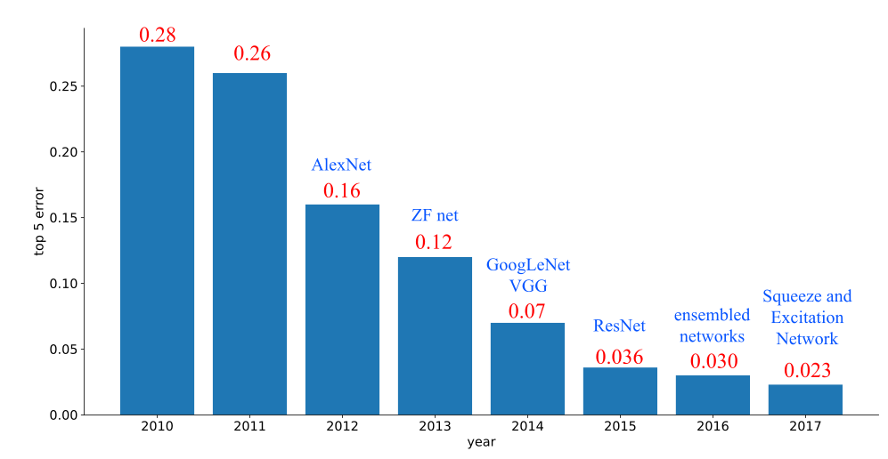
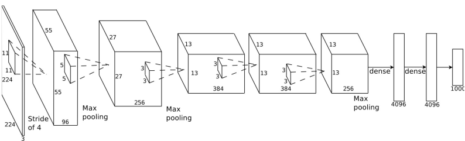
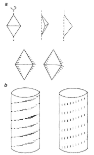
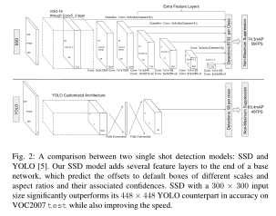

- 背後の数学が知りたいのか
- 昨今の流行の意味を知りたいのか
- 自分の研究に役立つのか


> T先生: そして，そうした場合に工学者たちがとりあえずの単純化されたトイモデルを解いて，解けたとよろこぶのをみては，臨床家実践家たちはうんざりしてきたのだと思うのです。

深層学習は以前からあるニューラルネットワークの発展である。2014年に画像認識コンテストやチェスにおいて人間の成績を凌駕し，
2019 年には自然言語処理でも人間を上回る成績を修めるに至った。
今回が視覚情報処理における現行モデルの解説を行う

人間の神経系に基づいて設計された情報処理モデルである。
深層学習モデルは人間の視覚情報処理過程を模した多層構造を取り入れることにより性能を向上された。翻って人間の認識過程を再考にことが可能になってきていると考える。

- 演題(案): 視覚情報処理モデルとしての深層学習
- 要旨(案): ニューラルネットワークは Hubel & Wiesel の生理学的証拠や Poggio らの標準正則化理論による定式化などを取り入れた視覚情報処理過程の構成論的アプローチとみなしうる。本講演では精度向上が著しい深層学習諸技術を視覚情報処理過程との関連で位置づけ，人間と機械との視覚認識理解研究の進展を展望する。(149文字)
- 所要時間: 西尾先生と同じであれば 2 時間程度ということだとお見受けしました。下記に列挙させていただいた話題の候補を考えるともう少し必要かも知れません。対案としましては最後の 4 つを無視して，一話題につき 15 分として 2 時間です。いかがでしょうか。
- 場所: 特に希望はございません。ただし Wi-Fi 環境をお願いできますでしょうか。
- 事前準備: 実習に参加してくださる方々には，ノート PC の持参とその PC へ Google Chrome のインストールをお願いしたします。
- キーワード(取り上げる話題の候補): 

1. 畳み込みネットワークと初期視覚領野との対応関係，およびその特徴抽出や表現学習，記号接地問題，(ソフトマックス関数と penultimate 層)，Inception, VGG, ResNet
  - 畳み込み演算，福島のネオコグニトロン，C 層と S 層，マックスプーリング，
1. スキップコネクト(ResNet) と Van Essen ら視覚野結合地図との対応
1. データ拡張，ReLU, tanh, 
1. SGD，オンライン，バッチ，ミニバッチと短期記憶
1. 一撃学習，転移学習，ファインチューニング，実習 , U-Net
1. 腹側=背側視覚経路と位置=対象の処理および領域切り出し，対象切り出し
1. 顔認識と相貌失認と責任領野 紡錘状回
1. 注意と健在性地図と特徴表現
1. 文字認識と視覚的単語形態領域(VWFA) と難読症とそのモデル
1. 画風変換と錯視とバイアスの関係を考える
1. 視覚的注意と顕在性地図とから対象検出と無視とを説明する
1. 正確さと反応速度のトレードオフ(speed-accuracy tradeoff)， MNet
1. 確率的勾配降下法，転移学習，一撃学習，小数例学習
1. エネルギー関数，最適化問題，制約付き正則化，オイラーラグランジェ方程式
1. ドロップアウト，平均場近似，バッチ/層/事例/正則化，汎化性能
1. 変分ベイズ，敵対生成ネットワーク（Nash 均衡），解絡 (disentangled) 表現。ヘルムホルツの自由エネルギー。


## 画像認識の進歩

<div align="center">
	<br/>
</div>

<div align="center">
	<br/>
</div>

<div align="center">
	<br/>
</div>

背景には，エコシステムの充実がある

1. OS の 64 ビット化
2. GPU 利用
2. GitHub
3. arXiv
4. SNS, stackoverflow, Facebook, 
5. Python Framework


## 標準正則化理論
[@Poggio1985,@1995GirosiPoggio,@1999Riesenhuber_Poggio,@2005Serre_Poggio] と正則化L1, L2, L0, ElasticNet

[@1999Riesenhuber_Poggio] は MAX


<div align="center">
	<br/>
	<br/>
</div>

# Eco system
- AMT 
- ArXiv (Aritcle repository)
- GitHub (Source code repository)
- Colabratory
- Kaggle (Competition)
- Linux (Open Source Software)
- Medium (blog)
- Python, R (Free software packages)
- PyTorch, TensorFlow, Keras
- Reddit, stackoverflow, stackexchange (SNSs)


<div align="center">
	<br/>
	GitHub でも星の数の推移<br/>
	<br/>
	同期間の TensorFlow を除いた場合の星の数
</div>

上記の図から，[TensorFlow](https://www.tensorflow.org/), [Keras](https://keras.io/), [PyTorch](https://pytorch.org/) が人気であることが分かる。
Keras は TensorFlow 2.0 に統合されるので，実質は TensorFlow と PyTorch になる。TensorFlow は商業ユーザが多い。一方 Pytorch は研究ベースである。
実際 [arXiv](https://arxiv.org/) で発表される深層学習関係の論文に付属するソースコードはほぼ PyTorch となっている。
加えて State of the arts のスコアボードサイト https://paperswithcode.com/sota を観ると，提供されるソースコードは PyTorch が主流である。
したがって，今後の研究ベースで取り組む際には PyTorch を第一選択肢と考えた方が良いと思われる。

とは言え Keras は簡単に操作できる利点が指摘できる。したがって 教育用には keras，ビジネス用途では TensorFlow, 研究用途では PyTorch という棲み分けが発生していると考えられる。
実際，

```R
install.packages("nnet") # nnet のインストール
library("nnet")          # nnet 使用宣言
```

のような簡単な R の使い方と ほぼ 同じような感覚で keras は使用可能である。[Rstudio](https://rstudio.com/) と同じような感覚で
ブラウザ上で python を動作させる開発環境 jupyter notebook がある。この jupyter notebook をクラウド上で実行する環境を
[colaboratory](https://colab.research.google.com/notebooks/welcome.ipynb?hl=en), ここでは省略して Colab と呼ぶことにする。
もしくはアイコンを用いて  と表現することとする。


```python
!pip install keras  # keras のインストール
import keras        # keras 使用宣言
```

深層学習が流行した一因として，これらのフレームワークの普及が挙げられます。これらのフレームワークはすべて自動微分が実装されているので，面倒な微分作業をする必要がありません。


## PyTorch

- Imperative  (vs Functional) Programmming
- Dynamic Graph (like Chainer), `Define by Run`

## オイラー=ラグランジェ方程式と正則化項

Original: https://ja.wikipedia.org/wiki/%E3%82%AA%E3%82%A4%E3%83%A9%E3%83%BC%EF%BC%9D%E3%83%A9%E3%82%B0%E3%83%A9%E3%83%B3%E3%82%B8%E3%83%A5%E6%96%B9%E7%A8%8B%E5%BC%8F

3次元デカルト座標 $\boldsymbol{x}=(x,y,z)$ の場合を考える。このとき時間微分 $\dot{\boldsymbol{x}}=\boldsymbol{v}=(v_x,v_y,v_z)$ は速度である。また ポテンシャルは速度には依らないものとする。
ラグランジアン $L$ は『$\text{運動エネルギー} - \text{ポテンシャル}$』の形をしており
\[
L({\boldsymbol{x}},{\boldsymbol{v}},t)=\frac{m}{2}
({v_{x}}^{2}+{v_{y}}^{2}+{v_{z}}^{2})-V(\boldsymbol{x})
\]
である。

このとき，ラグランジュの運動方程式は
\[
m{\dot{\boldsymbol{v}}} = -\nabla V({\boldsymbol{x}})
\]
となり ニュートンの運動方程式に一致する。

ニュートン力学においては 関数 $u_{i}$ は一般化座標 $q_{i}$ であり，その変数は時間 $t$ である。一般化座標の次元 $f$ を系の（力学的な）自由度という。
関数 $F$ はラグランジアン $L$ がその役割を果たす。 オイラー＝ラグランジュ方程式は
\[
\frac{\partial L}{\partial q_{i}}(q(t),{\dot{q}}(t),t) - {\frac{d}{dt}}\left({\frac{\partial L}{\partial {\dot{q}}_{i}}} (q(t),{\dot{q}}(t),t)\right) = 0
\]
となる。なお、ドットは時間による微分を表す。この式を特に **ラグランジュの運動方程式** と呼ぶこともある。
**一般化運動量** は
\[
p_{i}\left(q(t),{\dot{q}}(t),t\right) = \frac{\partial L}{\partial\dot{q}_i}\left(q(t),\dot{q}(t),t\right)
\]
で定義され、これを使うとオイラー＝ラグランジュ方程式は
\[
\dot{p}_{i}=
\frac{\partial L}{\partial q_{i}}\left(q(t),{\dot {q}}(t),t\right)
\]
と書き換えられる。上式右辺を一般化力と呼ぶ事にすると，上述の方程式は「$\text{一般化運動量の微分}=\text{一般化力}$」を意味する。

ニュートン方程式は「運動量の微分＝力」であったので、オイラー＝ラグランジュ方程式はニュートン方程式を一般化座標に拡張したものであるとみなす事ができる。

## Poggio の標準正則化理論

<div aling="center">
<!--	-->
	
	
<!--
 	
	
 -->
</div>

機械学習の文脈では，重み崩壊 weight decay などと呼ばれてきたが，標準正則化理論とオイラー=ラグランジェ方程式との関係で言うと見通しが良い。
オイラー=ラグランジェ方程式はラグランジェの未定乗数法により変分法，条件付き最適化，になるので，物理学，経済学，などへの応用も盛んである。

重み減衰[@1991Krogh_weight_decay] については，古典的なニューラルネットワークで研究されてきており，From  https://machinelearningmastery.com/how-to-reduce-overfitting-in-deep-learning-with-weight-regularization/


The classic text on Multilayer Perceptrons “Neural Smithing: Supervised Learning in Feedforward Artificial Neural Networks” provides a worked example demonstrating the impact of weight decay by first training a model without any regularization, then steadily increasing the penalty. They demonstrate graphically that weight decay has the effect of improving the resulting decision function.

> net was trained […] with weight decay increasing from 0 to 1E-5 at 1200 epochs, to 1E-4 at 2500 epochs, and to 1E-3 at 400 epochs. […] The surface is smoother and transitions are more gradual
— Page 270, Neural Smithing: Supervised Learning in Feedforward Artificial Neural Networks, 1999.

This is an interesting procedure that may be worth investigating. The authors also comment on the difficulty of predicting the effect of weight decay on a problem.

> … it is difficult to predict ahead of time what value is needed to achieve desired results. The value of 0.001 was chosen arbitrarily because it is a typically cited round number
— Page 270, Neural Smithing: Supervised Learning in Feedforward Artificial Neural Networks, 1999.

## 腹側経路と背側経路

<div aling="center">
	<br/>
	<br/>
</div>

<div align="center">

</div>