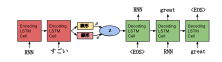
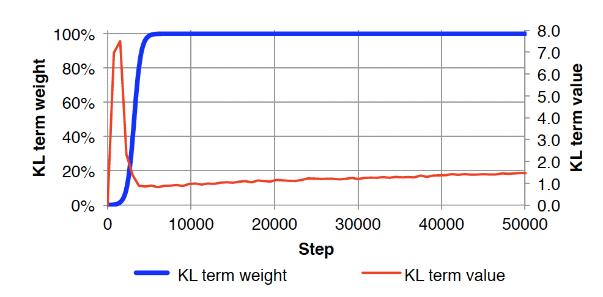
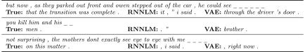
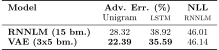
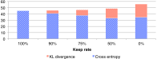
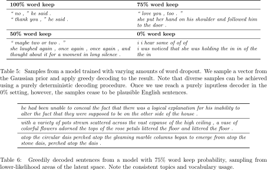
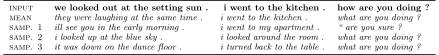
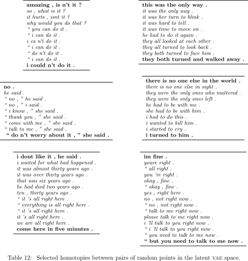

# 連続空間からのテキスト生成 

## Generating Sentences from a Continuous Space
### author: Samuel R. Bowman, Luke Vilnis, Oriol Vinyals, Andrew M. Dai, Rafal Jozefowicz & Samy Bengio

要旨:

標準的なリカレントニューラルネットワーク言語モデル (RNNLM) は，文を 1 語ずつ生成し，明示的な大域文表現から動作しない。
本研究では，文全体の分散潜在表現を組み込んだ rnn ベースの変分自己符号化生成モデルを導入し，研究する。
この因数分解により，文のスタイル，話題，高レベルの構文特徴などの文の全体的な特性を明示的にモデル化することができる。
このような文の潜在的な表現に基づいた先行研究から得られたサンプルは，単純な決定論的復号化によって，多様で整った文を驚くほど生成する。
この潜在空間を通る経路を調べることで，既知の文の間を補間する首尾一貫した新文章を生成することが可能である。
このモデルが示す困難な学習問題を解決する技術を紹介し，欠落している単語を補うのに有効であることを示し，このモデルの潜在的な文空間の多くの興味深い性質を探り，言語モデリングにおけるこのモデルの使用に関する否定的な結果を提示する。
<!-- The standard recurrent neural network language model (RNNLM) generates sentences one word at a time and does not work from an explicit global sentence representation.
In this work, we introduce and study an rnn-based variational autoencoder generative model that incorporates distributed latent representations of entire sentences. 
This factorization allows it to explicitly model holistic properties of sentences such as style, topic, and high-level syntactic features. 
Samples from the prior over these sentence representations remarkably produce diverse and well-formed sentences through simple deterministic decoding. 
By examining paths through this latent space, we are able to generate coherent novel sentences that interpolate between known sentences. 
We present techniques for solving the difficult learning problem presented by this model, demonstrate its effectiveness in imputing missing words, explore many interesting properties of the model's latent sentence space, and present negative results on the use of the model in language modeling.
 -->
 
    

# 1. はじめに
<!-- # 1. Introduction-->

リカレントニューラルネットワーク言語モデル (RNNLMs, Mikolov et al., 2011) は，自然言語文の教師なし生成モデリングにおける最先端の技術を代表するものである。
教師ありの設定では，課題固有の特徴を条件とする RNNLM 復号化器は，機械翻訳 (Sutskever ら,2014; Bahdanau ら,2015) および画像脚注付け (Vinyals ら,2015; Mao ら,2015; Donahue ら,2015) などの課題の最先端技術である。
RNNLM は進化する分散状態表現に基づいて単語単位で文を生成するため，有意な独立性の仮定を持たない確率的モデルとなり，長期依存性を含む系列上の複雑な分布をモデル化することが可能である。
しかし RNNLM はモデル構造を一連の次段階予測に分解することで，話題などの大域的特徴や高次構文特性の解釈可能な表現を顕に示さない。
<!-- Recurrent neural network language models (RNNLMs, Mikolov et al., 2011) represent the state of the art in unsupervised generative modeling for natural language sentences. 
In supervised settings, RNNLM decoders conditioned on tasks pecific features are the state of the art in tasks like machine translation (Sutskever et al.,2014; Bahdanau et al.,2015) and image captioning (Vinyals et al.,2015; Mao et al.,2015; Donahue et al.,2015). 
The RNNLM generates sentences word-by-word based on an evolving distributed state representation, which makes it a probabilistic model with no significant independence assumptions, and makes it capable of modeling complex distributions over sequences, including those with long-term dependencies. 
However, by breaking the model structure down into a series of next-step predictions, the RNNLM does not expose an interpretable representation of global features like topic or of high-level syntactic properties.-->

i went to the store to buy some groceries . 
i store to buy some groceries . 
i were to buy any groceries . 
horses are to buy any groceries . 
horses are to buy any animal . 
horses the favorite any animal . 
horses the favorite favorite animal . 
horses are my favorite animal . 

表 1: 従来の自己符号化器で 2 文の符号化の中間点から貪欲に復号して生成された文。
中間文は，もっともらしい英語ではない。
<!-- Table 1: Sentences produced by greedily decoding from points between two sentence encodings with a conventional autoencoder. 
The intermediate sentences are not plausible English. -->

我々は，このような大域特徴を連続潜在変数に明示的に取り込むように設計された RNNLM の拡張を提案する。
直感的には，このようなモデルにおける最尤法学習は，難解な推論問題を呈する。
画像のモデリング (Gregor et al.,2015)，手書き，及び自然音声 (Chung et al.,2015) における最近の成功からインスピレーションを得て，我々のモデルは変分自己符号化器のアーキテクチャを用いてこれらの困難を回避し，変分推論の最近の進歩 (Kingma and Welling,2015; Rezende et al.,2014) を利用して，潜在変数を持つ強力なニューラルネットワーク生成モデルのための実践的学習技術を導入している。
<!-- We propose an extension of the RNNLM that is designed to explicitly capture such global features in a continuous latent variable. 
Naively, maximum likelihood learning in such a model presents an intractable inference problem. 
Drawing inspiration from recent successes in modeling images (Gregor et al.,2015), handwriting, and natural speech (Chung et al.,2015), our model circumvents these difficulties using the architecture of a variational autoencoder and takes advantage of recent advances in variational inference (Kingma and Welling,2015; Rezende et al.,2014) that introduce a practical training technique for powerful neural network generative models with latent variables.-->

我々の貢献は以下の通りである。
テキストのための変分自己符号化器アーキテクチャを提案し，それを訓練する際の障害と我々の提案する解決策を議論する。 
グローバル変数が明示的に必要とされない標準的な言語モデリング評価において，このモデルは既存のRNNLMs と同等の性能をもたらすことを見出した。
また，より大規模なコーパスを用いて，欠損単語を埋め込む課題で我々のモデルを評価した。
この課題では，ノンパラメトリック 2 標本検定と敵対的学習からヒントを得て，難解な尤度計算の問題を回避し，敵対的分類器を用いた新しい評価戦略を導入している。
この設定において，我々のモデルは大域的潜在変数により，より単純なモデルが失敗するところでもうまくやることができる。
最後に，我々のモデルが文の高次特徴を学習する能力を分析するためのいくつかの定性的な技法を紹介する。
我々は，純粋に決定論的な復号化によって多様で一貫性のある文を生成できること，そして文と文の間を滑らかに補間できることを見出した。
<!-- Our contributions are as follows: We propose a variational autoencoder architecture for text and discuss some of the obstacles to training it as well as our proposed solutions. We find that on a standard language modeling evaluation where a global variable is not explicitly needed, this model yields similar performance to existing RNNLMs. 
We also evaluate our model using a larger corpus on the task of imputing missing words. 
For this task, we introduce a novel evaluation strategy using an adversarial classifier, side stepping the issue of intractable likelihood computations by drawing inspiration from work on non-parametric two-sample tests and adversarial training. 
In this setting, our model's global latent variable allows it to do well where simpler models fail. 
We finally introduce several qualitative techniques for analyzing the ability of our model to learn high level features of sentences. 
We find that they can produce diverse, coherent sentences through purely deterministic decoding and that they can interpolate smoothly between sentences. -->

# 2. 背景
<!-- # 2. Background-->

## 2.1 教師なし文符号化
<!-- ## 2.1 Unsupervised sentence encoding -->

標準的な RNN 言語モデルは，前の単語と進展する隠れ状態を条件として，文の各単語を予測する。
このモデルは効果的ではあるが，文全体のベクトル表現を学習しない。
連続的な潜在的文表現を取り入れるためには，まず，文と分散表現の間の写像を行う方法が必要であり，教師なし設定で学習することが可能である。
この問題に対して強力な生成モデルは存在しないが，3 つの非生成技術が有望視されている: 系列自己符号化器，スキップソート，段落ベクトルである。
<!-- A standard rnn language model predicts each word of a sentence conditioned on the previous word and an evolving hidden state. 
While effective, it does not learn a vector representation of the full sentence. 
In order to incorporate a continuous latent sentence representation, we first need a method to map between sentences and distributed representations that can be trained in an unsupervised setting. 
While no strong generative model is available for this problem, three non-generative techniques have shown promise: sequence autoencoders, skip-thought, and paragraph vector. -->

系列自己符号化器は，教師あり下流課題の系列モデルの事前学習 (Dai and Le, 2015) や完全な文書の生成(Li et al.,2015a) において成功を収めている。
自己符号化器は，符号化関数 enc と確率的復号化モデル $p(x\vert z=\varphi_{\text{enc}}(x))$ からなり，$x$ の学習コードである $z$ を条件とした例 $x$ の尤度を最大化させるものである。
系列自己符号化器の場合，符号化器と復号化器はともに rnn であり，事例はトークン列である。
<!-- Sequence autoencoders have seen some success in pre-training sequence models for supervised downstream tasks (Dai and Le, 2015) and in generating complete documents (Li et al.,2015a). 
An autoencoder consists of an encoder function 'enc and a probabilistic decoder model p(xjz)=varphi_enc(x)), and maximizes the likelihood of an example x conditioned on z, the learned code for x. 
In the case of a sequence autoencoder, both encoder and decoder are rnns and examples are token sequences. -->

標準的な自己符号化器は，大域的な意味的特徴を抽出するのに有効でない。
表 1 では，2 つの文に対する符号化間のパスまたはホモトピーを計算し，それぞれの中間符号を復号化した結果を示している。
中間文は一般に非文法的であり，一方から他方へスムーズに遷移することはない。
このことは，これらのモデルが一般に文の符号化のための滑らかで解釈可能な特徴系を学習していないことを示唆している。
さらに，これらのモデルは $z$ に関する事前分布を組み込んでいないため，文に確率を割り当てたり，新しい文をサンプリングするために使用することはできない。
<!-- Standard autoencoders are not effective at extracting for global semantic features. 
In Table 1, we present the results of computing a path or homotopy between the encodings for two sentences and decoding each intermediate code. 
The intermediate sentences are generally ungrammatical and do not transition smoothly from one to the other. 
This suggests that these models do not generally learn a smooth, interpretable feature system for sentence encoding. 
In addition, since these models do not incorporate a prior over z, they cannot be used to assign probabilities to sentences or to sample novel sentences.-->

他の 2 つのモデルは文の符号化学習に有望であるが，生成的な設定では使用することができない。
スキップソートモデル (Kiros et al.2015) は，系列自己符号化器と同じモデル構造をとる教師なし学習モデルであるが，ターゲット文そのものではなく，ターゲット文から隣接する文を条件としたテキストを生成するものである。
最後に，段落ベクトルモデル (Le and Mikolov, 2014) は，非再帰型文表現モデルである。
段落ベクトルモデルでは，文の単語を予測するためにそれを使用することを目的として，見込み符号化ベクトルに対して勾配に基づく推論を行うことにより，文の符号化が得られる。
<!-- Two other models have shown promise in learning sentence encodings, but cannot be used in a generative setting: Skip-thought models (Kiros et al.,2015) are unsupervised learning models that take the same model structure as a sequence autoencoder, but generate text conditioned on a neighboring sentence from the target text, instead of on the target sentence itself. 
Finally, paragraph vector models (Le and Mikolov, 2014) are non-recurrent sentence representation models. 
In a paragraph vector model, the encoding of a sentence is obtained by performing gradient-based inference on a prospective encoding vector with the goal of using it to predict the words in the sentence. -->

## 2.2 変分自己符号化器
<!-- ## 2.2 The variational autoencoder -->

変分自己符号化器 (VAE, Kingma and Welling, 2015; Rezende et al.,2014) は，標準自己符号化器の正則化バージョンに基づく生成モデルである。
このモデルは，コード上の規則的な形状を強制する隠れコード $z$ に事前分布を課し，祖先 (前向き) サンプリングを用いてモデルから適切なサンプルを抽出することを可能にする。
<!-- The variational autoencoder (VAE, Kingma and Welling, 2015; Rezende et al.,2014) is a generative model that is based on a regularized version of the standard autoencoder. 
This model imposes a prior distribution on the hidden codes z which enforces a regular geometry over codes and makes it possible to draw proper samples from the model using ancestral sampling.  -->

VAE は決定論的関数 $\varphi_{\text{enc}}$ を学習された事後確率認識モデル $q(z\vert x)$  で置き換えることにより，自己符号化器アーキテクチャを変更する。
このモデルは $z$ に関する近似的な事後分布 (通常は対角ガウス分布)を，$x$ で条件づけられたニューラルネットワークでパラメタライズする。
直感的には VAE はコードを単一点としてではなく，潜在空間における柔らかい楕円形の領域として学習し，孤立したコードとして学習データを記憶するのではなく，コードが空間を埋めるように強制的に学習させる。
<!-- The VAE modifies the autoencoder architecture by replacing the deterministic function varphi_enc with a learned posterior recognition model, q(z|x). 
This model parametrizes an approximate posterior distribution over z (usually a diagonal Gaussian) with a neural network conditioned on x. 
Intuitively, the VAE learns codes not as single points, but as soft ellipsoidal regions in latent space, forcing the codes to fill the space rather than memorizing the training data as isolated codes. -->

もし VAE が標準自己符号化器の再構成目的で学習された場合，$q(z\vert x)$ の分散を消滅的に小さくすることで入力を決定論的に符号化するよう学習するだろう (Raiko et al.,2015)。
その代わりに VAE は，その事後分布を事前分布 $p(z$, 一般に標準ガウス分布 ($\mu=0,\sigma=1$) に近づけるようモデルに促す目的関数を使用する。
さらに，この目的関数はデータの真の対数尤度に対する有効な下界であり，VAE は生成モデルであると言える。
この目的関す次のような形式をとる:
<!-- If the VAE were trained with a standard autoencoder's reconstruction objective, it would learn to encode its inputs deterministically by making the variances in q(z|x) vanishingly small (Raiko et al.,2015). 
Instead, the VAE uses an objective which encourages the model to keep its posterior distributions close to a prior p(z), generally a standard Gaussian (mu=0, sigma=1). 
Additionally, this objective is a valid lower bound on the true log likelihood of the data, making the VAE a generative model. 
This objective takes the following form:
-->

$$
\mathcal{L}(\theta, x)= - D_{KL} \left[q_ {\theta}(z\vert x)\vert\vert p(z) \right]  + \mathbb{E}_ {q_ {\theta}(z\vert x)}\left[\log p_ {\theta}(x\vert z)\right] \le \log p(x) \tag{1} 
$$

このため，モデルは事前分布の下で妥当な確率を持つ潜在空間のあらゆる点から，もっともらしい文を解読できるようになることを強制される。
以下に示す VAE モデルを用いた実験では，Kingma and Welling (2015) のガウス再パラメータ化トリックを用いて，事前・事後分布 $p(z)$ と $q(z|x)$ に対角ガウス分布を用いる。
我々は，確率的勾配降下でモデルを訓練し，各勾配段階で $q(z\vert x)$ からの単一のサンプルを使用して再構成コストを推定するが，再び Kingma and Welling (2015) に従って，閉形式のコスト関数の KL ダイバージェンス項を計算する。
<!-- This forces the model to be able to decode plausible sentences from every point in the latent space that has a reasonable probability under the prior.
In the experiments presented below using VAE models, we use diagonal Gaussians for the prior and posterior distributions p(z) and q(z|x), using the Gaussian reparameterization trick of Kingma and Welling (2015). 
We train our models with stochastic gradient descent, and at each gradient step we estimate the reconstruction cost using a single sample from q(z|x), but compute the kl divergence term of the cost function in closed form, again following Kingma and Welling (2015).
-->

# 3. 文章のための VAE
<!-- # 3 A VAE for sentences -->

我々は，符号化器と復号化器に単層の LSTM RNNs (Hochreiter and Schmidhuber, 1997) を用いて，変分自己符号化器をテキストに適応させ，ガウス事前分布を隠れコードに対する正則化として作用させた系列自己符号化器を本質的に形成している。
復号化器はこの隠れコードに条件付けられた特別な RNN 言語モデルとして機能し，隠れコードが有用な情報を含まない縮退した設定では，このモデルは実質的に RNNLM と等価となる。
このモデルは 図 1 に示すように，後述するすべての実験に用いられている。
<!-- We adapt the variational autoencoder to text by using single-layer lstm rnns (Hochreiter and Schmidhuber, 1997) for both the encoder and the decoder, essentially forming a sequence autoencoder with the Gaussian prior acting as a regularizer on the hidden code. 
The decoder serves as a special rnn language model that is conditioned on this hidden code, and in the degenerate setting where the hidden code incorporates no useful information, this model is effectively equivalent to an RNNLM. 
The model is depicted in Figure 1, and is used in all of the experiments discussed below. -->

 

図 1. 変分自己符号化器言語モデルの核心構造。
単語は埋め込みベクトルの学習済み辞書を用いて表現された。
<!-- Figure 1: The core structure of our variational autoencoder language model. 
Words are represented using a learned dictionary of embedding vectors. -->

このアーキテクチャの変種として，時間ステップ毎にサンプリングした $z$ を復号化入力に連結する，分散にソフトプラスのパラメトリゼーションを用いる，復号化と潜在変数，符号化器と潜在変数間に深層フィードフォワードネットワークを用いる，などを検討した。
これら変種を用いた場合，モデルの性能にはほとんど差がないことがわかった。
しかし，符号化器と復号化器の間にフィードフォワードネットワークを含む場合，モデルが学習するために高速ネットワーク層を使用する必要があることが分かった (Srivastava et al.2015)。
ハイパーパラメータのチューニングについては，付録で説明する。
<!-- We explored several variations on this architecture, including concatenating the sampled z to the decoder input at every time step, using a softplus parametrization for the variance, and using deep feedforward networks between the encoder and latent variable and the decoder and latent variable. 
We noticed little difference in the model's performance when using any of these variations. 
However, when including feedforward networks between the encoder and decoder we found that it is necessary to use highway network layers (Srivastava et al.,2015) for the model to learn. 
We discuss hyperparameter tuning in the appendix. -->

我々はまた DRAW (Gregor et al.,2015) に倣った多段階サンプリングモデルや，正規化フローを用いた事後近似  (Rezende and Mohamed, 2015) など，より高度な認識モデル $q(z\vert x)$ の実験も行った。
しかし，我々はプレーンな VAE から有意な利得を得ることができなかった。
<!-- We also experimented with more sophisticated recognition models q(z|x), including a multistep sampling model styled after draw (Gregor et al.,2015), and a posterior approximation using normalizing fows (Rezende and Mohamed, 2015). 
However, we were unable to reap signifficant gains over our plain VAE. -->

これまで VAEs の最も強力な成果は，画像のような連続的な領域に対するものであったが，離散的な系列に対する研究も行われている。
我々のモデルと同じ高レベルのアーキテクチャを共有する RNN 符号化器と復号化器を使用してこれを行うための技法は，Fabius and van Amersfoort (2014) で音楽のモデリングのための 変分リカレント自己符号化器(VRAE) の名前で提案された。
音声，手書き，l音楽のモデリングのための RNN スタイルのモデルに連続的な潜在変数を含める研究は他にもあるが (Bayer and Osendorfer,2015; Chung et al.,2015) ，これらのモデルはタイムステップごとに個別の潜在変数を含み，大域特徴をモデル化する我々の目標には不向きであった。
<!-- While the strongest results with VAEs to date have been on continuous domains like images, there has been some work on discrete sequences: 
a technique for doing this using rnn encoders and decoders, which shares the same high-level architecture as our model, was proposed under the name Variational Recurrent Autoencoder (vrae) for the modeling of music in Fabius and van Amersfoort (2014). 
While there has been other work on including continuous latent variables in rnn-style models for modeling speech, handwriting, and music (Bayer and Osendorfer,2015; Chung et al.,2015), these models include separate latent variables per timestep and are unsuitable for our goal of modeling global features.-->

我々と似た目標を持つ最近の論文では Miaoら(2015) が，テキストを系列としてではなく，単語の袋としてモデル化する効果的な VAE ベースの文書レベル言語モデルを紹介している。
彼らは，ネットワークの符号化器と復号化器の部分を同時ではなく交互に学習させる必要があることを簡潔に述べており，おそらく 3.1 節で議論した問題のいくつかに対処する方法として，このことを述べている。
<!-- In a recent paper with goals similar to ours, Miao et al.(2015) introduce an effective VAE based document-level language model that models texts as bags of words, rather than as sequences. 
They mention brie y that they have to train the encoder and decoder portions of the network in alternation rather than simultaneously, possibly as a way of addressing some of the issues that we discuss in Section 3.1. -->

## 3.1 最適化の課題
<!-- ## 3.1 Optimization challenges-->

我々のモデルは文の内容に関する大域的な潜在的表現を学習することを目的としている。
変分下界の目的関数 式(1) を見ることで，我々のモデルが大域的特徴を学習する度合いを定量化することができる。
この下界は 2 つの項に分かれる。
すなわち (交差エントロピーとして表現される) 事後確率の下でのデータ尤度と，事前確率からの事後確率への KL ダイバージェンスである。
潜在変数 $z$ に有用な情報を持つモデルは，非ゼロの KL ダイバージェンス項と比較的小さな交差エントロピー項を持つことになる。
ごく稀なケースを除き，ほとんどのハイパーパラメータを用いた学習では $q(z\vert x)$ を事前分布 $p(z)$ に等しく設定し，コスト関数の KL ダイバージェンス項をゼロにするモデルを一貫して生成する。
<!-- Our model aims to learn global latent representations of sentence content. 
We can quantify the degree to which our model learns global features by looking at the variational lower bound objective (1). 
The bound breaks into two terms: the data likelihood under the posterior (expressed as cross entropy), and the kl divergence of the posterior from the prior. 
A model that encodes useful information in the latent variable z will have a nonzero KL divergence term and a relatively small cross entropy term. 
Straightforward implementations of our VAE fail to learn this behavior: except in vanishingly rare cases, most training runs with most hyperparameters yield models that consistently set q(z|x) equal to the prior p(z), bringing the KL divergence term of the cost function to zero. --> 

このような場合，モデルは本質的に RNNLM として振る舞う。
このため，出力文に対する任意の分布を表現することができ (厄介な左・右因数分解を伴う可能性はあるが)，それによって最適に近い尤度を達成することができる。
画像モデリングのための VAEs に関する以前の仕事 (Kingma and Welling, 2015) は，より弱い独立画素復号化器モデル $p(x\vert z)$ を用い，良い尤度を達成するためにモデルが大域的潜在変数を使用せざるを得なくなった。
関連する結果として LSTM 復号化器を使用する画像生成への最近のアプローチは VAE スタイルの大域的潜在変数なしでうまくいくこと (Theis and Bethge, 2015)。
<!-- When the model does this, it is essentially behaving as an RNNLM. 
Because of this, it can express arbitrary distributions over the output sentences (albeit with a potentially awkward left-toright factorization) and can thereby achieve likelihoods that are close to optimal. 
Previous work on VAEs for image modeling (Kingma and Welling, 2015) used a much weaker independent pixel decoder model p(x|z), forcing the model to use the global latent variable to achieve good likelihoods. 
In a related result, recent approaches to image generation that use LSTM decoders are able to do well without VAE-style global latent variables (Theis and Bethge, 2015).-->

学習におけるこの問題のある傾向は，事後サンプリング過程によってもたらされるような，隠れ状態の微妙な変動に対する LSTM 復号化器の感度によって，さらに悪化する。
これにより，モデルは当初 $z$ を無視し，より簡単に最適化された復号化器でデータを説明し，低いぶら下がりの果実を狙うことを学習する。
一旦これが起こると，復号化器は符号化器を無視し，両者の間を勾配信号がほとんど通らなくなり，KL コスト項がゼロとなる望ましくない安定均衡をもたらす。
我々はこの問題を軽減するために 2 つの技術を提案する。
<!-- This problematic tendency in learning is compounded by the LSTM decoder's sensitivity to subtle variation in the hidden states, such as that introduced by the posterior sampling process. 
This causes the model to initially learn to ignore z and go after low hanging fruit, explaining the data with the more easily optimized decoder. 
Once this has happened, the decoder ignores the encoder and little to no gradient signal passes between the two, yielding an undesirable stable equilibrium with the kl cost term at zero. 
We propose two techniques to mitigate this issue. -->

### 3.3.1 KL コスト焼きなまし
<!--  ### 3.3.1 KL cost annealing  -->

この問題に対する簡単なアプローチでは，学習時にコスト関数の KL 項に可変の重みを加える。
学習開始時には，その重みをゼロに設定し，モデルができるだけ多くの情報を $z$ に符号化するよう学習する。
そして，学習が進むにつれて，この重みを徐々に増加させ，モデルに符号化を平滑化させ，事前分布に詰め込ませる。
この重みは 1 になるまで増加させ，その時点で重み付きコスト関数は真の変分下界と等価になる。
この設定では，学習の初期段階では学習データ尤度の適切な下界を最適化しないが，それでも収束時にはその下界の値が改善されることが分かる。
これは，バニラ自己符号化器 から VAE へのアニーリングと考えることができる。
この増加の割合はハイパーパラメータとして調整される。
<!-- In this simple approach to this problem, we add a variable weight to the KL term in the cost function at training time. 
At the start of training, we set that weight to zero, so that the model learns to encode as much information in z as it can. 
Then, as training progresses, we gradually increase this weight, forcing the model to smooth out its encodings and pack them into the prior. 
We increase this weight until it reaches 1, at which point the weighted cost function is equivalent to the true variational lower bound. 
In this setting, we do not optimize the proper lower bound on the training data likelihood during the early stages of training, but we nonetheless see improvements on the value of that bound at convergence.
This can be thought of as annealing from a vanilla autoencoder to a VAE. 
The rate of this increase is tuned as a hyperparameter.  -->

図 2 は，KL コスト焼きなましを導入した Penn Treebank (Marcus et al.,1993) 言語モデリングにおいて，最初の 50k ステップの学習における KL コスト項の振る舞いを示したものである。
この例では，我々がよく観察するパターンを再現している。
KL は学習初期に急上昇し，その後 KL ダイバージェンスのペナルティを受け始めると大幅に低下し，最終的には再び上昇し，$z$ に情報を凝縮することを学習すると収束する
。
<!-- Figure 2 shows the behavior of the KL cost term during the first 50k steps of training on Penn Treebank (Marcus et al.,1993) language modeling with KL cost annealing in place. 
This example re ects a pattern that we observed often: KL spikes early in training while the model can encode information in z cheaply, then drops substantially once it begins paying the full KLdivergence penalty, and finally slowly rises again before converging as the model learns to condense more information into z.
-->

 

図 2: シグモイドアニーリングによる変分下界の KL ダイバージェンス項の重みと，Penn Treebank における VAE の KL ダイバージェンス項の値 (重みなし) をプロット。
<!-- Figure 2: The weight of the KL divergence term of variational lower bound according to a typical sigmoid annealing schedule plotted alongside the (unweighted) value of the kl divergence term for our VAE on the Penn Treebank. -->

### 3.3.2 単語ドロップアウトと履歴なし復号化 <!-- Word dropout and historyless decoding--> 

符号化のペナルティ項を弱めるだけでなく，復号化の弱体化も実験している。
RNNLMsや 系列自己符号化器と同様に，学習中の復号化器は実際の前単語を条件として各単語を予測する。
復号化を弱めるには，学習中にこの条件付け情報の一部または全部を削除するのが自然な方法である。
これは条件付けされた単語トークンの一部を一般的な未知の単語トークン unk とランダムに置き換えることによって行う。
これにより，モデルは潜在変数 $z$ に依存して良い予測をするようになる。
この手法は，単語ドロップアウト (Iyyer et al.,2015; Kumar et al.,2015) の変形であり，特徴抽出器ではなく，復号化器に適用したものである。
また，復号化器の入力単語埋め込みに適用される標準ドロップアウト (Srivastava et al.,2014) も実験したが，これはモデルが潜在変数を使用することを学習するのに役立たなかった。
<!-- In addition to weakening the penalty term on the encodings, we also experiment with weakening the decoder. 
As in RNNLMs and sequence autoencoders, during learning our decoder predicts each word conditioned on the ground-truth previous word. 
A natural way to weaken the decoder is to remove some or all of this conditioning information during learning. 
We do this by randomly replacing some fraction of the conditioned-on word tokens with the generic unknown word token unk. 
This forces the model to rely on the latent variable z to make good predictions. 
This technique is a variant of word dropout (Iyyer et al.,2015; Kumar et al.,2015), applied not to a feature extractor but to a decoder. 
We also experimented with standard dropout (Srivastava et al.,2014) applied to the input word embeddings in the decoder, but this did not help the model learn to use the latent variable.-->

この手法は 保持率 $k\in[0,1]$ によってパラメータ化されている。
我々は，このパラメータを，我々の VAE とベースライン RNNLM の両方について調整する。
$k=0$ の場合，復号化器は何も入力しないため，これまでに生成された単語数のみを条件とすることができ，$z$ を使用せずにモデル化できる分布の種類が極端に制限されるモデルが出来上がる。
<!-- This technique is parameterized by a keep rate kin[01]. 
We tune this parameter both for our VAE and for our baseline RNNLM. 
Taken to the extreme of k=0, the decoder sees no input, and is thus able to condition only on the number of words produced so far, yielding a model that is extremely limited in the kinds of distributions it can model without using z.-->

# 4. 結果 言語モデリング
<!-- # 4. Results: Language modeling-->

本節では，大域的潜在変数がこの標準的な課題に有用であるかどうかを見るために Penn Treebank の言語モデリング実験について報告する。
このため，我々は変分下界の KL ダイバージェンス項によって測定されるように，潜在変数に非自明な量を包含するモデルにハイパーパラメータ探索を制限している。
<!-- In this section, we report on language modeling experiments on the Penn Treebank in an effort to discover whether the inclusion of a global latent variable is helpful for this standard task. 
For this reason, we restrict our VAE hyperparameter search to those models which encode a non-trivial amount in the latent variable, as measured by the kl divergence term of the variational lower bound.  -->

## 4.1 結果 
<!-- ## 4.1 Results  -->

コーパスは標準的な 訓練と検証分割を用い，表 2 にテストセットの結果を報告する。
この結果は，各モデルが開発セットで最も良い性能を示した学習ステップでの学習と検証セットの性能を反映している。
また，VAE は検証データ尤度の変分下界を，RNNLM は検証データ尤度を正確に評価することができるため，真のテスト尤度を報告している。
この相違により VAE は不利になる可能性がある。
<!-- We used the standard train{test split for the corpus, and report test set results in Table 2. 
The results shown reflect the training and test set performance of each model at the training step at which the model performs best on the development set. 
Our reported figures for the VAE reflect the variational lower bound on the test likelihood, while for the RNNLMs, which can be evaluated exactly, we report the true test likelihood.
This discrepancy puts the VAE at a potential disadvantage. -->

標準的な設定では VAE は RNNLM のベースラインよりもわずかに性能が劣るが，潜在空間を限定的に利用することに成功している。
再構成コスト (99) は RNNLM のベースラインより優れているが，KL ダイバージェンスコストが 2 であり，これを補うことができる。
ワードドロップアウトとコストアニーリングの両方を行わない標準的な設定で VAE を訓練すると，ベースライン RNNLM と同等の性能を持ち，KL ダイバージェンスがゼロのモデルを確実に得ることができます。
<!-- In the standard setting, the VAE performs slightly worse than the RNNLM baseline, though it does succeed in using the latent space to a limited extent: 
it has a reconstruction cost (99) better than that of the baseline RNNLM, but makes up for this with a KL divergence cost of 2. 
Training a VAE in the standard setting without both word dropout and cost annealing reliably results in models with equivalent performance to the baseline RNNLM, and zero kl divergence.-->

潜在変数が，より抽象的な大域的特徴に加えて，文の内容を完全に符号化できることを示すために，前のトークンを条件としない無入力復号化器の数値も示している (単語のドロップアウト維持率 0 に対応) 。
この領域では，変分下界はかなり大きな KL 項を含み，弱体化した RNNLM よりも実質的な改善を示していることがわかるが，この設定では基本的に一文統計の利用に限定される。
入力なし復号化器は，標準的な復号化器より弱いものの，文生成過程が完全微分可能という興味深い性質を持っている。
この種の生成モデルの進歩は，微分可能な生成器を必要とする敵対的学習法を用いながらテキストを生成する手段として有望であると考えられる。
<!-- To demonstrate the ability of the latent variable to encode the full content of sentences in addition to more abstract global features, we also provide numbers for an inputless decoder that does not condition on previous tokens, corresponding to a word dropout keep rate of 0. 
In this regime we can see that the variational lower bound contains a significantly larger KL term and shows a substantial improvement over the weakened RNNLM, which is essentially limited to using unigram statistics in this setting. 
While it is weaker than a standard decoder, the inputless decoder has the interesting property that its sentence generating process is fully differentiable. 
Advances in generative models of this kind could be promising as a means of generating text while using adversarial training methods, which require differentiable generators. -->

前節で述べた無入力復号器を含む手法でも，コスト関数の KL ダイバージェンス項が再構成項を支配するようなモデルを学習することはできなかった。
このことは RNNLM のように単純な局所統計量を用いてデータ分布を因数分解する方がまだ実質的に学習しやすく，復号化器はその情報がこれらの局所統計量で効果的に記述できない場合にのみ $z$ の情報を符号化するように学習することを示唆している。
<!-- Even with the techniques described in the previous section, including the inputless decoder, we were unable to train models for which the KL divergence term of the cost function dominates the reconstruction term. 
This suggests that it is still substantially easier to learn to factor the data distribution using simple local statistics, as in the RNNLM, such that an encoder will only learn to encode information in z when that information cannot be effectively described by these local statistics.-->

# 5. 結果 欠落語の推定
<!-- # 5. Results: Imputing missing words-->

我々は VAE が持つ大域的な文の特徴により，既知の文に含まれない単語を推定する課題に特に適していると主張する。
本節では，単語置換の手法と，敵対的訓練に着想を得た新しい評価戦略を紹介する。
定性的には VAE は同じ計算量でより多様で妥当な代入を行うことができるが (表 3 の例参照)，正確な定量評価には難解な尤度計算が必要であることが分かる。
そこで，我々は新しい評価方法を導入し，この問題を回避した。
<!-- We claim that the our VAE's global sentence features make it especially well suited to the task of imputing missing words in otherwise known sentences. 
In this section, we present a technique for imputation and a novel evaluation strategy inspired by adversarial training. 
Qualitatively, we find that the VAE yields more diverse and plausible imputations for the same amount of computation (see the examples given in Table 3), but precise quantitative evaluation requires intractable likelihood computations. 
We sidestep this by introducing a novel evaluation strategy. -->

標準的な RNNLM は強力な生成モデルであるが，尤度計算と復号が連続的であるため，既知の単語から未知の単語を推定する (代入課題) には不向きである。
未知語のすべてが復号系列の最後に現れるような特殊な場合を除き，欠落した変数に対する事後サンプリングは，最小の語彙を除き，困難である。
サイズ $V$ の語彙の場合，Gibbs サンプリングまたは条件モードの反復の 1 ステップあたり $O(V)$ 回の完全なRNN 推論を必要とする。
さらに RNNLM によって与えられるグラフィカルモデルの方向性のため，未知の変数と既知の下流変数の間の情報を伝播するために，多くのステップのサンプリングが必要となる可能性がある。
VAE は，サンプリングや写像代入計算において，同じように難解な問題を抱えるが，大域的な潜在変数と扱いやすい認識モデルを持っているため，すべての変数間の情報をより容易に伝播させることができる。
<!-- While the standard RNNLM is a powerful generative model, the sequential nature of likelihood computation and decoding makes it unsuitable for performing inference over unknown words given some known words (the task of imputation). 
Except in the special case where the unknown words all appear at the end of the decoding sequence, sampling from the posterior over the missing variables is intractable for all but the smallest vocabularies. 
For a vocabulary of size V , it requires O(V ) runs of full rnn inference per step of Gibbs sampling or iterated conditional modes. 
Worse, because of the directional nature of the graphical model given by an RNNLM, many steps of sampling could be required to propagate information between unknown variables and the known downstream variables. 
The VAE, while it suffers from the same intractability problems when sampling or computing map imputations, can more easily propagate information between all variables, by virtue of having a global latent variable and a tractable recognition model.-->

この実験とその後の分析では Kiros et al.(2015) で紹介された Books Corpus でモデルを学習する。
これは 12k の電子書籍のテキストを集めたものであり，ほとんどがフィクションである。
プルーニング後のデータセットには約 80 M 文が含まれる。
我々は，このはるかに大きなデータ量が，より小さな標準的な言語モデリングデータセットよりも主観的に興味深い生成モデルを生成することを見出した。
このモデルの学習には，特に指定がない限り 75% の固定単語ドロップアウト率を用いている。
このモデル (VAE と RNNLM) は言語モデルとして学習され，VAE では学習時に依存関係を短くするために右から左へ復号化される。
512 の隠れユニットを使用した。
<!-- For this experiment and subsequent analysis, we train our models on the Books Corpus introduced in Kiros et al.(2015). 
This is a collection of text from 12k e-books, mostly fiction. 
The dataset, after pruning, contains approximately 80m sentences. 
We find that this much larger amount of  data produces more subjectively interesting generative models than smaller standard language modeling datasets. 
We use a fixed word dropout rate of 75% when training this model and all subsequent models unless otherwise specified. 
Our models (the VAE and RNNLM) are trained as language models, decoding right-to-left to shorten the dependencies during learning for the VAE. 
We use 512 hidden units. -->

## 5.1 推論方法 
<!-- ## 5.1 Inference method -->

2 つのモデルから代入課題を生成するために RNNLM ではビームサイズ 15 のビームサーチを，VAE ではビームサイズ 5 の 3 ステップの探索を行う近似反復条件モード (Besag, 1986) を使用する。
これにより，両モデルで同じ計算量を比較することができる。
その結果 VAE に対する復号をいくつかの連続したステップに分けることが，変数間の情報を伝播させるために必要であることがわかった。
条件付き反復モードは，条件付き分布を交互に最大化することにより，変数集合の最大結合割り当てを求める手法であり k-means (Kearns et al.,1998) のような `ハードEM` アルゴリズムの一般化である。
近似的な反復条件モードでは，まず未知語は unk トークンに初期化する。
次に，認識モデルから潜在変数をそのモードに割り当て，未知語を割り当てるために制約付きビームサーチを交互に実行する。
両生成モデルは右から左へ文を解読するように学習され VAE の学習に関わる依存関係を短くし，各文の最後の20% をインプットする。
これにより RNNLM が帰納バイアスに最も苦しむ領域で，大域的潜在変数の利点を示すことができる。
<!-- To generate imputations from the two models, we use beam search with beam size 15 for the RNNLM and approximate iterated conditional modes (Besag, 1986) with 3 steps of a beam size 5 search for the VAE. 
This allows us to compare the same amount of computation for both models. 
We find that breaking decoding for the VAE into several sequential steps is necessary to propagate information among the variables. 
Iterated conditional modes is a technique for finding the maximum joint assignment of a set of variables by alternately maximizing conditional distributions, and is a generalization of "hard-EM" algorithms like k-means (Kearns et al.,1998). 
Forapproximate iterated conditional modes, we first initialize the unknown words to the unk token. 
We then alternate assigning the latent variable to its mode from the recognition model, and performing constrained beam search to assign the unknown words. 
Both of our generative models are trained to decode sentences from right-to-left, which shortens the dependencies involved in learning for the VAE, and we impute the final 20% of each sentence.
This lets us demonstrate the advantages of the global latent variable in the regime where the RNNLM suffers the most from its inductive bias.-->

## 5.2 敵対的評価 
<!-- ## 5.2 Adversarial evaluation -->

ノンパラメトリック二標本検定と同様に生成モデルのための敵対的学習方法からヒントを得て (Goodfellow et al.,2014; Li et al.,2015b; Denton et al.,2015; Gretton et al.,2012)，真の文末との区別性を調べることによってインプット文末を評価した。
離散 RNN 復号化器の微分不可能性から，訓練時に敵対的基準を容易に適用できない。だが，生成文と真文を分離する判別関数を訓練することにより，非常に柔軟なテスト時評価を定義し，敵対的エラーを定義することが可能である。
<!-- Drawing inspiration from adversarial training methods for generative models as well as non-parametric two-sample tests (Goodfellow et al.,2014; Li et al.,2015b; Denton et al.,2015; Gretton et al.,2012), we evaluate the imputed sentence completions by examining their distinguishability from the true sentence endings. 
While the non-differentiability of the discrete rnn decoder prevents us from easily applying the adversarial criterion at train time, we can define a very fexible test time evaluation by training a discriminant function to separate the generated and true sentences, which defines an adversarial error. -->

 

表 3. ビームサーチを用いた文中欠落単語の補填例。
右から左へ復号化するため，トピックデータやより多様な語彙を用いることが多い VAE  の補完と比較して，RNNLM  が与えるステレオタイプな補完に注目。
<!-- Table 3: Examples of using beam search to impute missing words within sentences. 
Since we decode from right to left, note the stereotypical completions given by the RNNLM, compared to the VAE completions that often use topic data and more varied vocabulary.
-->

2 つの分類器を訓練した: Bag-of-Unigrams  ロジスティック回帰 と LSTM ロジスティック回帰，である。両者は入力文を読み，最後の eos トークンを見た後に二値予測を生成する。
これらの分類器は 80/10/10 の 320k 文 の train/dev/test 分割で早期停止を用いて学習し，コーパスから 50% の完全な文 (正事例) と 50% の偽の完全な文 (負事例) からなるデータセットを構築する。
敵対的誤差は，識別器の理想的な精度 (50% すなわち識別不可能なサンプル) と実際に達成された精度との間のギャップとして定義される。
<!-- We train two classifiers: a bag-of-unigrams logistic regression classifier and an lstm logistic regression classifier that reads the input sentence and produces a binary prediction after seeing the final eos token. 
We train these classifiers using early stopping on a 80/10/10 train/dev/test split of 320k sentences, constructing a dataset of 50% complete sentences from the corpus (positive examples) and 50% sentences with imputed completions (negative examples). 
We define the adversarial error as the gap between the ideal accuracy of the discriminator (50%, i.e. indistinguishable samples), and the actual accuracy attained.-->

## 5.3 結果 
<!-- ## 5.3 Results -->

この実験の結果 RNNLM は文の最後のトークンを生成する際，RNN の初期無条件分布 $P(x_{1}|\text{Null})$ によって与えられる上位 15 個のトークン以外のものを選択することができない。
なぜなら，条件となるものをまだ生成せず，ビームサイズが 15 であるためである。
表 4 は，この弱点により RNNLM は VAE よりもはるかに多様性に欠けるサンプルを生成し，それに応じて敵対的分類器に対して苦戦していることを示している。
さらに，独立に訓練された言語モデルを用いて，文全体に与えられた得点と推定された補完を含んでいる。
尤度の結果は同等だが RNNLM は「彼は言った he said」のような一般的な高確率の語尾を好むため，負の対数尤度が若干低くなっている。
RNNLM によって生成された文の尤度を測定することは，モデルのパワーを測定する良い方法ではないが，RNNLM は，典型的な局所統計量を優先して，高品質の代入語を生成できることを実証している。
したがって，敵対的評価の下では，我々のモデルは潜在変数を通して効率的に情報を双方向に伝搬させることができるため，ベースラインを大幅に上回る性能を発揮する。
<!-- 
As a consequence of this experimental setup, the RNNLM cannot choose anything outside of the top 15 tokens given by the rnn's initial unconditional distribution P(x1|Null) when producing the final token of the sentence, since it has not yet generated anything to condition on, and has a beam size of 15. 
Table 4 shows that this weakness makes the RNNLM produce far less diverse samples than the VAE and suffer accordingly versus the adversarial classifier. 
Additionally, we include the score given to the entire sentence with the imputed completion given a separate independently trained language model. 
The likelihood results are comparable, though the RNNLMs favoring of generic high-probability endings such as "he said," gives it a slightly lower negative log-likelihood. 
Measuring the RNNLM likelihood of sentences themselves produced by an RNNLM is not a good measure of the power of the model, but demonstrates that the RNNLM can produce what it sees as highquality imputations by favoring typical local statistics, even though their repetitive nature produces easy failure modes for the adversarial classifier.
Accordingly, under the adversarial evaluation our model substantially outperforms the baseline since it is able to efficiently propagate information bidirectionally through the latent variable.-->

 

表 4. 代入課題の敵対的評価の結果。
Unigram と LSTM の数値は敵対的誤差 (本文参照)，RNNLM の数値は RNNLM が生成した文全体に与えた負の対数尤度 (文の典型度の指標)。
どちらの指標も低い方が良い。
VAE は真の文との区別が著しく困難な代入語を生成することが可能である。
<!-- Table 4: Results for adversarial evaluation of imputations. 
Unigram and LSTM numbers are the adversarial error (see text) and RNNLM numbers are the negative log-likelihood given to entire generated sentence by the RNNLM, a measure of sentence typicality. 
Lower is better on both metrics. 
The VAE is able to generate imputations that are significantly more difficult to distinguish from the true sentences.-->

# 6.  変分モデルの分析
<!-- # 6 Analyzing variational models-->

ここでモデルのより定性的な分析に移る。
我々の復号化モデル $p(x|z)$ は洗練された RNNLM なので，単に有向グラフモデルからサンプリングしても (最初に $p(z)$，次に $p(x|z)$) データが潜在空間と復号化器のそれぞれによってどのくらい説明されているかについてはあまりわからないだろう。
その代わりに，評価のここでは，ガウス事前分布からサンプリングするが $p(x|z)$ すなわち $z$ に条件付けられた RNNLM のための貪欲な決定論的復号化器を使用する。
これにより，データ分布の分散のどの程度が，復号化器ではなく，分布ベクトル $z$ によって捕捉されているかを知ることができる。
興味深いことに，これらの結果は，生成された言語の大きな変動がこの手順に従うことによって達成されることを定性的に示している。
付録では，小さなテキストの分類課題に関するいくつかの結果を示す。
<!-- We now turn to more qualitative analysis of the model. 
Since our decoder model p(x|z) is a sophisticated RNNLM, simply sampling from the directed graphical model (first p(z) then p(x|z)) would not tell us much about how much of the data is being explained by each of the latent space and the decoder.
Instead, for this part of the evaluation, we sample from the Gaussian prior, but use a greedy deterministic decoder for p(x|z), the RNNLM conditioned on z. 
This allows us to get a sense of how much of the variance in the data distribution is being captured by the distributed vector z as opposed to the decoder. 
Interestingly, these results qualitatively demonstrate that large amounts of variation in generated language can be achieved by following this procedure. 
In the appendix, we provide some results on small text classification tasks. -->

## 6.1 単語脱落の影響分析
<!-- ## 6.1 Analyzing the impact of word dropout-->

この実験では，書籍コーパスで学習し，そのコーパスから取り出した 1 万文のテストセットでテストを行った。
その結果，学習セットとテストセットの性能は非常によく似ていることがわかった。
図 3 では，単語の削除が変分下界に与える影響を KL ダイバージェンスと交差エントロピーの成分に分解して検証している。
訓練時に指定された保持率の単語を削除し，テスト時には 0% 設定を除いて全ての単語を入力として供給する。
<!-- For this experiment, we train on the Books Corpus and test on a held out 10k sentence test set from that corpus. 
We find that train and test set performance are very similar. 
In Figure 3, we examine the impact of word dropout on the variational lower bound, broken down into KL divergence and cross entropy components. 
We drop out words with the specified keep rate at training time, but supply all words as inputs at test time except in the 0% setting. -->

 

図 3.  単語ドロップアウトが増加した場合のコスト関数の 2 項の値
<!-- Figure 3: The values of the two terms of the cost function as word dropout increases.-->

各実行でハイパーパラメータの再チューニングを行わないため，ドロップアウトのないモデルは $z$ の情報が非常に少ない (すなわち KL 成分が小さい) 結果となった。
単語のドロップアウトの保持率を下げると，潜在変数に格納される情報量が増え，モデル全体の尤度が多少劣化することがわかる。
4 節の結果から，潜在的変数を持たないモデルは，重い単語脱落がある場合，著しく性能が低下することがわかる。
<!-- We do not re-tune the hyperparameters for each run, which results in the model with no dropout encoding very little information in z (i.e., the KL component is small). 
We can see that as we lower the keep rate for word dropout, the amount of information stored in the latent variable increases, and the overall likelihood of the model degrades somewhat. 
Results from the Section 4 indicate that a model with no latent variable would degrade in performance significantly more in the presence of heavy word dropout.-->

また KL の増加により，純粋に連続サンプリングから意味のある文が生成できることを示すため，サンプルを定性的に評価した。
我々の復号化モデル $p(x|z)$ は洗練されたRNNLM なので，有向グラフモデルから単純にサンプリングしても (最初に $p(z)$  次に $p(x|z)$)，学習ベクトルと言語モデルでどの程度データが説明されているかはわからないだろう。
その代わりに，定性的評価のこの部分では，ガウス事前分布からサンプリングしますが，各トークン $x_{t}=\operatorname{argmax}_{x_{t}}p(x_{t}|x_{0,\ldots,t-1}, z)$ を取り，$x$ の貪欲な決定論的復号化器を使用する。
これにより，データ分布の分散のうち，局所的な言語モデルの依存性ではなく，分布ベクトル $z$ によってどの程度捕捉されているかを把握することができる。
<!-- We also qualitatively evaluate samples, to demonstrate that the increased kl allows meaningful sentences to be generated purely from continuous sampling. 
Since our decoder model p(x|z) is a sophisticated RNNLM, simply sampling from the directed graphical model (first p(z) then p(x|z)) would not tell us about how much of the data is being explained by the learned vector vs. the language model. Instead, for this part of the qualitative evaluation, we sample from the Gaussian prior, but use a greedy deterministic decoder for x, taking each token xt = argmaxxtp(xt|x0;:::;t-1; z).
This allows us to get a sense of how much of the variance in the data distribution is being captured by the distributed vector z as opposed to by local language model dependencies.-->

表 5 に示すこれらの結果は，この手順に従うことで，生成される言語の大きなバリエーションが得られることを定性的に示している。
低レベルでは $z$ によって説明される分散はごくわずかであり，ガウス型サンプルに適用される貪欲な復号化では多様な文が生成されないことがわかる。
単語のドロップアウト量を増やし，$z$ がより多くの情報を符号化するようにすると，文はより多様になる。
だが，ある点を超えると，単語の繰り返しや他の非文法的な徴候が現れ始める。
このように，完全に脱落した復号化器の場合でも，このモデルは 1 gram の分布には存在しない高次の統計量を捕らえることができる。
<!-- These results, shown in Table 5, qualitatively demonstrate that large amounts of variation in generated language can be achieved by following this procedure. 
At the low end, where very little of the variance is explained by z, we see that greedy decoding applied to a Gaussian sample does not produce diverse sentences. 
As we increase the amount of word dropout and force z to encode more information, we see the sentences become more varied, but past a certain point they begin to repeat words or show other signs of ungrammaticality. 
Even in the case of a fully dropped-out decoder, the model is able to capture higher-order statistics not present in the unigram distribution.
-->

 

表 5. 単語の脱落量を変化させて学習させたモデルのサンプル。
ガウス事前分布からベクトルをサンプリングし，その結果に対して貪欲な復号化を適用している。
純粋に決定論的な復号手順を用いると，多様なサンプルが得られることに注意。
しかし 0 %設定において純粋な無入力復号化器を用いると，サンプルはもっともらしい英語文でなくなってしまう。
<!-- Table 5: Samples from a model trained with varying amounts of word dropout. 
We sample a vector from the Gaussian prior and apply greedy decoding to the result. 
Note that diverse samples can be achieved using a purely deterministic decoding procedure. 
Once we use reach a purely inputless decoder in the 0% setting, however, the samples cease to be plausible English sentences. -->
    
表 6. 潜在空間の低尤度領域からサンプリングし，単語保持確率 75% のモデルから貪欲に解読された文。
トピックと語彙の使い方が一貫していることに注目。
<!-- Table 6. Greedily decoded sentences from a model with 75% word keep probability, sampling from lower-likelihood areas of the latent space. 
Note the consistent topics and vocabulary usage. -->

さらに 表 6 では 75% の単語保持率を持つモデルにおいて，潜在的なガウス空間からより低い確率のサンプルを使用することの効果を検証している。
ガウス分布に体積保存変換を行い，いくつかの固有空間を最大 4 倍まで拡張することで，より低い確率のサンプルを見つけることができる。
この変換は，事前分布の下ではあまりありえないが，分布の末尾に到達するサンプルを作成する効果がある。
我々は，行列の要素が [-c,c] の一様分布から抽出されたランダムな線形変換を使用し，c は望ましい特性 (我々の実験では 0.1) を与えるように選択される。
ここで，文ははるかに典型的ではないが，大部分は文法的であり，明確なトピックを維持していることがわかる。
これは，潜在変数がまれな文であっても豊富な種類の大域的な特徴を捉えていることを表している。
<!-- Additionally, in Table 6 we examine the effect of using lower-probability samples from the latent Gaussian space for a model with a 75% word keeprate. 
We find lower-probability samples by applying an approximately volume-preserving transformation to the Gaussian samples that stretches some eigenspaces by up to a factor of 4. 
This has the effect of creating samples that are not too improbable under the prior, but still reach into the tails of the distribution. We use a random linear transformation, with matrix elements drawn from a uniform distribution from [-c,c], with c chosen to give the desired properties (0.1 in our experiments). 
Here we see that the sentences are far less typical, but for the most part are grammatical and maintain a clear topic, indicating that the latent variable is capturing a rich variety of global features even for rare sentences. -->

## 6.2 事後関係からのサンプリング
<!-- ## 6.2 Sampling from the posterior-->

無条件サンプルの生成に加えて，様々な文 $x$ に対して事後ベクトル  $p(z|x)$ から復号した文を調べることができる。
モデルは決定論的なコードではなく，分布を生成するように正則化されているので，入力を正確に記憶して往復 (ラウンドトリップ) することはない。
その代わり，表 7 の事後サンプルを調べることで，モデルが何を類似文とみなしているかを見ることができる。
このコードは，トークンの数と各トークンの品詞に関する情報，およびトピック情報を捉えているようである。
文が長くなるにつれて，往復した文の忠実度は減少する。
<!-- In addition to generating unconditional samples, we can also examine the sentences decoded from the posterior vectors p(zjx) for various sentences x. 
Because the model is regularized to produce distributions rather than deterministic codes, it does not exactly memorize and round-trip the input. 
Instead, we can see what the model considers to be similar sentences by examining the posterior samples in Table 7. 
The codes appear to capture information about the number of tokens and parts of speech for each token, as well as topic information. 
As the sentences get longer, the fidelity of the round-tripped sentences decreases.-->

 

表 7. VAE の入力となった 3 つの文について，事後分布の平均とその分布からの 3 つのサンプルからの貪欲復号化を提示したもの。
<!-- Table 7: Three sentences which were used as inputs to the VAE, presented with greedy decodes from the mean of the posterior distribution, and from three samples from that distribution.-->

## 6.3 線形補間 Homotopies

変分自己符号化器を用いることで，符号化空間からの連続的なサンプルに対して貪欲な復号を用いて文を生成することができる。
さらに，符号空間の体積充填性と滑らかさにより，文間のホモトピー (線形補間) の概念を初めて検証することができる。
ここで 2 つの符号 $z_{1}, z_{2}$ 間のホモトピーとは，それらの間の直線上の点の集合で $t\in[0,1]$ に対して $z(t)=z_{1}(1-t)+z_{2}t$ を包括したものである。
同様に，コード $z_{1}$ と $z_{2}$ から (貪欲に) 復号された二つの文の間のホモトピーは，線上のコードから復号された文の集合となる。
これらのホモトピーを調べることで，コード空間の近傍がどのようなものか，自己符号化器がどのように情報を整理し，何を 2 文間の連続変形とみなしているか，を知ることができる。
<!-- The use of a variational autoencoder allows us to generate sentences using greedy decoding on continuous samples from the space of codes. 
Additionally, the volume-filling and smooth nature of the code space allows us to examine for the first time a concept of homotopy (linear interpolation) between sentences. 
In this context, a homotopy between two codes z1 and z2 is the set of points on the line between them, inclusive, z(t)=z1(1-t)+z2t for tin[0,1]. 
Similarly, the homotopy between two sentences decoded (greedily) from codes z1 and z2 is the set of sentences decoded from the codes on the line. 
Examining these homotopies allows us to get a sense of what neighborhoods in code space look like { how the autoencoder organizes information and what it regards as a continuous deformation between two sentences-->

標準的な非変分 RNNLM はこのようなホモトピーを行う方法がない。
だが，バニラ系列自己符号化器はこれを行うことができる。
しかし，前述したように 表 1 の系列自己符号化器で作られたホモトピーを調べると，文の切り替えが鋭く，非文法的な中間文になっていることが分かる。
これは VAE が滑らかで空間を `埋める` 表現を学習するという我々の直感の根拠となる。
<!-- While a standard non-variational RNNLM does not have a way to perform these homotopies, a vanilla sequence autoencoder can do so. 
As mentioned earlier in the paper, if we examine the homotopies created by the sequence autoencoder in Table 1, though, we can see that the transition between sentences is sharp, and results in ungrammatical intermediate sentences. 
This gives evidence for our intuition that the VAE learns representations that are smooth and "fill up" the space.-->

表 8 (および付録の追加表) では，コードのほとんどがトークンの語数や品詞などの構文情報を含んでおり，中間文はすべて文法的であることがわかる。
また，いくつかのトピック情報は経路上の近隣で一貫している。
さらに，構文やトピックは似ているが，例えば「痛みは耐えられない」対「その考えは私を微笑ませた」のように感情の価数が反転している文は，類似の埋め込みを持つことがある。
これは単一単語の埋め込みで観察されている現象である (例えば `悪い` と `良い` のベクトルは，その分布特性が似ているのでしばしば非常によく似ている)。
<!-- In Table 8 (and in additional tables in the appendix) we can see that the codes mostly contain syntactic information, such as the number of words and the parts of speech of tokens, and that all intermediate sentences are grammatical. 
Some topic information also remains consistent in neighborhoods along the path. 
Additionally, sentences with similar syntax and topic but flipped sentiment valence, e.g. "the pain was unbearable" vs. "the thought made me smile", can have similar embeddings, a phenomenon which has been observed with single-word embeddings (for example the vectors for "bad" and "good" are often very similar due to their similar distributional characteristics).-->

# 7. まとめ
<!-- # 7. Conclusion-->

本論文では，自然言語文に対する変分自己符号化器の利用について紹介した。
本論文では，変分自己符号化器を用いた自然言語文の学習と，欠落単語を効率的に埋め込むための新しい手法を提案した。
また，本モデルが学習する潜在空間を解析し，純粋な連続サンプリングにより一貫性のある多様な文を生成できること，文間を滑らかに補間する解釈可能なホモトピーを提供できることを明らかにした。
<!-- This paper introduces the use of a variational autoencoder for natural language sentences. 
We present novel techniques that allow us to train our model successfully, and find that it can e ectively impute missing words. 
We analyze the latent space learned by our model, and  nd that it is able to generate coherent and diverse sentences through purely continuous sampling and provides interpretable homotopies that smoothly interpolate between sentences. -->

将来的には，潜在的な変数をスタイルと内容の別々の成分に分解すること，外部的な特徴を条件として文を生成すること，テキスト内包のような言語理解課題のために半教師付き方式で文埋め込みを学習すること，敵対的評価を超えて完全な敵対的学習目標に到達することを期待している。
<!-- We hope in future work to investigate factorization of the latent variable into separate style and content components, to generate sentences conditioned on extrinsic features, to learn sentence embeddings in a semi-supervised fashion for language understanding tasks like textual entailment, and to go beyond adversarial evaluation to a fully adversarial training objective. -->

# 付録

## A.1. テキスト分類
<!-- ## A.1. Text classification-->

VAE によって発見された表現の構造をさらに調べるために，言い換え検出と質問タイプ分類の分類実験を行った。
書籍コーパスに対して，隠れ状態サイズ 1200 の VAE を学習し，抽出された文ベクトルとしてモデルの事後平均を使用した。
これらの平均に対して Kiros et al.(2015) と同じ実験プロトコルで分類器を学習させた。
<!-- In order to further examine the the structure of the representations discovered by the VAE, we conduct classification experiments on paraphrase detection and question type classification. 
We train a VAE with a hidden state size of 1200 hidden units on the Books Corpus, and use the posterior mean of the model as the extracted sentence vector. 
We train classifiers on these means using the same experimental protocol as Kiros et al.(2015).-->

### A.1.1. 言い換え検出 
<!-- ## A.2. Paraphrase detection -->

言い換え検出課題には Microsoft Research Paraphrase Corpus (Dolan et al.,2004) を使用した。
Kiros et al.(2015) と同様に文対の文ベクトルから 2 つのベクトルの要素毎の積と要素毎の差の絶対値を連結して特徴を計算する。
l2 正則化ロジスティック回帰分類器を学習し，交差検証法を用いて正則化の強さをチューニングした。
<!-- For the task of paraphrase detection, we use the Microsoft Research Paraphrase Corpus (Dolan et al.,2004). 
We compute features from the sentence vectors of sentence pairs in the same way as Kiros et al.(2015), concatenating the elementwise products and the absolute value of the elementwise differences of the two
vectors. 
We train an l2-regularized logistic regression classifier and tune the regularization strength using cross-validation. -->

この課題の結果を表 9 に示し，いくつかの先行モデルと比較する。
Feats は Socher et al.(2011) の語彙化ベースラインである。
RAE はその研究の再帰的自己符号化器を使用し，DP は対毎特徴を計算するために彼らの動的プーリングステップを追加したものである。
ST は単方向 skip-thought モデル，BI-ST は双方向 skip-thoughtモデル,
combine-ST はそれらの特徴を連結したものを用いている。
また，語彙素性と 2 種類の分散素性を連結する実験も行った。
<!-- We present results in Table 9 and compare to several previous models for this task. 
Feats is the lexicalized baseline from Socher et al.(2011). 
RAE uses the recursive autoencoder from that work, and dp adds their dynamic pooling step to calculate pairwise features. 
ST uses features from the unidirectional skip-thought model, bi-st uses bidirectional skip-thought, and combine-st uses the concatenation of those features. 
We also experimented with concatenating lexical features and the two types of distributed features.-->

その結果，本特徴は単独では skip-thought 特徴量より若干悪く，再帰的オートエンコーダ特徴量より若干良い性能を示し，skip-thought 特徴量と単純に連結した場合には補完的で強い性能を発揮することが分かった。
<!-- We found that our features performed slightly worse than skip-thought features by themselves and slightly better than recursive autoencoder features, and were complementary and yielded strong performance when simply concatenated with the skip-thought features. -->

### A.1.2. 質問分類 
<!-- ### A.1.2. Question classification -->

Li and Roth (2002) の TREC Question Classification データセットに対する実験も行う。
Kiros et al.(2015) に従い，正則化を設定するために 10-fold cross-validation で l2-正則化ソフトマックス分類器を学習する。
このような線形分類器を使用すると，VAE  の隠れコード上のガウス分布が線形分離性を阻害する可能性が高いため，ここでの我々の表現に不利になる可能性があることに注意。
<!-- We also conduct experiments on the TREC Question Classification dataset of Li and Roth (2002). 
Following Kiros et al.(2015), we train an l2-regularized softmax classifier with 10-fold cross-validation to set the regularization. 
Note that using a linear classifier like this one may disadvantage our representations here, since the Gaussian distribution over hidden codes in a VAE is likely to discourage linear separability. -->

表 10 に結果を示した。
ここで AE はプレーン系列自己符号化器である。
Bag of word vectors (cbow, Zhao et al.,2015) や skip-thought (st) の結果と比較した。
また RNN 分類器 (Zhao et al., 2015) や CNN  分類器 (Kim, 2014) とも比較したが，これらは我々のモデルとは異なり，エンドツーエンドで最適化されたものであった。
この場合 VAE コードの性能を cbow より良くすることはできなかったが，系列自己符号化器からの特徴量を上回った。
これは，次文予測というスキップソートの学習目的がこの課題によく合致しているためと思われる。
スキップソートは本質的に，本の物語から得た暗黙のオープンな質問に対応する文を生成するようモデルを訓練した。
2 つの表現を組み合わせても，基本的な skip-thought モデルに対する性能向上は見られなかった。
<!-- We present results in Table 10. 
Here, AE is a plain sequence autoencoder. 
We compare with results from a bag of word vectors (cbow, Zhao et al.,2015) and skip-thought (st). 
We also compare with an rnn classifier (Zhao et al., 2015) and a cnn classifier (Kim, 2014) both of which, unlike our model, are optimized end-to-end. 
We were not able to make the VAE codes perform better than cbow in this case, but they did outperform features from the sequence autoencoder. 
Skipthought performed quite well, possibly because the skip-thought training objective of next sentence prediction is well aligned to this task: it essentially trains the model to generate sentences that address implicit open questions from the narrative of the book. 
Combining the two representations did not give any additional performance gain over the base skip-thought model.-->

## A.2 ハイパーパラメータのチューニング
<!-- ## A.2 Hyperparameter tuning-->

各モデルのハイパーパラメータを，開発セットのデータに対して自動ベイズハイパーパラメータチューニングアルゴリズム (Snoek et al.2012 に基づく) を用いて広範囲にチューニングした。
各ハイパーパラメータのセットで 10 時間モデルを実行し，12 個の実験を並行して行い，200 回実行した後に最適なハイパーパラメータのセットを選択した。
言語モデリング実験の結果は，次ページの 表 11 に示したとおりである。
<!-- We extensively tune the hyperparameters of each model using an automatic Bayesian hyperparameter tuning algorithm (based on Snoek et al.,2012) over development set data. 
We run the model with each set of hyperpameters for 10 hours, operating 12 experiments in parallel, and choose the best set of hyperparameters after 200 runs. 
Results for our language modeling experiments are reported in Table 11 on the next page. -->

## A.3 追加のホモトピー
<!-- ## A.3 Additional homotopies-->

次ページの 表12 は，我々のモデルから得られた追加のホモトピーである。
中間文はほぼ常に文法的であり，終点文の間を補間するように局所近傍に一貫したトピック，語彙，構文情報を含むことが多いことが分かる。
このモデルは恋愛小説などのフィクションを対象としているため，話題はかなり劇的なことが多い。
<!-- Table 12, on the next page, shows additional homotopies from our model. 
We observe that intermediate sentences are almost always grammatical, and often contain consistent topic, vocabulary and syntactic information in local neighborhoods as they interpolate between the endpoint sentences. 
Because the model is trained on fiction, including romance novels, the topics are often rather dramatic. -->

 

表 12. 潜在 VAE 空間におけるランダムな点の対間のホモトピーを選択した文
<!-- Table 12: Selected homotopies between pairs of random points in the latent VAE space. -->

