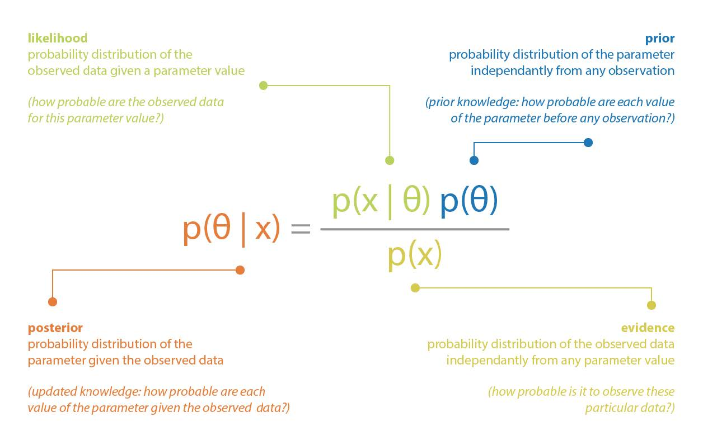
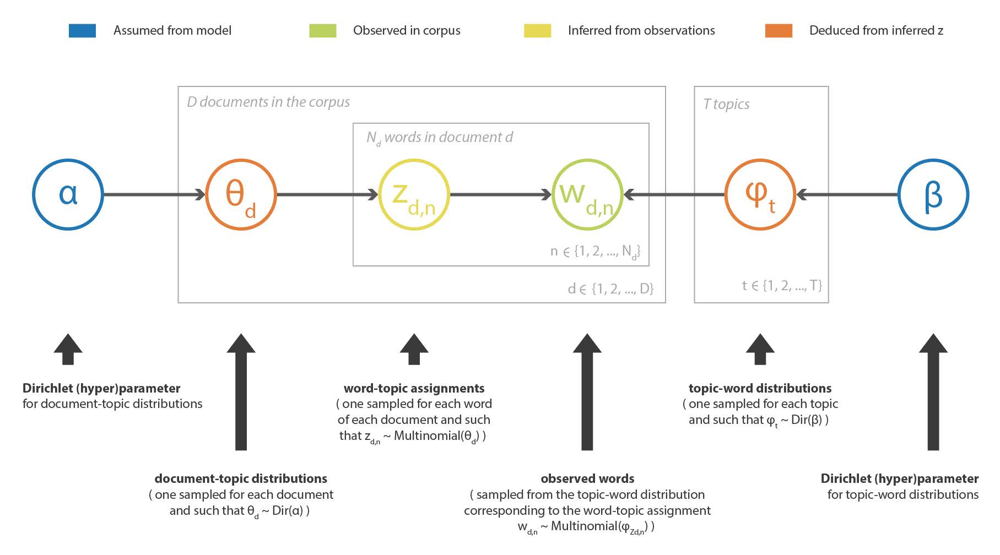
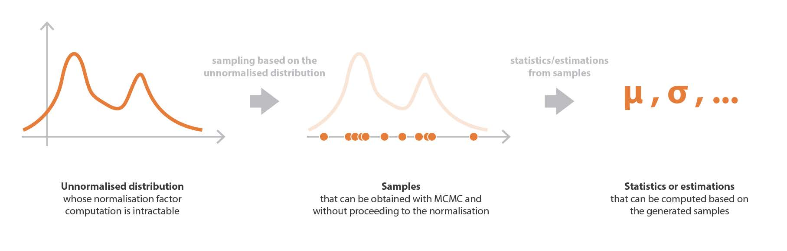
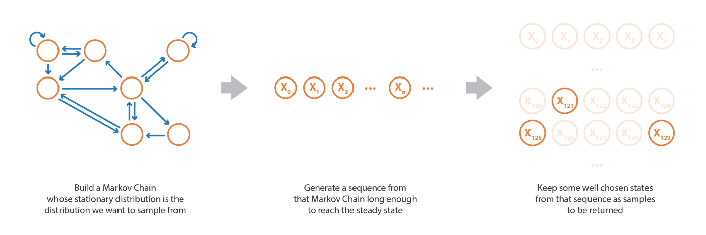
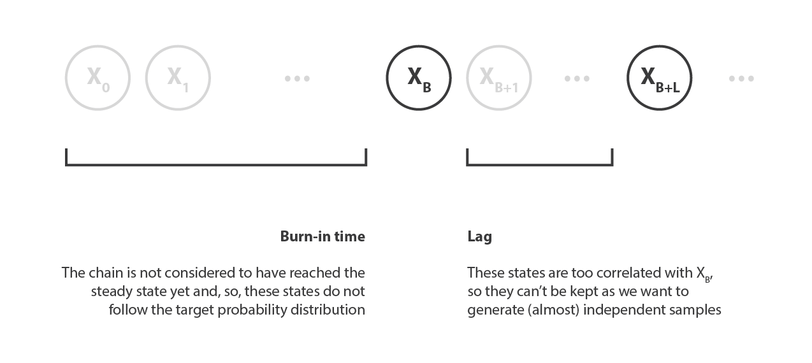
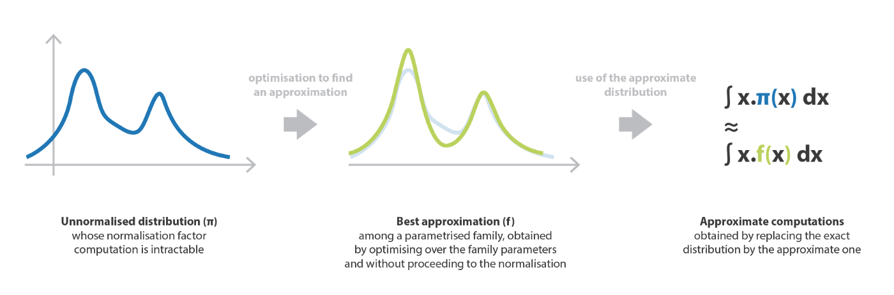
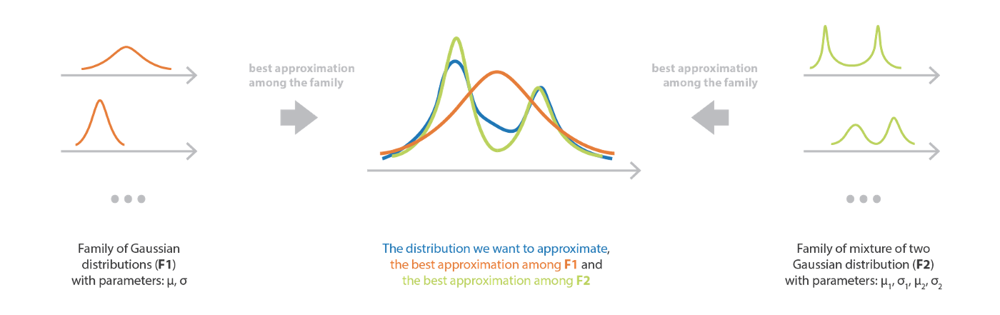
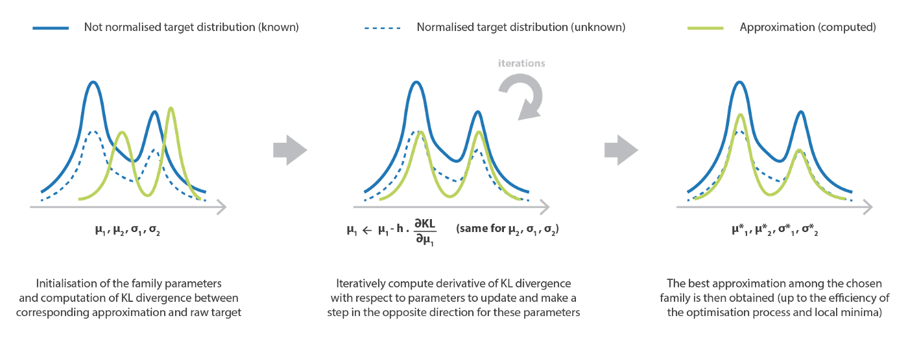

---
title: Bayesian inference problem, MCMC and variational inference
original: <https://towardsdatascience.com/bayesian-inference-problem-mcmc-and-variational-inference-25a8aa9bce29>
author: Joseph Rocca
date: 2019    
---    

# ベイズ推論問題 MCMC と変分推論
<!-- # Bayesian inference problem, MCMC and variational inference-->

## 統計学におけるベイズ推定問題の概要
<!-- Overview of the Bayesian inference problem in statistics. -->

Joseph Rocca, Jul 1, 2019

* [Joseph Rocca ](https://medium.com/@joseph.rocca?source=post_page-----25a8aa9bce29--------------------------------)
<!-- (https://medium.com/@joseph.rocca?source=post_page-----f70510919f73--------------------------------) -->
<!-- * [Joseph Rocca ](https://medium.com/@joseph.rocca?source=post_page-----f70510919f73--------------------------------) -->
* [原著](https://towardsdatascience.com/bayesian-inference-problem-mcmc-and-variational-inference-25a8aa9bce29)
* 本記事は [Baptiste Rocca](https://medium.com/u/20ad1309823a?source=post_page-----25a8aa9bce29--------------------------------) との共著

# 1. はじめに
<!-- ## Introduction -->

ベイズ推定は，統計学における主要な問題であり，多くの機械学習法においても遭遇する問題である。
例えば，分類のためのガウス混合モデルやトピックモデリングのための Latent Dirichlet Allocation などは，いずれもデータをフィッティングする際にこの問題を解決する必要があるグラフィカルモデルである。
<!-- Bayesian inference is a major problem in statistics that is also encountered in many machine learning methods. 
For example, Gaussian mixture models, for classification, or Latent Dirichlet Allocation, for topic modelling, are both graphical models requiring to solve such a problem when fitting the data. -->

一方で，ベイズ推定問題は，モデルの設定 (仮定，次元数など) によっては，非常に難しい問題になることがある。
大規模な問題では，厳密な解を得るためには膨大な計算が必要となり，しばしば手に負えなくなる。この問題を克服し，高速でスケーラブルなシステムを構築するためには，いくつかの近似技術を使用する必要がある。
<!-- Meanwhile, it can be noticed that Bayesian inference problems can sometimes be very difficult to solve depending on the model settings (assumptions, dimensionality, …). 
In large problems, exact solutions require, indeed, heavy computations that often become intractable and some approximation techniques have to be used to overcome this issue and build fast and scalable systems.  -->

この記事では，ベイズ推論の問題に取り組むために使用できる 2 つの主な手法について説明する: サンプリングベースのアプローチである Markov Chain Monte Carlo (MCMC) と，近似ベースのアプローチである変分推論 Variational Inference (VI) である。
<!-- In this post we will discuss the two main methods that can be used to tackle the Bayesian inference problem: Markov Chain Monte Carlo (MCMC), that is a sampling based approach, and Variational Inference (VI), that is an approximation based approach.  -->

## 1.1 概要
<!-- ## Outline -->

最初の節では，ベイズ推論問題について説明し，この問題が自然に現れる古典的な機械学習の応用例をいくつか見てみる。
そして第 2 章では，この問題を解決するためのグローバルな MCMC 手法を紹介し，2 つの MCMC アルゴリズムについて詳細を述べる。
Metropolis-Hasting と Gibbs Sampling である。
最後に第 3 章では，変分推論を紹介し，パラメータ化された分布群に対する最適化過程を経て，どのように近似解が得られるかを見ていく。
<!-- 
In the first section we will discuss the Bayesian inference problem and see some examples of classical machine learning applications in which this problem naturally appears. 
Then in the second section we will present globally MCMC technique to solve this problem and give some details about two MCMC algorithms: Metropolis-Hasting and Gibbs Sampling. 
Finally in the third section we will introduce Variational Inference and see how an approximate solution can be obtained following an optimisation process over a parametrised family of distributions. -->

注:  (∞) でマークされた節はかなり数学的なので，このポストの全体的な理解を妨げることなくスキップすることができる。
また，この記事では，$p(.)$ は，文脈に応じて，確率，確率密度，確率分布のいずれかを表すために使用されていることに注意。
<!-- >  Note. The subsection marked by a (∞) are pretty mathematical and can be skipped without hurting the global understanding of this post. 
Notice also that in this post p(.) is used to denote either probability, probability density or probability distribution depending on the context.-->

# 2. ベイズ推論問題
<!-- ## The Bayesian inference problem -->

本節では，ベイズ推論問題を提示し，いくつかの計算上の困難さを議論した後，この問題に遭遇するトピックモデリングの具体的な機械学習手法である Latent Dirichlet Allocation の例を示す。
<!-- In this section we present the Bayesian inference problem and discuss some computational difficulties before giving the example of Latent Dirichlet Allocation, a concrete machine learning technique of topic modelling in which this problem is encountered. -->

## 2.1 推論とは何か？
<!--## 2.1 What is inference? -->

統計的推論とは，観察したものに基づいて，観察していないものについて学ぶことである。
言い換えれば，母集団または母集団の標本で観察された変数 (多くの場合，影響) に基づいて，母集団のいくつかの潜在的な変数 (多くの場合，原因) について， 時間的推定，信頼区間または分布推定などの結論を導く過程である。
<!-- Statistical inference consists in learning about what we do not observe based on what we observe. 
In other words, it is the process of drawing conclusions such as punctual estimations, confidence intervals or distribution estimations about some latent variables (often causes) in a population, based on some observed variables (often effects) in this population or in a sample of this population. -->

特にベイズ推論は，ベイジアンの視点で統計的推論を行う過程である。
つまり，ベイズのパラダイムは，確率分布でモデル化された事前知識が，別の確率分布でモデル化された不確実性を持つ新しい観測結果が記録されるたびに更新される，統計的／確率的なパラダイムである。
ベイジアンパラダイムを支配する全体的な考え方は，更新された知識 (事後)，
事前知識 (事前)，および観測から得られる知識 (尤度) の間の関係を表現する，いわゆるベイズ定理に組み込まれている。
<!-- In particular, Bayesian inference is the process of producing statistical inference taking a Bayesian point of view. 
In short, the Bayesian paradigm is a statistical/probabilistic paradigm in which a prior knowledge, modelled by a probability distribution, is updated each time a new observation, whose uncertainty is modelled by another probability distribution, is recorded. 
The whole idea that rules the Bayesian paradigm is embed in the so called Bayes theorem that expresses the relation between the updated knowledge (the “posterior”), the prior knowledge (the “prior”) and the knowledge coming from the observation (the “likelihood”).
-->

古典的な例としてパラメータのベイズ推論がある。
データ $x$ が未知のパラメータ $\theta$ に依存する確率分布から生成されるモデルを想定してみよう。
また，パラメータ $\theta$ について，確率分布 $p(\theta)$ として表現できる事前知識を持っているとする。
そして，データ $x$ が観測されたとき，ベイズの定理を用いてこのパラメータに関する事前知識を次のように更新することができる:
<!-- A classical example is the Bayesian inference of parameters. 
Let’s assume a model where data x are generated from a probability distribution depending on an unknown parameter θ. 
Let’s also assume that we have a prior knowledge about the parameter θ that can be expressed as a probability distribution p(θ). 
Then, when data x are observed, we can update the prior knowledge about this parameter using the Bayes theorem as follows 
-->

 

図 1. 観測されたデータからパラメータを推定する際に適用されるベイズの定理の説明
<!-- Illustration of the Bayes theorem applied to the inference of a parameter given observed data. -->

## 2.2 計算上の問題点
<!-- ## Computational difficulties -->

ベイズの定理によれば，事後評価の計算には，事前，尤度，証拠の 3 つの項が必要であるとされている。
最初の 2 つは，想定されるモデルの一部であるため，簡単に表現することができる (多くの状況では，事前と尤度は明示的に知られている)。
しかし，3 つ目の項，つまり正規化係数は，以下のように計算する必要がある: 
<!-- The Bayes theorem tells us that the computation of the posterior requires three terms: a prior, a likelihood and an evidence. 
The first two can be expressed easily as they are part of the assumed model (in many situation, the prior and the likelihood are explicitly known). 
However, the third term, that is a normalisation factor, requires to be computed such that -->

$$
p(x)= \int_{\theta}p(x\vert\theta)\;p(\theta)\;d\theta.
$$

この積分は低次元ではそれほど困難なく計算できるが，高次元では難解になることがある。
この場合，事後分布を厳密に計算することは現実的に不可能であり，この事後分布を知る必要がある問題 (例えば，平均の計算など) の解を得るためには，何らかの近似的な手法を用いなければならない。
<!-- Although in low dimension this integral can be computed without too much difficulties, it can become intractable in higher dimensions. 
In this last case, the exact computation of the posterior distribution is practically infeasible and some approximation techniques have to be used to get solutions to problems that require to know this posterior (such as mean computation, for example).
-->

ベイズ推定問題には，例えば変数が離散的である場合の組合せ問題など，他の計算上の困難が生じることがあることに気付くことができる。
これらの困難を克服するために最もよく使われるアプローチとして，マルコフ連鎖モンテカルロ法と変分推論法がある。
この記事の後半で，特に「正規化因子問題」に焦点を当てて，この 2 つのアプローチについて説明するが，ベイズ推定に関連する他の計算上の困難に直面したときにも，これらの方法が重要になることを覚えておく必要がある。
<!-- We can notice that some other computational difficulties can arise from Bayesian inference problem such as, for example, combinatorics problems when some variables are discrete. 
Among the approaches that are the most used to overcome these difficulties we find Markov Chain Monte Carlo and Variational Inference methods. Later in this post, we will describe these two approaches focusing especially on the “normalisation factor problem” but one should keep in mind that these methods can also be precious when facing other computational difficulties related to Bayesian inference.
-->

次節以降でもう少し一般化するが，$x$ が所与であり，パラメータとして扱えるので，$\theta$ の確率分布が正規化因子まで定義されている状況に直面することができる。
<!-- In order to make things a lit bit more general for the upcoming sections, we can observe that, as x is supposed to be given and can, so, be teated as a parameter, we face a situation where we have a probability distribution on θ defined up to a normalisation factor
-->

$$
\pi_{x}(\theta) \equiv p(\theta\vert x)\propto p(x\vert\theta)\;p(\theta)\equiv g_{x}(\theta)
$$

次の 2 節で MCMC と VI を説明する前に，潜在ディレクリ配置 Latent Dirichlet Allocation を用いた機械学習におけるベイズ推論問題の具体例を挙げる。
<!-- Before describing MCMC and VI in the next two sections, let’s give a concrete example of Bayesian inference problem in machine learning with Latent Dirichlet Allocation. -->

### 2.2.1 例
<!-- ### 2.2.1 Example-->

ベイズ推定問題は、例えば確率的グラフィカルモデルを仮定した機械学習手法において，ある観測値が与えられたときに，そのモデルの潜在変数を復元したい場合に，自然に現れるものである。
トピックモデリングでは，LDA (Latent Dirichlet Allocation) 法がコーパス中のテキストの記述のためにこのようなモデルを定義している。
したがって，サイズ V の完全なコーパスの語彙と与えられたトピック数 T が与えられたとき，このモデルは以下のように仮定する:
<!--
Bayesian inference problem naturally appears, for example, in machine learning methods that assume a probabilistic graphical model and where, given some observations, we want to recover latent variables of the model. 
In topic modelling, the Latent Dirichlet Allocation (LDA) method defines such a model for the description of texts in a corpus. 
Thus, given the full corpus vocabulary of size V and a given number of topics T, the model assumes:
-->

- 各トピックについて，語彙に対する「トピック-単語」確率分布が存在する(Dirichlet 事前分布を仮定)。
- 各文書に対して，トピックに対する「文書-トピック」確率分布が存在する (これもディリクレ事前分布を仮定)。
- 文書内の各単語は，まず文書の「文書-トピック」分布からトピックを抽出し，次に，抽出されたトピックに付随する「トピック-単語」分布から単語を抽出するようにサンプリングされる。
<!-- - there exists, for each topic, a “topic-word” probability distribution over the vocabulary (with a Dirichlet prior assumed) 
- there exists, for each document, a “document-topic” probability distribution over the topics (with another Dirichlet prior assumed) 
- each word in a document have been sampled such that, first, we have sampled a topic from the “document-topic” distribution of the document and, second, we have sampled a word from the “topic-word” distribution attached to the sampled topic
-->

この手法の目的は，観測されたコーパスの潜在的なトピックと，各文書のトピック分解を推定することである (モデルで仮定されたディリクレ事前分布に由来)。
LDA の詳細は省略するが，非常に大雑把に言えば，コーパスに含まれる単語のベクトルを $w$, これらの単語に関連するトピックのベクトルを $z$ とすると，観測された $w$ に基づいてベイズ的手法で $z$ を推定することである。
<!-- The purpose of the method, whose name comes from the Dirichlet priors assumed in the model, is then to infer the latent topics in the observed corpus as well as the topic decomposition of each documents. 
Even if we won’t dive into details of LDA, we can say very roughly, denoting w the vector of words in the corpus and z the vector of topics associated to these words, that we want to infer z based on the observed w in a Bayesian way:
-->

$$
p(z\vert w) =\frac{p(w\vert z)p(z)}{p(w)} = \frac{p(w\vert z)p(z)}{\int_{z}p(w\vert z)\;p(z)\;dz}.
$$

ここでは，次元が大きいために正規化因子が絶対的に困難であることに加え，(問題のいくつかの変数が離散的であるため) 組合せ的な問題に直面し，MCMC か VI を使って近似解を得る必要がある。
トピックモデリングとその基礎となるベイズ推定問題に興味のある読者は LDA に関する [この参考文献](http://www.jmlr.org/papers/volume3/blei03a/blei03a.pdf) を参照。
<!-- Here, beyond the fact that the normalisation factor is absolutely intractable due to a huge dimensionality, we face a combinatoric challenge (as some variables of the problem are discrete) that require to use either MCMC or VI to get an approximate solution. 
The reader interested by topic modelling and its specific underlying Bayesian inference problem can take a look at this reference paper on LDA.
-->

 

図 2. Latent Dirichlet Allocation の説明図
<!-- Illustration of the Latent Dirichlet Allocation method. -->

# 3. マルコフ・チェーン・モンテカルロ法 (MCMC)
<!-- # Markov Chains Monte Carlo (MCMC)-->

先に述べたように，ベイズ推定問題を扱う際に直面する主な困難の 1 つは，正規化因子に由来するものである。
本節では，この問題とベイズ推定に関連する他のいくつかの計算上の困難を克服するための可能な解決策を構成する MCMC サンプリング法について説明する。
<!-- As we mentioned before, one of the main difficulty faced when dealing with a Bayesian inference problem comes from the normalisation factor. 
In this section we describe MCMC sampling methods that constitute a possible solution to overcome this issue as well as some others computational difficulties related to Bayesian inference.
-->

## 3.1 サンプリングの方法
<!-- ## 3.1 The sampling approach-->

サンプリング法の考え方は以下の通りである。
まず，ある係数まで定義された確率分布からサンプルを抽出する方法 (MCMC) があるとする。
すると，事後確率を含む難解な計算を扱う代わりに，この分布からサンプルを得て (正規化されていない部分の定義だけを用いて)， これらのサンプルを用いて平均や分散などの様々な時間的統計量を計算したり，カーネル密度推定によって分布を近似したりすることができる。
<!--The idea of sampling methods is the following. 
Let’s assume first that we have a way (MCMC) to draw samples from a probability distribution defined up to a factor. 
Then, instead of trying to deal with intractable computations involving the posterior, we can get samples from this distribution (using only the not normalised part definition) and use these samples to compute various punctual statistics such as mean and variance or even to approximate the distribution by Kernel Density Estimation.-->

次節で述べる VI 法とは対照的に，MCMC 法は調査した確率分布 (ベイズ推論の場合の事後値) に対してモデルを仮定しない。
その結果，これらの方法はバイアスは低いが分散が大きく，ほとんどの場合，VI から得られる結果よりもコストがかかるが，より正確であることを意味する。
<!-- Contrarily to VI methods described in the next section, MCMC approaches assume no model for the studied probability distribution (the posterior in the Bayesian inference case). 
As a consequence, these methods have a low bias but a high variance and it implies that results are most of the time more costly to obtain but also more accurate than the one we can get from VI. -->

本節の最後に，今述べたサンプリング過程は，ベイズ推定の事後分布に限定されるものではなく，より一般的に，確率分布がその正規化因子まで定義されているあらゆる状況で使用できることを，もう一度概説する。
<!-- To conclude this subsection, we outline once more the fact that this sampling process we just described is not constrained to the Bayesian inference of posterior distribution and can also, more generally, be used in any situation where a probability distribution is defined up to its normalisation factor.-->

図 3. サンプリング手法（MCMC）の説明図。
<!-- Illustration of the sampling approach (MCMC). -->

## 3.2 MCMC の考え方
<!-- ## 3.2 The idea of MCMC-->

統計学において，マルコフ連鎖モンテカルロ法は，与えられた確率分布からサンプルを生成することを目的としている。
この手法の名前の「モンテカルロ」の部分はサンプリングの目的からきており「マルコフ連鎖」の部分はこれらのサンプルを得る方法からきている (読者は [マルコフ連鎖についての入門記事](https://towardsdatascience.com/brief-introduction-to-markov-chains-2c8cab9c98ab) を参照)。
<!-- In statistics, Markov Chain Monte Carlo algorithms are aimed at generating samples from a given probability distribution. 
The “Monte Carlo” part of the method’s name is due to the sampling purpose whereas the “Markov Chain” part comes from the way we obtain these samples (we refer the reader to our introductory post on Markov Chains). -->

サンプルを生成するためには，サンプリングしたい定常分布を持つマルコフ連鎖を設定することである。
そして，そのマルコフ連鎖から，定常状態に (ほぼ) 到達するのに十分な長さのランダムな状態列をシミュレートし，生成されたいくつかの状態をサンプルとして保持することができる。
<!-- In order to produce samples, the idea is to set up a Markov Chain whose stationary distribution is the one we want to sample from. 
Then, we can simulate a random sequence of states from that Markov Chain that is long enough to (almost) reach the steady state and then keep some generated states as our samples. -->

確率変数の生成手法の中でも MCMC はかなり高度な手法であり (他の手法については [GAN に関する投稿](https://towardsdatascience.com/understanding-generative-adversarial-networks-gans-cd6e4651a29) ですでに説明した)，**乗法定数までしか定義できない非常に難しい確率分布からサンプルを取得することが可能** である。
MCMC で正規化されていない分布からサンプルを得ることができるという直感に反する事実は，これらの正規化因子に影響されないマルコフ連鎖を定義する特定の方法からきています。
<!--Among the random variables generation techniques, MCMC is a pretty advanced kind of methods (we already discussed an other method in our post about GANs) that makes possible to get samples from a very difficult probability distribution potentially defined only up to a multiplicative constant. 
The counter-intuitive fact that we can obtain, with MCMC, samples from a distribution not well normalised comes from the specific way we define the Markov Chain that is not sensitive to these normalisation factor. -->

 
<!--   -->

図 4. マルコフ連鎖モンテカルロ法は，因子まで定義できる難しい確率分布からサンプルを生成することを目的としている
<!-- The Markov Chain Monte Carlo approach is aimed at generating samples from a difficult probability distribution that can be defined up to a factor. -->

## 3.3 マルコフ連鎖の定義
<!-- ## 3.3 Definition of the Markov Chain-->

MCMC のアプローチ全体は，サンプリングしたいものを定常分布とするマルコフ連鎖を構築する能力に基づいている。
これを実現するために，メトロポリス・ヘイスティングとギブスサンプリングのアルゴリズムは，両方ともマルコフ連鎖の特別な性質である可逆性を利用する。
<!-- The whole MCMC approach is based on the ability to build a Markov Chain whose stationary distribution is the one we want to sample from. 
In order to do so, Metropolis-Hasting and Gibbs Sampling algorithms both use a particular property of Markov Chains: reversibility.-->

遷移確率を持つ状態空間 E 上のマルコフ連鎖を以下のように定義する:
<!-- A Markov Chain over a state space E with transition probabilities denoted by  -->

$$
\kappa(\alpha,\beta)\equiv p(X_ {n+1}=\beta\vert X_ {n}=\alpha),
$$

次のような確率分布 $\gamma$ が可逆であると言う。<!-- is said to be reversible if there exists a probability distribution γ such that -->

$$
\kappa(\alpha,\beta)\gamma(\alpha)=\kappa(\beta,\alpha)\gamma(\beta)\hspace{2cm}\forall \alpha,\beta\in E
$$

このようなマルコフ連鎖では，以下を容易に確認できる
<!-- For such Markov Chain, we can easily verify that we have -->

$$
\int_ {\beta\in E}\kappa(\beta,\alpha)\gamma(\beta)\,d\beta=\int_ {\beta\in E}\kappa(\alpha,\beta)\gamma(\alpha)\,d\beta=\gamma(\alpha)
$$

であり $\gamma$ は定常分布 (マルコフ連鎖が既約なら唯一) である。
<!-- and, then, γ is a stationary distribution (the only one if the Markov Chain is irreducible). -->

ここで，標本化したい確率分布 $\pi$ が，ある因子までしか定義されていないと仮定する
<!-- Let’s now assume that the probability distribution π we want to sample from is only defined up to a factor-->

$$
\pi(\cdot)=C\times g(\cdot)\propto g(\cdot)
$$

(ここで C は未知の乗法定数)。
以下の同値が成立することに気づくことができる。
<!-- (where C is the unknown multiplicative constant). 
We can notice that the following equivalence holds-->

$$
\begin{aligned}
\kappa(\alpha,\beta)\pi(\alpha) &= \kappa(\beta,\alpha)\pi(\beta) \hspace{1cm}\forall \alpha,\beta\in E\\
\Leftrightarrow \kappa(\alpha,\beta)g(\alpha) &=\kappa(\beta,\alpha)g(\beta)\hspace{1cm}\forall\alpha,\beta\in E\\
\end{aligned}
$$

そして，最後の等式を検証するために定義された遷移確率  $\kappa(\cdot,\cdot)$ を持つマルコフ連鎖は，予想通り $\pi$ を定常分布として持つことになる。
このように，明示的に計算できない確率分布 $\pi$ を定常分布に持つマルコフ連鎖を定義することができる。
<!-- and, then, a Markov Chain with transition probabilities k(.,.) defined to verify the last equality will have, as expected, π as stationary distribution. 
Thus, we can define a Markov Chain that have for stationary distribution a probability distribution π that can’t be explicitly computed.-->

## 3.4 ギブスサンプリング遷移 (∞)
<!-- ### The Gibbs Sampling transitions (∞)-->

定義したいマルコフ連鎖が D 次元で，次のようなものであるとする: 
<!-- Let’s assume that the Markov Chain we want to define is D-dimensional, such that -->

$$
X_ {n} = \left(X_ {n,1}, X_ {n,2},\ldots, X_ {n,D}\right)
$$

**ギブスサンプリング法** は，結合確率が難解でも，ある一次元の条件付き分布が他の次元から与えられると計算できる，という仮定に基づいている。
この考え方に基づき，反復回数 $n+1$ において，次に訪れる状態が以下のような処理で与えられるように遷移が定義される。
<!-- The Gibbs Sampling method is based on the assumption that, even if the joint probability is intractable, the conditional distribution of a single dimension given the others can be computed. 
Based on this idea, transitions are defined such that, at iteration n+1, the next state to be visited is given by the following process.
-->

まず $X_ {n}$ の D 次元の中からランダムに整数 $d$ を選択する。
次に，他の次元を固定とした場合の条件付き確率に従って，その次元の新しい値をサンプリングする。
<!-- First we randomly choose an integer d among the D dimensions of X_n. 
Then we sample a new value for that dimension according to the corresponding conditional probability given that all the other dimensions are kept fixed: -->

$$
d\sim \text{Uniform}(\{1,2,\ldots,D\}), X_ {(n+1),j}= X_ {n,j}\hspace{1cm}\forall j\ne d\text{ and }X_ {(n+1),d}
\sim \pi_ {d}(\cdot\vert X_ {n,\neg d})
$$

ここで <!-- where -->

$$
\pi_ {d}(\cdot\vert X_ {n,\neg d})
=\frac{\pi(X_ {n,1},\ldots,X_ {n,(d-1)}\cdot X_ {n,(d+1)},\ldots, X_ {n,D})}{
    \int \pi(X_ {n,1},\ldots,X_ {n,(d-1)}\cdot X_ {n,(d+1)},\ldots, X_ {n,D})\,du}
=\frac{g(X_ {n,1},\ldots,X_ {n,(d-1)}\cdot X_ {n,(d+1)},\ldots, X_ {n,D})}{
    \int g(X_ {n,1},\ldots,X_ {n,(d-1)}\cdot X_ {n,(d+1)},\ldots, X_ {n,D})\,du}
$$

は，他のすべての次元が与えられたときの d 番目の次元の条件付き分布である。
<!-- is the conditional distribution of the d-th dimension given all the other dimensions.-->

形式的には
<!--Formally, if we denote -->

$$
\alpha\sim_{d}\beta \Leftrightarrow \alpha_ {i}=\beta_ {i}\hspace{1cm}\forall i\ne d
$$

とすると、遷移確率は次のように書ける
<!-- the transition probabilities can then be written -->

$$
\kappa(\alpha,\beta)= \left\{\begin{aligned}
\frac{1}{D} \frac{g(\beta)}{\int_ {\gamma\sim_ {d}\alpha} g(\gamma)d\gamma} & \hspace{1cm}\text{ if }\beta\sim_ {d}\alpha\\
0                                                                           & \hspace{1cm}\text{ otherwise}\\
\end{aligned}\right.
\hspace{1cm}\forall \beta\ne\alpha
$$

で期待通りの局所的なバランスが検証され，唯一の非自明なケースとなった。
<!-- and, so, the local balance is verified as expected with, for the only non-trivial case,-->

$$
g(\alpha)\kappa(\alpha,\beta)
= \frac{1}{D}\frac{g(\alpha)g(\beta)}{\int_ {\gamma\sim_ {d}\alpha}g(\gamma)d\gamma}
= \frac{1}{D}\frac{g(\beta)g(\alpha)}{\int_ {\gamma\sim_ {d}\beta}g(\gamma)d\gamma}
= g(\beta)\kappa(\beta,\alpha)
$$

## 3.5 メトロポリス・ヘイスティング遷移(∞)
<!-- ## 3.5 The Metropolis-Hasting transitions (∞)-->

ギブス法に関わる条件付き分布でさえ，あまりにも複雑で求めることができない場合がある。
そのような場合には，メトロポリス・ヘイスティングを利用することができる。
そのために，まず遷移を示唆する役割を果たす側面の遷移確率 $h(\cdot,\cdot)$  を定義する。
そして，反復 $n+1$ において，マルコフ連鎖が次に訪れるべき 状態を次のような過程で定義する。
まず，$h$ から「提案された遷移」$x$ を引き，それを受け入れる関連確率 $r$ を計算する。
<!--
Sometimes even conditional distributions involved in Gibbs methods are far too complex to be obtained. 
In such cases, Metropolis-Hasting can then be used. 
For this, we start by defining a side transition probability h(.,.) that will serve at suggesting transitions. 
Then, at iteration n+1, the next state to be visited by the Markov Chain is defined by the following process. 
We first draw a “suggested transition” x from h and compute a related probability r to accept it:
-->

$$
x\sim h(X_ {n},\cdot)\hspace{1cm}\text{and}\hspace{1cm}r=\min\left(1,\frac{g(x)h(x,X_ {n})}{g(X_ {n})h(X_ {n},x)}\right)
$$

そして、有効な遷移は以下のように選択される:
<!-- Then the effective transition is chosen such that-->

$$
X_ {n+1}=\left\{
\begin{aligned}
x      & \hspace{1cm}\text{ with probability } r\\
X_ {n} & \hspace{1cm}\text{ with probability } 1-r\\
\end{aligned}\right.
$$

形式的には，遷移確率は以下のように書くことができる: 
<!-- Formally, the transition probabilities can then be written -->

$$
\kappa(\alpha,\beta)= h(\alpha,\beta)\min\left(1,\frac{g(\beta)h(\beta,\alpha)}{g(\alpha)h(\alpha,\beta)}\right)\hspace{1cm}\forall\beta\ne\alpha
$$

ということで，予想通りローカルバランスが検証された。
<!-- and, so, the local balance is verified as expected-->

$$
\begin{aligned}
g(\alpha)\kappa(\alpha,\beta) &= g(\alpha)h(\alpha,\beta)\min\left(1,\frac{g(\beta)h(\beta,\alpha)}{g(\alpha)h(\alpha,\beta)}\right)=\min(g(\alpha)h(\alpha,\beta),g(\beta)h(\beta,\alpha))\\
                              &= g(\alpha)h(\alpha,\beta)\min\left(1,\frac{g(\beta)h(\beta,\alpha)}{g(\alpha)h(\alpha,\beta)}\right)=g(\beta)\kappa(\beta,\alpha)\\
\end{aligned}
$$

## 3.6 サンプリング過程
<!-- ## 3.6 The sampling process-->

マルコフ連鎖が定義できたら，ランダムな状態列 (ランダムに初期化) をシミュレートし，そのうちのいくつかは，目標とする分布に従うと同時に独立であるサンプルを得るように選択し続けることができる。
<!-- Once our Markov Chain has been defined, we can simulate a random sequence of states (randomly initialised) and keep some of them chosen such as to obtain samples that, both, follow the targeted distribution and are independent. -->

まず，狙った分布に (ほぼ) 従うサンプルを得るためには，マルコフ連鎖の定常状態 (定常状態は理論的には漸近的にしか到達しない) にほぼ到達するような生成系列の先頭から十分遠い状態のみを考慮する必要がある。
したがって，最初にシミュレートされた状態はサンプルとして使用できず，定常状態に到達するために必要なこの段階をバーンイン時間と呼ぶ。
実際には，このバーンイン時間の長さを知ることはかなり困難であることに注意。
<!-- First, in order to have samples that (almost) follow the targeted distribution, we need to only consider states far enough from the beginning of the generated sequence to have almost reach the steady state of the Markov Chain (the steady state being, in theory, only asymptotically reached). 
Thus, the first simulated states are not usable as samples and we call this phase required to reach stationarity the burn-in time. 
Notice that, in practice it is pretty difficult to know how long this burn-in time has to be. -->

次に (ほぼ) 独立なサンプルを得るためには，バーンイン時間後の系列の連続した状態を全て保持することはできない。
実際，マルコフ連鎖の定義では，2 つの連続した状態の間に強い相関があることを意味しており，ほぼ独立とみなせるほど互いに離れている状態のみをサンプルとして保持する必要がある。
実際には，ほぼ独立とみなされるために 2 つの状態の間に必要なラグは，自己相関関数の分析によって推定することができる (数値の場合のみ)。
<!--
Second, in order to have (almost) independent samples, we can’t keep all the successive states of the sequence after the burn-in time. 
Indeed, the Markov Chain definition implies a strong correlation between two successive states and we then need to keep as samples only states that are far enough from each other to be considered as almost independent.
In practice, the lag required between two states to be considered as almost independent can be estimated through the analysis of the autocorrelation function (only for numeric values).
-->

そこで，目標とする分布に従う独立なサンプルを得るために，生成された系列から，互いにラグ L だけ離れていて，バーンイン時間 B の後に来る状態を保持することにする。
従って，マルコフ連鎖の連続する状態を 
<!-- So, in order to get our independent samples that follow the targeted distribution, we keep states from the generated sequence that are separated from each other by a lag L and that come after the burn-in time B. 
Thus, if the successive states of the Markov Chain are denoted 
-->

$$
(X_ {n})_ {n\ge0}= X_ {0},X_ {1}, X_ {2},\ldots
$$

のみをサンプルとする。
<!-- we only keep as our samples the states-->

$$
X_ {B}, X_ {B+L}, X_ {B+2L}, X_ {B+3L},\ldots
$$

 
<!--  -->

図 5. MCMC サンプリングではバーンイン時間とラグを考慮する必要がある。
<!-- MCMC sampling requires to consider both a burn-in time and a lag. -->

# 4. 変分推論 (VI)
<!-- # 4. Variational Inference (VI)-->

推論問題に関連する計算の難しさを克服するもう一つの可能な方法は，パラメター化された族の中から分布の最良の近似を見つけることからなる変分推論法を用いることである。
この最良の近似を見つけるために，我々は (族のパラメータに対する) 最適化処理に従う。
<!--
Another possible way to overcome computational difficulties related to inference problem is to use Variational Inference methods that consist in finding the best approximation of a distribution among a parametrised family. 
In order to find this best approximation, we follow an optimisation process (over the family parameters) that only require the targeted distribution to be defined up to a factor.
-->

## 4.1 近似アプローチ
<!-- ## 4.1 The approximation approach-->

VI 法は，ある複雑な目標確率分布の最良の近似を，与えられた族の中から探索することからなる。
具体的には，パラメータ化された分布族を定義し，パラメータ上で最適化し，よく定義された誤差尺度に関して，目標に最も近い要素を得るというものである。
<!--
VI methods consist in searching for the best approximation of some complex target probability distribution among a given family. 
More specifically, the idea is to define a parametrised family of distributions and to optimise over the parameters to obtain the closest element to the target with respect to a well defined error measure.
-->

ここでまだ，正規化因子 C までで定義された確率分布 $\pi$ を考える。
<!-- Let’s still consider our probability distribution π defined up to a normalisation factor C:-->

$$
\pi(\cdot)=C\times g(\cdot)\propto g(\cdot)
$$

そして，より数学的に，パラメトリックな分布の族を表すと，以下のようになる: 
<!-- Then, in more mathematical terms, if we denote the parametrised family of distributions-->

$$
\mathcal{F}_ {\Omega} = \left\{f_ {\omega};\omega\in\Omega\right\}\hspace{2cm}\Omega\equiv\text{ set possible parameters}
$$

とし，2 つの分布 $p$ と $q$ の間の誤差尺度 $E(p,q)$ を考え，次のような最適なパラメータを探索する。
<!-- and we consider the error measure E(p,q) between two distributions p and q, we search for the best parameter such that-->

$$
\omega^ {\star}=\text{argmin}_ {\omega\in\Omega} E(f_ {\omega},\pi)
$$

もし $\pi$ を明示的に正規化することなくこの最小化問題を解くことができれば，難解な計算を扱う代わりに，$f_ {\omega}^ {\star}$ を近似値として用いて様々な量を推定することができるようになる。
変分推論が意味する最適化問題は，直接の計算 (正規化，組合せ論,...) よりはるかに単純に扱えるはずである。
<!-- If we can solve this minimisation problem without having to explicitly normalise π, we can use f_𝜔* as an approximation to estimate various quantities instead of dealing with intractable computations. 
The optimisation problem implied by variational inference approaches is, indeed, supposed to be much simpler to handle than issues coming from direct computations (normalisation, combinatorics, …).-->

サンプリングアプローチとは異なり，モデル (パラメトリック族) が仮定されるため，バイアスがかかるが分散も小さくなる。
一般に VI 法は MCMC 法より精度が劣るが，より速く結果が得られる。
これらの方法は，大規模で非常に統計的な問題によりよく適応している。
<!-- Contrarily to sampling approaches, a model is assumed (the parametrised family), implying a bias but also a lower variance. 
In general VI methods are less accurate that MCMC ones but produce results much faster: these methods are better adapted to big scale, very statistical, problems.
-->

 
<!--   -->

図 6. 近似アプローチ (変分推論) の説明図
<!-- Illustration of the approximation approach (Variational Inference). -->

## 4.2 分布族
<!-- ## 4.2 Family of distribution-->

最初に設定する必要があるのは，最良の近似を探索する空間を定義するパラメータ化された分布族である。
<!-- The first thing we need to set up is the parametrised family of distributions that defines the space in which we search for our best approximation. -->

族を選択することで，手法の偏りと複雑さの両方を制御するモデルが定義される。
かなり限定的なモデル (単純族) を仮定すると，バイアスは高くなるが，最適化処理は単純になる。
逆に，かなり自由なモデル (複雑な族) を仮定すると，バイアスはかなり低くなるが，最適化は難しくなります (難解ではないにしても)。
このように，最終的な近似の品質を保証するのに十分な複雑な族と，最適化処理を扱いやすくするのに十分な単純な族の間の適切なバランスを見出す必要がある。
もし，族内のどの分布も目標分布に近くない場合は，最良の近似であっても悪い結果になることを心に留めておく必要がある。
<!--
The choice of the family defines a model that control both the bias and the complexity of the method. 
If we assume a pretty restrictive model (simple family) then we have a high bias but the optimisation process is simple. 
On the contrary, if we assume a pretty free model (complex family) the bias is much lower but the optimisation is harder (if not intractable). 
Thus, we have to find the right balance between a family that is complex enough to ensure a good quality of the final approximation and a family that is simple enough to make the optimisation process tractable. 
We should keep in mind that if no distribution in the family is close to the target distribution, then even the best approximation can give poor results.
-->

**平均場変分族** は，考慮されたランダムベクトルのすべての成分が独立である確率分布族である。
この系列の分布は，各独立成分が積の異なる因子によって支配されるような積密度を持つ。
したがって，平均場変分族に属する分布は，次のように書くことができる密度を持つ。
<!-- The mean-field variational family is a family of probability distributions where all the components of the considered random vector are independent. 
Distributions from this family have product densities such that each independent component is governed by a distinct factor of the product. 
Thus, a distribution that belongs to the mean-field variational family has a density that can be written -->

$$
f(z)=\prod_ {j=1}^ {m}f_ {j}(z_ {j})
$$

ここで $m$ 次元の確率変数 $z$ を仮定している。
表記が省略されていても，すべての密度 $f_ {j}$  はパラメータ化されていることに注意。
例えば，各密度 $f_ {j}$ が平均と分散のパラメータを持つ正規分布である場合，大域的密度 $f$ はすべての独立した要因から来るパラメータのセットによって定義され，最適化はこのパラメータのセット全体に対して行わる。
<!-- where we have assumed a m-dimensional random variable z. 
Notice that, even if it has been omitted in the notation, all the densities f_j are parametrised. 
So, for example, if each density f_j is a Gaussian with both mean and variance parameters, the global density f is then defined by a set of parameters coming from all the independent factors and the optimisation is done over this entire set of parameters.
-->

 
<!--  -->

図 7. 変分推論における分布族の選択は，最適化処理過程の難易度と最終的な近似の質の両方を設定する
<!-- The choice of the family in variational inference sets both the difficulty of the optimisation process and the quality of the final approximation. -->

## 4.3 カルバック・ライブラー・ダイバージェンス
<!-- ## 4.3 Kullback-Leibler divergence-->

分布族が定義されれば，与えられた確率分布 (正規化因子まで明示的に定義されている) の最良の近似を，この分布族の中からどのように見つけるか，という問題である。
最良近似は明らかに我々が考慮する誤差測定の性質に依存するとしても，我々が比較したいのは量そのものよりも量分布 (確率分布としてはユニタリーでなければならない) なので、最小化問題は正規化因子に敏感であってはならないと考えるのは極めて自然だと思われる。
<!--
Once the family has been defined, one major question remains: how to find, among this family, the best approximation of a given probability distribution (explicitly defined up to its normalisation factor)? 
Even if the best approximation obviously depends on the nature of the error measure we consider, it seems pretty natural to assume that the minimisation problem should not be sensitive to normalisation factors as we want to compare masses distributions more than masses themselves (that have to be unitary for probability distributions).
-->

そこで，カルバック・ライブラー (KL) ダイバージェンスを定義し，この尺度が問題を正規化要因に左右されなくすることを見てみよう。
$p$ と $q$ を 2 つの分布とすると，KL ダイバージェンスは以下のように定義される: 
<!-- So, let’s now define the Kullback-Leibler (KL) divergence and see that this measure makes the problem insensitive to normalisation factors. 
If p and q are two distributions, the KL divergence is defined as follows
-->

$$
KL(p,q)=\mathbb{E}_ {z\sim p}\left[\log p(z)\right] - \mathbb{E}_ {z\sim p}\left[\log q(z)\right]
$$

この定義により，容易に以下を得る:
<!-- From that definition, we can pretty easily see that we have -->

$$
KL(f_ {\omega}, C_ {g})=\mathbb{E}_ {z\sim f_ {\omega}}\left[\log f_ {\omega}(z)\right]-\mathbb{E}_ {z\sim f_ {\omega}}\left[\log(C_ {g}(z))\right]
= \mathbb{E}_ {z\sim f_ {\omega}}\left[\log f_ {\omega}(z)\right]-\mathbb{E}_ {z\sim f_ {\omega}}\left[\log g(z)\right] -\log C.
$$

これは最小化問題に対して以下の等式を意味する。
<!-- which implies the following equality for our minimisation problem -->

$$
\omega^ {\star}=\text{arg min}_ {\omega\in\Omega}\text{KL}(f_ {\omega},\pi)=\text{arg min}_ {\omega\in\Omega}\text{KL}(f_ {\omega}, C_ {g}) = \text{arg min}_ {\omega\in\Omega}\text{KL}(f_ {\omega}, g)
$$

このように，誤差指標として KL ダイバージェンスを選択した場合，最適化処理は乗法係数に影響されず，予想されたように，対象となる分布の苦しい正規化因子を計算することなく，パラメトリックな分布群の中から最良の近似値を探索することができる。
<!-- Thus, when choosing KL divergence as our error measure, the optimisation process is not sensitive to multiplicative coefficients and we can search for the best approximation among our parametrised family of distributions without having to compute the painful normalisation factor of the targeted distribution, as it was expected. -->

最後に，副次的な事実として KL ダイバージェンスは交差エントロピーからエントロピーを引いたものであり，情報理論において素晴らしい解釈を持っていることに注目して，本節を締めくくる。
<!-- Finally, as a side fact, we can conclude this subsection by noticing for the interested readers that the KL divergence is the cross-entropy minus the entropy and has a nice interpretation in information theory. -->

## 4.4 最適化処理と直観的な理解
<!-- ## 4.4 Optimisation process and intuition-->

パラメトリック族と誤差測定の両方が定義されると，パラメータを初期化し (ランダムに，または明確に定義された戦略に従って)，最適化に進むことができる。
勾配降下や座標降下など，いくつかの古典的な最適化手法を用いることができ，実際には局所的な最適値に到達することになる。
<!--
Once both the parametrised family and the error measure have been defined, we can initialise the parameters (randomly or according to a well defined strategy) and proceed to the optimisation. 
Several classical optimisation techniques can be used such as gradient descent or coordinate descent that will lead, in practice, to a local optimum.
-->

この最適化過程をよりよく理解するために，ベイズ推定問題の具体的なケースに戻り，次のような事後分布を仮定する。
<!-- In order to better understand this optimisation process, let’s take an example and go back to the specific case of the Bayesian inference problem where we assume a posterior such that
-->

$$
p(z\vert x)\propto p(x\vert z)p(z) = p(x,z)
$$

この場合，変分推論を用いてこの事後推定値の近似値を得ようとすると，以下の最適化過程を解く必要がある (パラメター化された族が定義され，誤差指標として KLダイバージェンスを仮定する場合)。
<!-- In this case, if we want to get an approximation of this posterior using variational inference, we have to solve the following optimisation process (assuming the parametrised family defined and KL divergence as error measure) -->

$$
\begin{aligned}
\omega^ {\star} &=\text{argmin}_ {\omega\in\Omega} \text{KL}(f_ {\omega}(z), p(z\vert x))\\
 &=\text{argmin}_ {\omega\in\Omega} \text{KL}(f_ {\omega}(z), p(x,z))\\
 &=\text{argmax}_ {\omega\in\Omega} \left(-\text{KL}(f_ {\omega}(z), p(x,z)\right)\\
 &=\text{argmax}_ {\omega\in\Omega}\left(\mathbb{E}_ {z\sim f_ {\omega}}\left[\log p(z)\right] + \mathbb{E}_ {z\sim f_ {\omega}}\left[\log p(x\vert z)   \right] - \mathbb{E}_ {z\sim f_ {\omega}}\left[\log f_ {\omega}(z)\right]\right)\\
 &=\text{argmax}_ {\omega\in\Omega} \left(\mathbb{E}_ {z\sim f_ {\omega}}\left[\log p(x\vert z)\right]- \text{KL}(f_ {\omega},p(z))\right)\\
\end{aligned}
$$

最後の等式は，近似値がどのようにその量を分配するように促されるかをよりよく理解するのに役立つ。
最初の項は，期待対数尤度で，観測されたデータを最もよく説明する潜在変数 $z$ の値に近似の量を配置するようにパラメータを調整する傾向がある。
第 2 項は，近似と事前分布の間の負の KL ダイバージェンスであり，近似を事前分布に近づけるためにパラメータを調整する傾向がある。
したがって，この目的関数は，通常の事前分布と尤度のバランスをよく表している。
<!-- The last equality helps us to better understand how the approximation is encouraged to distribute its mass. 
The first term is the expected log-likelihood that tends to adjust parameters so that to place the mass of the approximation on values of the latent variables z that explain the best the observed data. 
The second term is the negative KL divergence between the approximation and the prior that tends to adjust the parameters in order to make the approximation be close to the prior distribution. 
Thus, this objective function expresses pretty well the usual prior/likelihood balance.
-->

 
<!--  -->

図 8. 変分推論アプローチの最適化過程
<!-- Optimisation process of the Variational Inference approach. -->

# 5. お持ち帰り
<!-- # Takeaways-->

この記事の主な点，以下の通り:
<!-- The main takeways of this article are: -->

* ベイズ推定は統計学や機械学習におけるかなり古典的な問題で，よく知られたベイズの定理に依存している。その主な欠点は，ほとんどの場合，いくつかの非常に重い計算である。
* マルコフ連鎖モンテカルロ法 (MCMC) は，非常に複雑な密度や，ある係数まで定義された密度からサンプルをシミュレートすることを目的としている。
* MCMC は，ベイズ推定において，難解な計算を扱う代わりに，事後的に「正規化されていない部分」から直接，作業するためのサンプルを生成するために使用することができる。
* 変分推論 (VI) は分布を近似するための手法で，パラメータに対する最適化処理を用いて，与えられた族の中から最良の近似を見つける。
* VI 最適化処理は対象分布の乗法定数に影響されないので，ある正規化係数までしか定義されていない事後分布を近似するのに使用できる。

<!--
* Bayesian inference is a pretty classical problem in statistics and machine learning that relies on the well known Bayes theorem and whose main drawback lies, most of the time, in some very heavy computations 
* Markov Chain Monte Carlo (MCMC) methods are aimed at simulating samples from densities that can be very complex and/or defined up to a factor 
* MCMC can be used in Bayesian inference in order to generate, directly from the “not normalised part” of the posterior, samples to work with instead of dealing with intractable computations 
* Variational Inference (VI) is a method for approximating distributions that uses an optimisation process over parameters to find the best approximation among a given family 
* VI optimisation process is not sensitive to multiplicative constant in the target distribution and, so, the method can be used to approximate a posterior only defined up to a normalisation factor
-->

すでに述べたように，MCMC 法と VI 法は異なる特性を持っており，それは異なる典型的な使用例を意味する。
一方では MCMC アプローチのサンプリング処理はかなり重いが，バイアスがないので，正確な結果を期待する場合には，時間を気にせずこれらの方法が好まれる。
一方 VI 法における族の選択は，明らかにバイアスをもたらす。だが，合理的な最適化処理を伴うので，これらの方法は，高速計算を必要とする非常に大規模な推論問題に特に適応している。
<!-- As already mentioned, MCMC and VI methods have different properties that imply different typical use cases. 
In one hand, the sampling process of MCMC approaches is pretty heavy but has no bias and, so, these methods are preferred when accurate results are expected, without regards to the time it takes. 
In the other hand, although the choice of the family in VI methods can clearly introduce a bias, it comes along with a reasonable optimisation process that makes these methods particularly adapted to very large scale inference problem requiring fast computations.
-->

MCMC と VI とのその他の比較は，[変分推論: 統計学者のためのレビュー](https://arxiv.org/pdf/1601.00670.pdf) 論文に記載されている。
VI にしか興味がない読者には強くお勧めする。
MCMC についての詳しい情報は，[この一般的な紹介論文](https://pdfs.semanticscholar.org/21a9/2825dcec23c743e77451ff5b5ee6b1091651.pdf) と，[機械学習指向の紹介論文](https://www.cs.ubc.ca/~arnaud/andrieu_defreitas_doucet_jordan_intromontecarlomachinelearning.pdf) をお勧めする。
LDA に適用される Gibbs サンプリングについてもっと知りたい方は，[Tutorial on Topic Modelling and Gibbs Sampling](http://u.cs.biu.ac.il/~89-680/darling-lda.pdf) を参照 ([LDA Gibbs Sampler についての講義ノート](http://www2.cs.uh.edu/~arjun/courses/advnlp/LDA_Derivation.pdf) と合わせて，慎重に導出することができる)。
<!-- Additional comparisons between MCMC and VI can be found in the excellent Variational Inference: A Review For Statisticians, that we also highly recommend for readers interested in VI only. 
For further readings about MCMC, we recommend this general introduction as well as this machine learning oriented introduction. The reader interested to learn more about Gibbs Sampling applied to LDA can refer to this Tutorial on Topic Modelling and Gibbs Sampling (combined with these lecture note on LDA Gibbs Sampler for cautious derivation).
-->

最後に，少しおちゃらけて，次回の記事で変分推論に基づく深層学習のアプローチである変分自己符号化器について述べることにしましょう。
それではご期待ください。
<!-- Finally, let’s conclude with a little bit of teasing and mention that in an upcoming post we will discuss Variational Auto Encoder, a deep learning approach that is based on variational inference… so stay tuned! -->

読んでくださってありがとうございます！もしあなたがそれに値すると思ったら、お気軽にシェアしてください。
<!-- Thanks for reading and feel free to share if you think it deserves to be! -->
