# 変分自己符号化器 (VAE:Variational Auto Encoders) の理解
<!-- # Understanding Variational Autoencoders (VAEs) -->
## VAE の理解へ導くステップ・バイ・ステップでの構築
<!-- ## Building, step by step, the reasoning that leads to VAEs. -->

* [Joseph Rocca ](https://medium.com/@joseph.rocca?source=post_page-----f70510919f73--------------------------------)
<!-- * [Joseph Rocca ](https://medium.com/@joseph.rocca?source=post_page-----f70510919f73--------------------------------) -->
* [原著](https://towardsdatascience.com/understanding-variational-autoencoders-vaes-f70510919f73)
* 本記事は [Baptiste Rocca](https://medium.com/u/20ad1309823a?source=post_page-----f70510919f73--------------------------------) との共著

# 1. はじめに
<!-- # 1. Introduction -->

ここ数年，深層学習をベースにした生成モデルは，この分野における驚くべき進歩により，ますます注目を集めている。
この分野では，驚くべき進歩を遂げている。
膨大な量のデータ，適切に設計されたネットワークアーキテクチャ，そしてスマートな学習技術を利用して，深層生成モデルは，画像，テキスト，音声などの様々な種類のコンテンツを非常にリアルに生成する驚くべき能力を示している。
これらの深層生成モデルの中でも，特に注目すべき 2 つの主要なファミリーがあり，特別な注意を払う必要がある。
それらは GAN（Generative Adversarial Networks）とVAE（Variational Autoencoders）である。
<!-- In the last few years, deep learning based generative models have gained more and more interest due to (and implying) some amazing improvements
in the field. 
Relying on huge amount of data, well-designed networks architectures and smart training techniques, deep generative models have shown an incredible ability to produce highly realistic pieces of content of various kind, such as images, texts and sounds. Among these deep generative models, two major families stand out and deserve a
special attention: Generative Adversarial Networks (GANs) and Variational Autoencoders (VAEs). -->

<!-- )](https://miro.medium.com/max/60/1*BaZPg3SRgZGVigguQCmirA.png?q=20)-->

 
<!--  -->

図 1. 変分自己符号化器で生成した顔画像<!-- Face images generated with a Variational Autoencoder --> (出典:[Wojciech Mormul on Github](https://github.com/wojciechmo/vae))

今年の 1 月に公開した前回の記事では [Generative Adversarial Networks (GANs)](/understanding-generative-adversarial-networks-gans-cd6e4651a29) について詳しく説明し，特に，敵対的な学習によって，生成器と識別器という 2 つのネットワークを対立させ，反復に次ぐ反復で両方を改善させる方法を紹介しました。
この記事では，もう 1 つの主要な深層生成モデルを紹介する。
Variational Autoencoders (VAE) である。
一言で言えば VAE とは，学習中に符号化器分布が正則化され，潜在空間が新しいデータを生成するのに適した特性を持つことを保証する自己符号化器のことである。
また 変分 (variational) という言葉は，正則化と統計学における変分推論法との間に密接な関係があることに由来している。
<!-- In a previous post, published in January of this year, we discussed in depth [Generative Adversarial Networks (GANs)](/understanding-generative-adversarial-networks-gans-cd6e4651a29) and showed, in particular, how adversarial training can oppose two networks, a generator and a discriminator, to push both of them to improve iteration after iteration. 
We introduce now, in this post, the other major kind of deep generative models: Variational Autoencoders (VAEs). 
In a nutshell, a VAE is an autoencoder whose encodings distribution is regularised during the training in order to ensure that its latent space has good properties allowing us to generate some new data. 
Moreover, the term "variational" comes from the close relation there is between the regularisation and the variational inference method in statistics. 
-->

最後の 2 つの文章が VAE の概念をよく表しているとすれば，それは多くの疑問を投げかけるものでもあろう。
自己符号化器とは何か？
潜在空間とは何か，なぜそれを正則化するのか？
VAE から新しいデータを生成する方法は？
VAE と変分推論の間にはどのようなつながりがあるのか？
VAE を可能な限り説明するために，これらすべての質問 (そして他の多くの質問も！) に答え，できる限り多くの洞察 (基本的な直観からより高度な数学的詳細まで) を読者に提供しよう。
したがって，この記事の目的は，変分自己符号化器が依拠している基本的な概念を議論するだけでなく，これらの概念につながる推論を最初から段階的に構築することにある。
<!-- If the last two sentences summarise pretty well the notion of VAEs, they can also raise a lot of questions. 
What is an autoencoder? 
What is the latent space and why regularising it? 
How to generate new data from VAEs? 
What is the link between VAEs and variational inference? 
In order to describe VAEs as well as possible, we will try to answer all this questions (and many others!) and to provide the reader with as much insights as we can (ranging from basic intuitions to more advanced mathematical details). 
Thus, the purpose of this post is not only to discuss the fundamental notions Variational Autoencoders rely on but also to build step by step and starting from the very beginning the reasoning that leads to these notions.-->

それでは，一緒に VAE を(再)発見しよう!
<!-- Without further ado, let's (re)discover VAEs together! -->

## 1.1 概要
<!-- ## Outline -->

第 1 節では，VAE の理解に役立つ次元削減と自己符号化器に関するいくつかの重要な概念を確認する。
次に第 2 節では，自己符号化器が新しいデータの生成に使用できない理由を示し，生成過程を可能にする自己符号化器の正則化版である変分自己符号化器を紹介する。
最後に，変分推論に基づいて VAE をより数学的に説明する。
<!-- In the first section, we will review some important notions about dimensionality reduction and autoencoder that will be useful for the understanding of VAEs. 
Then, in the second section, we will show why autoencoders cannot be used to generate new data and will introduce Variational Autoencoders that are regularised versions of autoencoders making the generative process possible. 
Finally in the last section we will give a more mathematical presentation of VAEs, based on variational inference. -->

注 最終節では，直感と方程式の間のギャップを埋めるために，数学的導出をできるだけ完全かつ明確にすることを試みた。
しかし VAE の数学的な詳細に深入りしたくない読者は，主要な概念の理解を妨げることなく，この節をスキップすることができる。
この記事では，以下のように表記を乱用することにも注意。
確率変数 $z$ に対して，この確率変数の分布 (または文脈によっては密度) を$p(z)$ と表記する。
<!-- > **Note.** In the last section we have tried to make the mathematical derivation as complete and clear as possible to bridge the gap between intuitions and equations. 
However, the readers that doesn't want to dive into the mathematical details of VAEs can skip this section without hurting the understanding of the main concepts. 
Notice also that in this post we will make the following abuse of notation: for a random variable z, we will denote p(z) the distribution (or the density, depending on the context) of this random variable. 
-->

# 2. 次元削減，PCA，自己符号化器
<!-- # Dimensionality reduction, PCA and autoencoders -->

この最初の節では，次元削減に関連するいくつかの概念について説明することから始める。
特に，主成分分析 (PCA) と自己符号化器について簡単に概説し，両者の考え方がどのように関連しているかを説明する。
<!-- In this first section we will start by discussing some notions related to dimensionality reduction. 
In particular, we will review briefly principal component analysis (PCA) and autoencoders, showing how both ideas are related to each others. -->

## 2.1 次元削減とは？
<!-- ## 2.1 What is dimensionality reduction?-->

機械学習において [次元削減](https://en.wikipedia.org/wiki/Dimensionality_reduction) とは，あるデータを記述する特徴の数を減らす処理のことである。
次元削減は，選択 (既存のいくつかの特徴のみを保存する) または抽出 (古い特徴を基に新しい特徴の数を減らす) により行われ，低次元のデータを必要とする多くの状況 (データの可視化，データストレージ，重い計算…) で有用である。
次元削減には様々な手法があるが，これらの手法のほとんどに適合する大域的な枠組みを設定することができる (ないとしても！)。
<!--
In machine learning, [dimensionality reduction](https://en.wikipedia.org/wiki/Dimensionality_reduction) is the process of reducing the number of features that describe some data. 
This reduction is done either by selection (only some existing features are conserved) or by extraction (a reduced number of new features are created based on the old features) and can be useful in many situations that require low dimensional data (data visualisation, data storage, heavy computation...). 
Although there exists many different methods of dimensionality reduction, we can set a global framework that is matched by most (if not any!) of these methods.
-->

まず「古い特徴」表現から「新しい特徴」表現を (選択または抽出によって) 生成する処理を **符号化器**，その逆を **復号化器** と呼ぶことにする。
次元削減は，符号化器がデータを圧縮し (初期空間から符号化空間へ)，復号化器がデータを伸長するデータ圧縮と解釈することができる。
もちろん，初期データ分布，潜在空間次元，符号化器の定義によっては，この圧縮は非可逆的であり，符号化中に情報の一部が失われ，復号時に復元できないことを意味する。
<!-- First, let's call **encoder** the process that produce the "new features" representation from the "old features" representation (by selection or by extraction) and **decoder** the reverse process. 
Dimensionality reduction can then be interpreted as data compression where the encoder compress the data (from the initial space to the **encoded space**, also called **latent space**) whereas the decoder decompress them. 
Of course, depending on the initial data distribution, the latent space dimension and the encoder definition, this compression can be lossy, meaning that a part of the information is lost during the encoding process and cannot be recovered when decoding.
-->

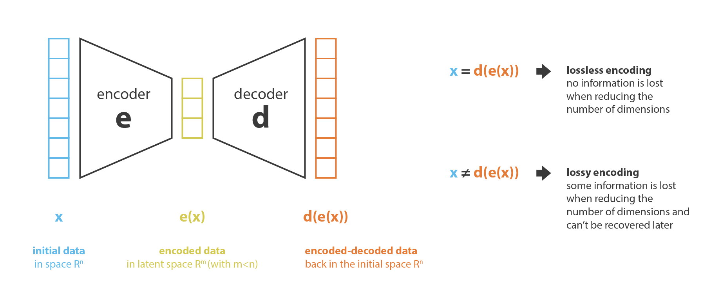 
<!--   -->

図 2. 符号化器と復号化器による次元削減原理の説明<!-- Illustration of the dimensionality reduction principle with encoder and decoder. -->
<!--  -->

次元削減法の主な目的は，与えられたファミリーの中から最適な符号化/復号化の対を見つけることである。
言い換えれば，与えられた符号化と復号化のセットに対して，符号化時に最大限の情報を保持し，復号化時に最小限の再構成誤差を持つ対を探すことである。
符号化器と復号化器のファミリーをそれぞれ $E$ と $D$ とすると，次元削減問題は次のように書くことができる。
(訳注: エンコーダ $E$ とデコーダ $D$ だが，Kingma and Welling (2014) の原著論文では $q_{\phi}(x)$ と $p_{\theta}(z)$ と表現している。)
<!-- The main purpose of a dimensionality reduction method is to find the best encoder/decoder pair among a given family. 
In other words, for a given set of possible encoders and decoders, we are looking for the pair that **keeps the maximum of information when encoding** and, so, **has the minimum of reconstruction error when decoding**. 
If we denote respectively E and D the families of encoders and decoders we are considering, then the dimensionality reduction problem can be written
-->

$$
(e^{* },d^{* })=\arg\min_{(e,d)\in E\times D} \epsilon\left(x,d(e(x))\right),
$$
<!--  -->
ここで $e(x,d(e(x)))$ <!--  -->
は，入力データ $x$ と符号化・復号化データ $d(e(x))$ との間の再構成誤差を定義する。<!-- defines the reconstruction error measure between the input data $x$ and the encoded-decoded data $d(e(x))$.  -->
最後に，以下では $N$ をデータ数，$n_ {d}$ を初期 (復号化) 空間の次元，$n_ {e}$ を縮減 (符号化) 空間の次元とする。
<!-- Notice finally that in the following we will denote $N$ the number of data, $n_d$ the dimension of the initial (decoded) space and $n_e$ the dimension of the reduced (encoded) space.
-->

## 2.2 主成分分析(PCA)
<!-- ## 2.2 Principal components analysis (PCA)-->

次元削減といえば，まず思い浮かぶのが [主成分分析 (PCA)](https://en.wikipedia.org/wiki/Principal_component_analysis) である。
PCA が今説明した枠組みにどのように適合するかを示し，自己符号化器へのリンクを作るために，PCA がどのように機能するかについて，ほとんどの詳細はさておき，非常に高い概要を説明する (このテーマについて完全な記事を書く予定があることに注意)。
<!--
One of the first methods that come in mind when speaking about dimensionality reduction is [principal component analysis (PCA)](https://en.wikipedia.org/wiki/Principal_component_analysis). 
In order to show how it fits the framework we just described and make the link towards autoencoders, let's give a very high overview of how PCA works, letting most of the details aside (notice that we plan to write a full post on the subject).
-->

PCA の考え方は，$n_ {d}$ 個の古い特徴の **線形結合** である $n_ {e}$ 個の新しい **独立した** 特徴を構築し，これらの新しい特徴によって定義される部分空間へのデータの投影が初期データにできるだけ近くなるようにすることである (ユークリッド距離の意味で)。
言い換えれば PCA は (新しい特徴の直交基底によって記述される) 初期空間の最良の線形部分空間を探しており，この部分空間への投影によってデータを近似する際の誤差が可能な限り小さくなるようにする。
<!-- The idea of PCA is to build n_e new **independent** features that are **linear combinations** of the n_d old features and so that the projections of the data on the subspace defined by these new features are as close as possible to the initial data (in term of euclidean distance). 
In other words, PCA is looking for the best linear subspace of the initial space (described by an orthogonal basis of new features) such that the error of approximating the data by their projections on this subspace is as small as possible. -->

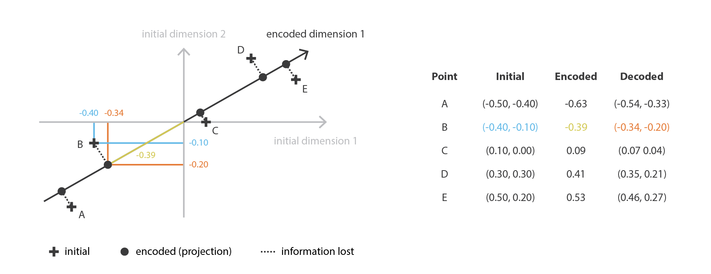 
<!--  -->

図 3. 主成分分析 (PCA) は線形代数を使って最適な線形部分空間を探す<!-- Principal Component Analysis (PCA) is looking for the best linear subspace using linear algebra. -->

我々の大域的枠組みに置き換えると，行が正規直交する $n_ {e}\times n_ {d}$ 行列 (線形変換) の族 $E$ に符号化を，$n_ {d} \times n_ {e}$ 行列の族 $\mathcal{D}$ に復号化器を探すことになる。
共分散特徴行列の (ノルムの) 最大固有値 $n_ {e}$ に対応するユニタリー固有ベクトルは直交しており (あるいはそうなるように選択できる)，近似誤差を最小にしてデータを投影するための次元 $n_ {e}$ の最適部分空間を定めることが示されている。
したがって，これらの $n_ {e}$ 個の固有ベクトルを新しい特徴として選択することができ，次元削減の問題は固有値/固有ベクトル問題として表現することができる。
さらに，このような場合，復号化行列は符号化行列の転置行列であることも示すことができる。
<!-- Translated in our global framework, we are looking for an encoder in the family E of the n_e by n_d matrices (linear transformation) whose rows are orthonormal (features independence) and for the associated decoder among the family $\mathcal{D}$ of $n_{d}$ by $n_{e}$ matrices. 
It can be shown that the unitary eigenvectors corresponding to the $n_{e}$ greatest eigenvalues (in norm) of the covariance features matrix are orthogonal (or can be chosen to be so) and define the best subspace of dimension $n_{e}$ to project data on with minimal error of approximation. 
Thus, these n_e eigenvectors can be chosen as our new features and, so, the problem of dimension reduction can then be expressed as an eigenvalue/eigenvector problem. 
Moreover, it can also be shown that, in such case, the decoder matrix is the transposed of the encoder matrix.
-->

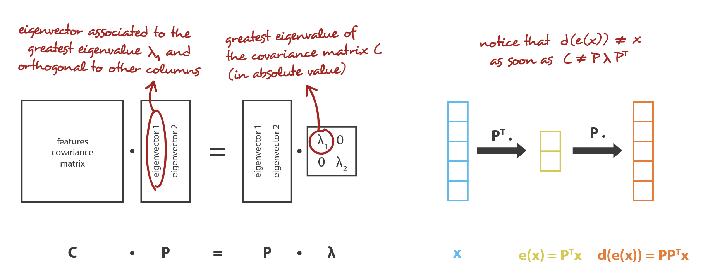 
<!--  -->

図 4. PCA はこれまで説明した符号化器と復号化器の枠組みに合致する
<!-- PCA matches the encoder-decoder framework we described. -->

## 2.3 自己符号化器
<!-- ## 2.3 Autoencoders-->

ここで **自己符号化器** について説明し，ニューラルネットワークをどのように次元削減に利用できるかを見る。
自己符合器は，符号化器と復号化器をニューラルネットワークとして設定し，最適な符号化・復号化方式を繰り返し学習させるという，非常に簡潔な考え方である。
すなわち，各反復計算において，自己符号化器アーキテクチャ (符号化器と復号化器) にいくつかのデータを与え，符号化-復号化出力を初期データと比較し，その誤差をアーキテクチャを通してバックプロパゲートし，ネットワークの重みを更新する。
<!-- Let's now discuss **autoencoders** and see how we can use neural networks for dimensionality reduction. 
The general idea of autoencoders is pretty simple and consists in **setting an encoder and a decoder as neural networks** and to **learn the best encoding-decoding scheme using an iterative optimisation process**. So, at each iteration we feed the autoencoder architecture (the encoder followed by the decoder) with some data, we compare the encoded-decoded output with the initial data and backpropagate the error through the architecture to update the weights of the networks. -->

このように，直感的には，自己符号化器アーキテクチャ全体 (符号化器＋復号化器) がデータに対してボトルネックを作り，情報の主要な構造部分のみを通過させ，再構築することを保証している。
我々の一般的な枠組みを見ると，考慮される符号化器のファミリー E は符号化器ネットワークアーキテクチャによって定義され，考慮される復号化器のファミリー D は復号化ネットワークアーキテクチャによって定義され，再構成誤差を最小化する符号化と復号化の探索はこれらのネットワークのパラメータに対する勾配降下によって行われる。
<!-- Thus, intuitively, the overall autoencoder architecture (encoder+decoder) creates a bottleneck for data that ensures only the main structured part of the information can go through and be reconstructed. 
Looking at our general framework, the family E of considered encoders is defined by the encoder network architecture, the family D of considered decoders is defined by the decoder network architecture and the search of encoder and decoder that minimise the reconstruction error is done by gradient descent over the parameters of these networks.
-->

 
<!--   -->

図 5. 自己符号化器とその損失関数の説明図
<!-- Illustration of an autoencoder with its loss function. -->

まず，我々の符号化器と復号化器の両方のアーキテクチャが，非線形性を持たない 1 層だけのもの (線形自己符号化器) であると仮定する。
このような符号化器と復号化器は，行列で表現できる単純な線形変換である。
このような状況では PCA と同じように，データを投影する際にできるだけ情報の損失が少ない最適な線形部分空間を探すという意味で，PCA との明確な関連性を見出すことができる。
PCA で得られた符号化および復号化行列は，当然，勾配降下法で到達して満足する解の 1 つを定義するが，これが唯一のものではないことを概説しておく。
実際 **複数の基底が同じ最適部分空間** を記述するように選ぶことができ，したがって，いくつかの符号化器/復号化器の対が最適な再構成誤差を与えることができる。
さらに，線形自己符号化器では，PCA とは逆に，最終的に得られる新しい特徴は独立である必要はない (ニューラルネットワークでは直交性の制約はない)。
<!-- Let's first suppose that both our encoder and decoder architectures have only one layer without non-linearity (linear autoencoder). 
Such encoder and decoder are then simple linear transformations that can be expressed as matrices. 
In such situation, we can see a clear link with PCA in the sense that, just like PCA does, we are looking for the best linear subspace to project data on with as few information loss as possible when doing so. 
Encoding and decoding matrices obtained with PCA define naturally one of the solutions we would be satisfied to reach by gradient descent, but we should outline that this is not the only one.
Indeed, **several basis can be chosen to describe the same optimal subspace** and, so, several encoder/decoder pairs can give the optimal reconstruction error. 
Moreover, for linear autoencoders and contrarily to PCA, the new features we end up do not have to be independent (no orthogonality constraints in the neural networks).-->

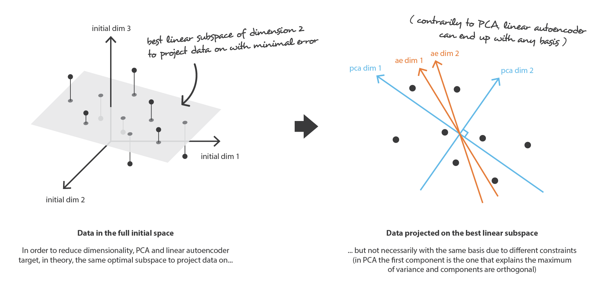 
<!--  -->

図 6. 線形自己符号化器 と PCA の関係<!-- Link between linear autoencoder and PCA. -->

ここで，符号化器と復号化器の両方が多層で，かつ非線形であると仮定しよう。
このような場合，アーキテクチャが複雑であればあるほど，自己符号化器は再構成損失を低く抑えながら高次元縮小を進めることができる。
直感的には，符号化器と復号化器に十分な自由度があれば，どんな初期次元数でも 1 にすることができる。
実際「無限の力」を持つ自己符号化器は，理論的には N 個の初期データ点を受け取り，それらを $1, 2, 3, \ldots, N$ 個まで (より一般的には実軸上の N 個の整数として) 符号化し，関連する復号化器はその過程で損失なしに逆変換を行うことが可能である。
<!-- Now, let's assume that both the encoder and the decoder are deep and non-linear. 
In such case, the more complex the architecture is, the more the autoencoder can proceed to a high dimensionality reduction while keeping reconstruction loss low. 
Intuitively, if our encoder and our decoder have enough degrees of freedom, we can reduce any initial dimensionality to 1. 
Indeed, an encoder with "infinite power" could theoretically takes our N initial data points and encodes them as 1, 2, 3, ... up to N (or more generally, as N integer on the real axis) and the associated decoder could make the reverse transformation, with no loss during the process.
-->

ただし，ここで 2 つのことを念頭に置く必要がある。
第 1 に，再構成の損失を伴わない重要な次元削減は，しばしば，潜在空間における解釈可能で利用可能な構造の欠如 (**規則性の欠如**) という代償を伴う。
第 2  に，ほとんどの場合，次元削減の最終目的は，データの次元数を減らすことだけではなく，**データ構造情報の大部分を削減後の表現に残したまま，この次元数を減らすことである**。
この 2 つの理由から，潜在空間の次元と自己符号化器の「深さ」 (圧縮の程度と品質を定義する) は，次元削減の最終目的に応じて慎重に制御・調整されなければならない。
<!-- Here, we should however keep two things in mind. First, an important dimensionality reduction with no reconstruction loss often comes with a price: the lack of interpretable and exploitable structures in the latent space (**lack of regularity**). 
Second, most of the time the final purpose of dimensionality reduction is not to only reduce the number of dimensions of the data but to reduce this number of dimensions **while keeping the major part of the data structure information in the reduced representations**. 
For these two reasons, the dimension of the latent space and the "depth" of autoencoders (that define degree and quality of compression) have to be carefully controlled and adjusted depending on the final purpose of the dimensionality reduction.-->

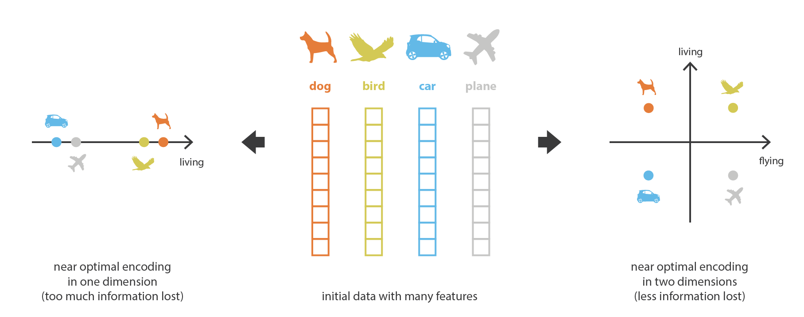 
<!--  -->

図 7. 次元削減時に，データ間に存在する主要な構造を維持したい<!-- When reducing dimensionality, we want to keep the main structure there exists among the data. -->

# 3. 変分自己符号化器
<!-- # 3. Variational Autoencoders-->

これまで，次元削減問題を取り上げ，勾配降下法で学習可能な符号化・復号化のアーキテクチャである自己符号化器を紹介してきた。
ここで，コンテンツ生成問題とリンクさせ，この問題に対する現在の自己符号化器の限界を見て，変分自己符号化器を紹介する。
<!--
Up to now, we have discussed dimensionality reduction problem and introduce autoencoders that are encoder-decoder architectures that can be trained by gradient descent. 
Let's now make the link with the content generation problem, see the limitations of autoencoders in their current form for this problem and introduce Variational Autoencoders.
-->

## 3.1 コンテンツ生成のための自己符号化器の限界
<!-- ## 3.1 Limitations of autoencoders for content generation-->

ここで「自己符号化器とコンテンツ生成の関係はどうなっているのか」という疑問が自然に湧いてくる。
確かに，自己符号化器が学習されると，符号化器と復号化器の両方が手に入るが，新しいコンテンツを生成する真の方法はまだない。
一見すると，潜在空間が十分に規則的であれば (学習過程で符号化器がよく「体制化して整理」した)，その潜在空間からランダムに点を取って復号化すれば新しいコンテンツが得られると考えたくなる。
復号化器 は 生成敵対ネットワーク GAN の生成器のような働きをする。
<!-- At this point, a natural question that comes in mind is "what is the link between autoencoders and content generation?". 
Indeed, once the autoencoder has been trained, we have both an encoder and a decoder but still no real way to produce any new content. 
At first sight, we could be tempted to think that, if the latent space is regular enough (well "organized" by the encoder during the training process), we could take a point randomly from that latent space and decode it to get a new content. 
The decoder would then act more or less like the generator of a Generative Adversarial Network. -->

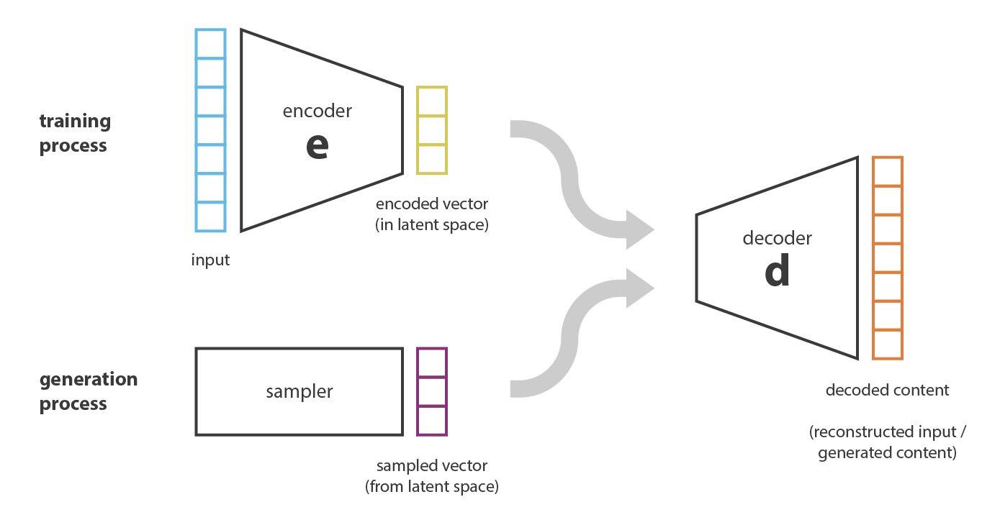 
<!--  -->

図 8. 潜在空間からランダムサンプリングした点を復号化することで新たなデータを生成することができる。
生成されたデータの品質と関連性は潜在空間の規則性に依存する
<!-- [We can generate new data by decoding points that are randomly sampled from the latent space. 
The quality and relevance of generated data depend on the regularity of the latent space.] -->

しかし，前節で述べたように，自己符号化器の潜在空間の規則性は，初期空間におけるデータの分布，潜在空間の次元，符号化器のアーキテクチャに依存する難しい点である。
従って，先験的に，符号化器が先程説明した生成過程に適合したスマートな方法で潜在空間を整理することを保証することは (不可能ではないにしても) かなり困難である。
<!-- However, as we discussed in the previous section, the regularity of the latent space for autoencoders is a difficult point that depends on the distribution of the data in the initial space, the dimension of the latent space and the architecture of the encoder. 
So, it is pretty difficult (if not impossible) to ensure, a priori, that the encoder will organize the latent space in a smart way compatible with the generative process we just described.
-->

この点を説明するために，前に述べた，任意の N 個の初期学習データを実軸上に置き (各データ点は実数値として符号化される)，それを再構成損失なしに復号するのに十分強力な符号化器と復号化器を説明する例を考える。
このような場合，(潜在空間の次元が低いにもかかわらず) 情報損失を伴わない符号化・復号化を可能にする自己符号化器の高い自由度は，潜在空間のいくつかの点が復号されると無意味な内容を与えることを意味する厳しい **オーバーフィッティング** につながる。
この 1 次元の例が極端な例として選ばれたのであれば，自己符号化器の潜在空間の規則性の問題はもっと一般的であり，特別な注意を払うべきものであることに気づく。
<!-- To illustrate this point, let's consider the example we gave previously in which we described an encoder and a decoder powerful enough to put any N initial training data onto the real axis (each data point being encoded as a real value) and decode them without any reconstruction loss. 
In such case, the high degree of freedom of the autoencoder that makes possible to encode and decode with no information loss (despite the low dimensionality of the latent space) **leads to a severe overfitting** implying that some points of the latent space will give meaningless content once decoded. 
If this one dimensional example has been voluntarily chosen to be quite extreme, we can notice that the problem of the autoencoders latent space regularity is much more general than that and deserve a special attention.
-->

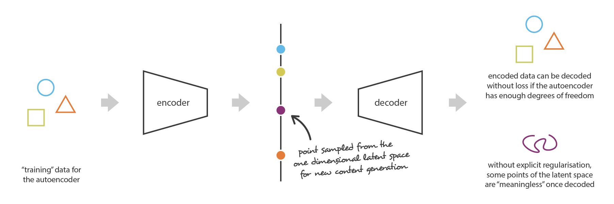 
<!--  -->

図 9. 不規則な潜在空間は新しいコンテンツ生成に自己符号化器を使うことを阻む<!-- Irregular latent space prevent us from using autoencoder for new content generation. -->

少し考えてみると，潜在空間に符号化されたデータに構造がないのは，ごく当たり前のことである。
実際，自己符号化器が学習する課題の中には，このような組織を得ることを強制するものはない。
**自己符号化器は，潜在空間がどのように構成されていても，できるだけ損失を少なくして符号化・復号化するようにしか訓練されていない**。
したがって，アーキテクチャの定義に注意を払わないと，学習中にネットワークが過学習の可能性を利用して，できる限り課題を達成しようとするのは当然である。明示的に正則化しなければ。
<!-- When thinking about it for a minute, this lack of structure among the encoded data into the latent space is pretty normal. 
Indeed, nothing in the task the autoencoder is trained for enforce to get such organisation: **the autoencoder is solely trained to encode and decode with as few loss as possible, no matter how the latent space is organised**. 
Thus, if we are not careful about the definition of the architecture, it is natural that, during the training, the network takes advantage of any overfitting possibilities to achieve its task as well as it can... unless we explicitly regularise it! -->

## 3.2 変分自己符号化器の定義
<!-- ## 3.2 Definition of variational autoencoders-->

そこで，自己符号化器の復号化器を生成目的に使用できるようにするために，潜在空間が十分に正則であることを確認する必要がある。
このような正則性を得るための一つの方法として，学習過程で明示的な正則化を導入することが考えられる。
したがって，この記事の冒頭で簡単に述べたように **変分自己符号化器とは，過学習を避け，潜在空間が生成処理を可能にする良い特性を持つことを保証するために学習が正則化された自己符号化器であると定義することができる**。
<!-- So, in order to be able to use the decoder of our autoencoder for generative purpose, we have to be sure that the latent space is regular enough. 
One possible solution to obtain such regularity is to introduce explicit regularisation during the training process. 
Thus, as we briefly mentioned in the introduction of this post, **a variational autoencoder can be defined as being an autoencoder whose training is regularised to avoid overfitting and ensure that the latent space has good properties that enable generative process.** -->

変分自己符号化器は，標準的な自己符号化器と同様に，符号化器と復号化器からなるアーキテクチャであり，符号化・復号化されたデータと初期データ間の再構成誤差を最小化するように学習されるものである。
しかし，潜在空間に正則化を導入するために，符号化-復号化の処理を少し修正する。
**入力を 1 つの点として符号化するのではなく，潜在空間上の分布として符号化する**。
そして，モデルは以下のように学習される。
<!-- Just as a standard autoencoder, a variational autoencoder is an architecture composed of both an encoder and a decoder and that is trained to minimise the reconstruction error between the encoded-decoded data and the initial data. 
However, in order to introduce some regularisation of the latent space, we proceed to a slight modification of the encoding-decoding process: **instead of encoding an input as a single point, we encode it as a distribution over the latent space**. 
The model is then trained as follows:
-->

1. 入力は潜在空間上の分布として符号化される
2. 潜在的な空間から点がサンプリングされる
3. サンプリングされた点は符号化され，再構成誤差を計算することができる
4. 再構成誤差はネットワークを通じて逆伝播される

<!-- * first, the input is encoded as distribution over the latent  space
* second, a point from the latent space is sampled from that distribution
* third, the sampled point is decoded and the reconstruction error can be computed
* finally, the reconstruction error is backpropagated through the network
-->

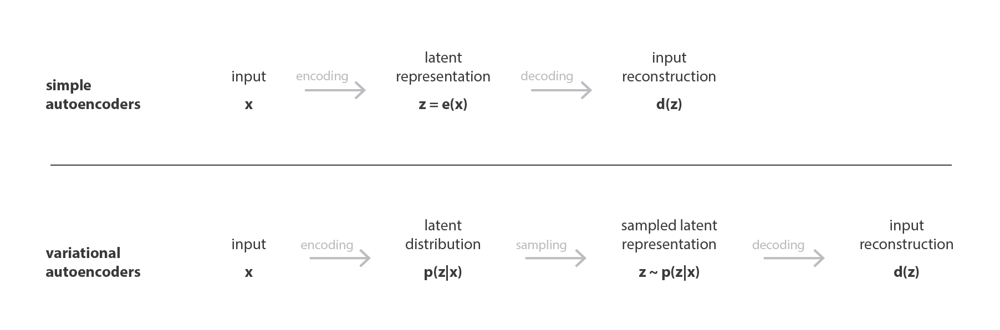 
<!--  -->

図 10. 自己符号化器 (決定論的) と変分自己符号化器 (確率論的) の違い<!-- Difference between autoencoder (deterministic) and variational autoencoder (probabilistic). -->

実際には，自己符号化器がガウス分布を記述する平均と共分散行列を返すように学習できるように，符号化された分布は正規分布に選ばれる。
入力が 1 点ではなく，ある分散を持つ分布として符号化される理由は，潜在空間正則化を非常に自然に表現することができる。
符号化器が返す分布は，標準正規分布に近くなるように強制される。
次節では，この方法で潜在空間の局所的および大域的正則化 (分散制御のため局所的に，平均制御のため大域的に) を保証することを見る。
<!-- In practice, the encoded distributions are chosen to be normal so that the encoder can be trained to return the mean and the covariance matrix that describe these Gaussians. 
The reason why an input is encoded as a distribution with some variance instead of a single point is that it makes possible to express very naturally the latent space regularisation: the distributions returned by the encoder are enforced to be close to a standard normal distribution. 
We will see in the next subsection that we ensure this way both a local and global regularisation of the latent space (local because of the variance control and global because of the mean control).-->

したがって VAE を学習する際に最小化される損失関数は「再構成項」(最終層) と「正則化項」(潜在層) から構成され，それは符号化器によって返される分布を標準正規分布に近づけることによって潜在空間の組織を正則化する傾向がある。
この正則化項は、返された分布と標準ガウス分布の間の [カルバック・ライブラー ダイバージェンス](https://en.wikipedia.org/wiki/Kullback-Leibler_divergence) として表され，次節でさらに正当化される。
2 つのガウス分布の間のカルバック・ライブラーのダイバージェンスは，2 つの分布の平均と共分散行列で直接表現できる閉じた形式を持っていることに気がづく。
<!-- Thus, the loss function that is minimised when training a VAE is composed of a "reconstruction term" (on the final layer), that tends to make the encoding-decoding scheme as performant as possible, and a "regularisation term" (on the latent layer), that tends to regularise the organisation of the latent space by making the distributions returned by the encoder close to a standard normal distribution. 
That regularisation term is expressed as the [Kulback-Leibler divergence](https://en.wikipedia.org/wiki/Kullback–Leibler_divergence) between the returned distribution and a standard Gaussian and will be further justified in the next section. We can notice that the Kullback-Leibler divergence between two Gaussian distributions has a closed form that can be directly expressed in terms of the means and the covariance matrices of the two distributions.-->

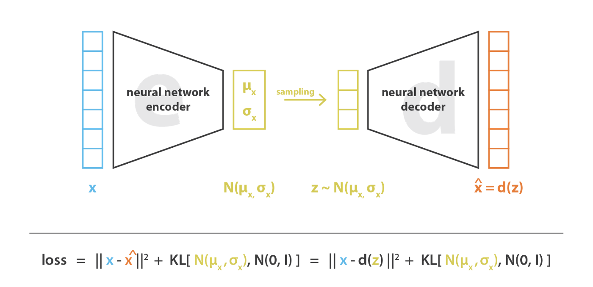 
<!--  -->

図 11. 変分自己符号化器では，損失関数は再構成項 (符号化・復号化スキームを効率化する) と正則化項 (潜在空間を正則化する) から構成される<!-- In variational autoencoders, the loss function is composed of a reconstruction term (that makes the encoding-decoding scheme efficient) and a regularisation term (that makes the latent space regular). -->

## 3.3 正則化に関する直感
<!-- ## 3.3 Intuitions about the regularisation-->

生成過程を可能にするために潜在空間に期待される規則性は，主に 2 つの特性によって表現できる。
**連続性** (潜在空間内の 2 つの近接した点は，一度復号されると全く異なる内容を与えてはならない) と **完全性** (選択された分布に対して潜在空間からサンプリングされた点は，一度復号されると「意味のある」内容を与えるべきである) である。
<!-- The regularity that is expected from the latent space in order to make generative process possible can be expressed through two main properties: **continuity** (two close points in the latent space should not give two completely different contents once decoded) and **completeness** (for a chosen distribution, a point sampled from the latent space should give "meaningful" content once decoded).-->

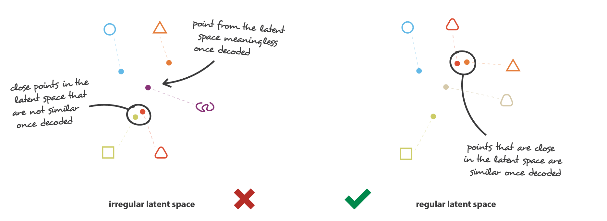 
<!--  -->

図 12. 正規の潜在空間と非規則な潜像空間の相違<!-- Difference between a "regular" and an "irregular" latent space. -->

VAE は入力を単純な点ではなく，分布として符号化するという事実だけでは，連続性と完全性を確保するのに十分ではありません。
うまく定義された正則化項がないと，モデルは再構成誤差を最小にするために，**分布が返されるという事実を「無視」して，ほとんど古典的な自己符号化器のように振る舞う**ことを学習することができる (
過学習につながる)。
これを行うために，符号化器は小さな分散の分布を返すか (これは時間的分布になりがちである)，非常に異なる平均の分布を返すか (これは潜在空間内で互いに本当に離れていることになる)，のどちらかを行うことができる。
どちらの場合も，分布は間違った方法で使用され (期待された利益がキャンセルされ)，連続性，完全性が満たされない。
<!-- The only fact that VAEs encode inputs as distributions instead of simple points is not sufficient to ensure continuity and completeness. 
Without a well defined regularisation term, the model can learn, in order to minimise its reconstruction error, **to "ignore" the fact that distributions are returned and behave almost like classic autoencoders** (leading to overfitting). 
To do so, the encoder can either return distributions with tiny variances (that would tend to be punctual distributions) or return distributions with very different means (that would then be really far apart from each other in the latent space). 
In both cases, distributions are used the wrong way (cancelling the expected benefit) and continuity and/or completeness are not satisfied.-->

そこで，これらの効果を避けるために，**符号化器が返す分布の共分散行列と平均の両方を正則化する必要がある**。
実際には，この正則化は，分布が標準正規分布に近くなるように強制することで行われる (中央化，縮小)。
この方法では，共分散行列が恒等式に近くなるように要求し，正確な分布を防ぎ，平均が 0 に近くなるように要求し，符号化された分布が互いに離れすぎないようにする。
<!--
So, in order to avoid these effects **we have to regularise both the covariance matrix and the mean of the distributions returned by the encoder**. 
In practice, this regularisation is done by enforcing distributions to be close to a standard normal distribution (centred and reduced). 
This way, we require the covariance matrices to be close to the identity, preventing punctual distributions, and the mean to be close to 0, preventing encoded distributions to be too far apart from each others.
-->

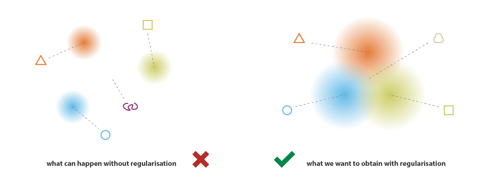 
<!--  -->

図 13. VAE の返された分布を正則化することで，良好な特性を持つ潜在空間を得ることができる<!-- The returned distributions of VAEs have to be regularised to obtain a latent space with good properties. -->

この正則化項により，モデルが潜在空間内の離れたデータを符号化するのを防ぎ，返された分布ができるだけ「重なる」ように促し，このようにして期待される連続性と完全性の条件を満足させることができる。
当然ながら，どの正則化項も，訓練データの再構成誤差を大きくする代償を払うことになる。
しかし，再構成誤差と KL ダイバージェンスのトレードオフは調整可能であり，次節では，そのバランスの表現が我々の公式導出からどのように自然に出てくるかを見ていく。
<!-- With this regularisation term, we prevent the model to encode data far apart in the latent space and encourage as much as possible returned distributions to "overlap", satisfying this way the expected continuity and completeness conditions. 
Naturally, as for any regularisation term, this comes at the price of a higher reconstruction error on the training data. 
The tradeoff between the reconstruction error and the KL divergence can however be adjusted and we will see in the next section how the expression of the balance naturally emerge from our formal derivation.-->

最後に，正則化によって得られる連続性と完全性は，**潜在空間にコード化された情報に対して「勾配」を作る傾向** があることが分かる。
例えば，異なる学習データから得られた 2 つの符号化された分布の平均値の中間にある潜在空間の点は，最初の分布を与えたデータと 2 番目の分布を与えたデータの間のどこかにあるもので，両方のケースで自己符号化器によってサンプリングされるかもしれないので，復号化されるはずである。
<!--
To conclude this subsection, we can observe that continuity and completeness obtained with regularisation **tend to create a "gradient" over the information encoded in the latent space**. 
For example, a point of the latent space that would be halfway between the means of two encoded distributions coming from different training data should be decoded in something that is somewhere between the data that gave the first distribution and the data that gave the second distribution as it may be sampled by the autoencoder in both cases. -->

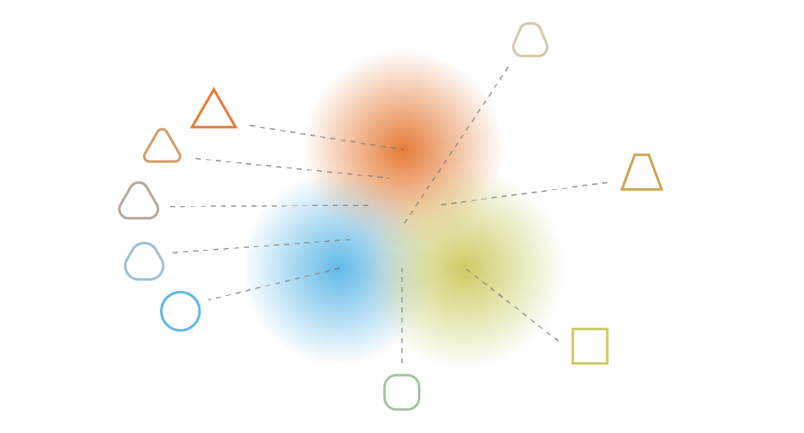 
<!--  -->

図 14. 正則化は，潜在的な空間にコード化された情報に対して「勾配」を作る傾向がある。<!-- Regularisation tends to create a "gradient" over the information encoded in the latent space. -->

注: 余談ですが，我々が言及した 2 番目の潜在的な問題 (ネットワークが分布を互いに遠くに置く) は，実はスケールを変えるまでは最初の問題 (ネットワークは時間厳守の分布を返す傾向がある) とほぼ同等。
どちらの場合も，分布の分散はそれらの平均間の距離に対して小さくなっている。
<!-- **Note.** 
As a side note, we can mention that the second potential problem we have mentioned (the network put distributions far from each others) is in fact almost equivalent to the first one (the network tends to return punctual distribution) up to a change of scale: in both case variances of distributions become small relatively to distance between their means.-->

# 4. VAEの数学的詳細
<!-- # 4. Mathematical details of VAEs-->

前節では、以下のような直感的な概要を説明した。
VAEは入力を点ではなく，分布としてエンコードするオートエンコーダであり，その潜在空間の「構造化」は符号化器が返す分布が標準正規分布に近くなるように制約することによって正則化される。
本節では，正則化項をより厳密に正当化することができるように，VAE のより数学的な見方を提供する。
そのために，明確な確率的枠組みを設定し，特に変分推論の技法を用いる。
<!-- In the previous section we gave the following intuitive overview: VAEs are autoencoders that encode inputs as distributions instead of points and whose latent space "organisation" is regularised by constraining distributions returned by the encoder to be close to a standard Gaussian. 
In this section we will give a more mathematical view of VAEs that will allow us to justify the regularisation term more rigorously.
To do so, we will set a clear probabilistic framework and will use, in particular, variational inference technique. -->

## 4. 確率論的な枠組みと仮定
<!-- ## Probabilistic framework and assumptions-->

まず，データを記述するための確率的グラフィカルモデルを定義することから始める。
データを表す変数を $x$ とし，$x$ は直接観測されない潜在変数 $z$ (符号化された表現) から生成されると仮定する。
従って，各データ点に対して，以下の 2 段階の生成過程が想定される。
<!--Let's begin by defining a probabilistic graphical model to describe our data. 
We denote by $x$ the variable that represents our data and assume that $x$ is generated from a latent variable $z$ (the encoded representation) that is not directly observed. 
Thus, for each data point, the following two steps generative process is assumed:-->

1.  潜在表現 $z$ を事前分布 $p(z)$ からサンプリングする。
2. データ $x$ を条件付き尤度分布$ p(x\vert z)$ からサンプリングする。

<!--
- first, a latent representation z is sampled from the prior distribution $p(z)$
- second, the data x is sampled from the conditional likelihood distribution $p(x\vert z)$
-->

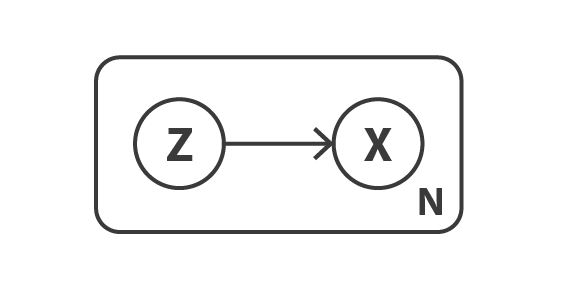 
<!--  -->

図 15. 生成過程のグラフィカルモデル<!-- Graphical model of the data generation process. -->

このような確率モデルを念頭に置くと，符号化器と復号化器の概念を再定義することができる。
実際，単純な自己符号化器が決定論的な符号化器と復号化器を考えるのとは対照的に， **この 2 つの対象の確率論的バージョンを考える**。
確率的符号化器は，符号化された変数の分布を表す $p(x\vert z)$ で定義され，確率論的符号化器は，符号化された変数の分布を表す $p(z\vert x)$ で定義される。
<!-- With such a probabilistic model in mind, we can redefine our notions of encoder and decoder. 
Indeed, contrarily to a simple autoencoder that consider deterministic encoder and decoder, **we are going to consider now probabilistic versions of these two objects**. 
The "probabilistic decoder" is naturally defined by **p(x\|z), that describes the distribution of the decoded variable given the encoded one**, whereas the "probabilistic encoder" is defined by **p(z\|x), that describes the distribution of the encoded variable given the decoded one**.
-->

この時点ですでに，単純な自己符号化器では欠けていた潜在空間の正則化が，データ生成過程の定義に自然に現れている。
潜在空間における符号化された表現 $z$ は，事前分布 $p(z)$ に従うと仮定される。
事前分布 $p(z)$，尤度 $p(x\vert z)$，事後分布 $p(z\vert x)$ の間のリンクを作るよく知られたベイズの定理を使うことができる。
<!-- 
At this point, we can already notice that the regularisation of the latent space that we lacked in simple autoencoders naturally appears here in the definition of the data generation process: encoded representations z in the latent space are indeed assumed to follow the prior distribution p(z). 
Otherwise, we can also remind the the well-known Bayes theorem that makes the link between the prior p(z), the likelihood p(x\|z), and the posterior p(z\|x) -->

$$
p(z\vert x)= \frac{p(x\vert z) p(z)}{p(x)} = \frac{p(x\vert z)p(z)}{\int p(x\vert u)p(u)du}
$$
<!--  -->

ここで $p(z)$ は標準正規分布であり，その平均は $z$ の変数の決定論的関数 $f$で定義される。 
その共分散行列は恒等行列Iに乗ずる正の定数 $c$ の形をとる正規分布であると仮定する。
関数 $f$ は $F$ と呼ばれる関数族に属するものとし，この関数族は後で選択される。したがって，以下のようになる。
<!-- Let's now make the assumption that p(z) is a standard Gaussian distribution and that p(x\|z) is a Gaussian distribution whose mean is defined by a deterministic function f of the variable of z and whose covariance matrix has the form of a positive constant c that multiplies the identity matrix I. 
The function f is assumed to belong to a family of functions denoted F that is left unspecified for the moment and that will be chosen later. 
Thus, we have
-->

$$
\begin{aligned}
p(x) &\equiv \mathcal{N}(0,I)\\
p(x\vert z) &\equiv \mathcal{N}(f(z),cI)\hspace{2cm}f\in F, c>0\\
\end{aligned}
$$
<!--  -->

$f$ はよく定義され，固定されているとする。
理論的には $p(z)$ と $p(x\vert z)$ がわかっているので，ベイズの定理を使って $p(z\vert x)$ を計算することができる。
これは古典的な [ベイズ推論問題](https://towardsdatascience.com/bayesian-inference-problem-mcmc-and-variational-inference-25a8aa9bce29) と呼ばれる。
しかし，前回の記事で述べたように，この種の計算は (分母に積分があるため) しばしば難解で，変分推論のような近似手法を用いる必要がある。
<!-- Let's consider, for now, that f is well defined and fixed. 
In theory, as we know p(z) and p(x\|z), we can use the Bayes theorem to compute p(z\|x): this is a classical [Bayesian inference problem](/bayesian-inference-problem-mcmc-and-variational-inference-25a8aa9bce29). 
However, as we discussed in our previous article, this kind of computation is often intractable (because of the integral at the denominator) and require the use of approximation techniques such as variational inference.-->

注. ここで $p(z)$ と $p(x\vert z)$ はともにガウス分布であることに言及する。
すなわち $\mathbb{E}(x\vert z) = f(z) = z$ とすれば $p(z\vert x)$  も正規分布に従うはずで，理論的には $p(z\vert x)$ の平均と共分散行列を $p(z)$ と $p(x\vert z)$ の平均と共分散行列に関して表現しようとする「だけ」で良いのである。
しかし，実際にはこの条件は満たされておらず，変分推論のような近似手法を用いる必要がある。
この手法により，アプローチはかなり一般的になり，モデルの仮説の変更に対してより頑健になる。
<!-- Here we can mention that p(z) and p(x\|z) are both Gaussian distribution. 
So, if we had E(x\|z) = f(z) = z, it would imply that p(z\|x) should also follow a Gaussian distribution and, in theory, we could "only" try to express the mean and the covariance matrix of p(z\|x) with respect to the means and the covariance matrices of p(z) and p(x\|z). 
However, in practice this condition is not met and we need to use of an approximation technique like variational inference that makes the approach pretty general and more robust to some changes in the hypothesis of the model. -->

## 4.1 変分推論の定式化
<!-- ## 4.1 Variational inference formulation-->

統計学において、**変動推論 (Variational Inference, VI) は複雑な分布を近似する手法の一つである**。
そのアイデアは，パラメータ化された分布の族 (例えば，平均と共分散をパラメータとするガウス族) を設定し，この族の中から目的の分布の最良の近似を探すことである。
族内の最適な要素は，与えられた近似誤差 (ほとんどの場合，近似と目標間 のカルバック-ライブラーダイバージェンス) を最小化するもので，族を記述するパラメータに対する勾配降下法によって探索される。
詳細は [変分推論の投稿](https://towardsdatascience.com/bayesian-inference-problem-mcmc-and-variational-inference-25a8aa9bce29) 
とその中の参考文献を参照。
<!-- In statistics, **variational inference (VI) is a technique to approximate complex distributions**. 
The idea is to set a parametrised family of distribution (for example the family of Gaussians, whose parameters are the mean and the covariance) and to look for the best approximation of our target distribution among this family. 
The best element in the family is one that minimise a given approximation error measurement (most of the time the Kullback-Leibler divergence between approximation and target) and is found by gradient descent over the parameters that describe the family. 
For more details, we refer to [our post on variational inference](/bayesian-inference-problem-mcmc-and-variational-inference-25a8aa9bce29) and references therein. -->

ここで，平均と共分散がパラメータ $x$ の 2 つの関数 $g$ と $h$ で定義される正規分布 $q_ {x}(z)$ で $p(z\vert x)$ を近似するとする。
この 2 つの関数は，それぞれ，後で指定する関数 G と H の族に属するが，パラメータ化されていることが前提である。
したがって，以下のように表すことができる。
<!-- Here we are going to approximate $p(z\vert x)$ by a Gaussian distribution $q_x(z)$ whose mean and covariance are defined by two functions, $g$ and $h$, of the parameter $x$. 
These two functions are supposed to belong, respectively, to the families of functions G and H that will be specified later but that are supposed to be parametrised. 
Thus we can denote
-->

$$
q_{x}(z) \approx \mathcal{N}\left(g(x),h(x)\right)\hspace{1cm} g\in G, h\in H
$$
<!--  -->

そこで，このようにして変分推論の候補の族を定義し，関数 $g$ と $h$ (実際にはそのパラメータ) を最適化して，近似値と目標値 $p(z\vert  x)$ の間のカルバック・ライブラー ダイバージェンス を最小にすることにより，この族から最良の近似値を見つける必要がある。
つまり，以下のような最適な $g^{\star }$ と $h^ {\star}$ を探す。
<!-- So, we have defined this way a family of candidates for variational inference and need now to find the best approximation among this family by optimising the functions g and h (in fact, their parameters) to minimise the Kullback-Leibler divergence between the approximation and the target $p(z\ert x)$. 
In other words, we are looking for the optimal $g^{*}$ and $h^{*}$ such that
-->

$$
\begin{aligned}
(g^{\star},h^{\star})&=\text{argmin}_{(g,h)\in G\times H} KL\left[q_{x}(z)||p(z|x)\right]\\
&= \text{argmin}_{(g,h)\in G\times H}\left(\mathbb{E}_{z\sim q_{x}}\left[\log q_{x}(z)\right]
-\mathbb{E}_{z\sim q_{x}} \left[\log\left({p(x|z)p(z\over p(x)}\right)\right]\right)\\
&= \text{argmin}_{(g,h)\in G\times H}\left(
\mathbb{E}_{z\sim q_{x}}\left[\log q_{x}(z)\right]    
-\mathbb{E}_{z\sim q_{x}} \left(\log p(z)\right)
-\mathbb{E}_{z\sim q_{x}} \left(\log p(x|z)\right)
-\mathbb{E}_{z\sim q_{x}} \left(\log p(x)\right)
\right)\\
&= \text{argmin}_{(g,h)\in G\times H}\left(
\mathbb{E}_{z\sim q_{x}}\left[\log p(x|z)\right]
-KL\left[q_{x}(z)||p(z)\right]
\right)\\
&= \text{argmin}_{(g,h)\in G\times H}\left(
\mathbb{E}_{z\sim q_{x}}\left[
-{\left\|x-f(z)\right\|\over 2c}
    \right]
-KL\left[q_{x}(z)||p(z)\right]
\right)\\
\end{aligned}
$$
<!--  -->

最後から 2 番目の式では，事後分布 $p(z\vert x)$ を近似する際に「観測値」の尤度の最大化 (第 1 項の期待対数尤度の最大化) と事前分布に近づくこと (第 2 項の $q_ {x}(z)$ と $p(z)$ の間の KL ダイバージェンスの最小化) のトレードオフが存在することが観察される。
このトレードオフはベイズ推論問題では当然のことであり，データの信頼度と事前分布の信頼度の間で見出されるべきバランスを表現している。
<!-- In the second last equation, we can observe the tradeoff there exists - when approximating the posterior p(z\|x) - between maximising the likelihood of the "observations" (maximisation of the expected log-likelihood, for the first term) and staying close to the prior distribution (minimisation of the KL divergence between q_x(z) and p(z), for the second term). 
This tradeoff is natural for Bayesian inference problem and express the balance that needs to be found between the confidence we have in the data and the confidence we have in the prior.
-->

これまで，我々は関数 $f$ が既知で固定であることを仮定し，その仮定下で変分推論技法を用いて事後分布  $p(z\vert x)$ を近似的に求めることができることを示してきた。
しかし，実際には，復号化器を定義するこの関数 $f$ は既知ではなく，また，選択する必要がある。
そのために，我々の当初の目標は，潜在空間が生成目的に使用できるほど正則な，性能の良い符号化・復号化方式を見つけることであった。
この規則性が潜在空間上で仮定される事前分布によって支配されている場合，符号化復号化スキーム全体の性能は関数 $f$ の選択に大きく依存する。
実際 $p(z\vert x)$ は $p(z)$ と $p(x\vert z)$ から (変分推論によって) 近似でき，$p(z)$ は単純な標準正規分布なので，我々のモデルで最適化を行うために自由に使えるのは，パラメータ $c$ (尤度の分散を定義する) と関数 $f$ (尤度の平均を定義する) の 2 つだけである。
<!-- Up to know, we have assumed the function f known and fixed and we have showed that, under such assumptions, we can approximate the posterior p(z\|x) using variational inference technique. 
However, in practice this function f, that defines the decoder, is not known and also need to be chosen. 
To do so, let's remind that our initial goal is to find a performant encoding-decoding scheme whose latent space is regular enough to be used for generative purpose. 
If the regularity is mostly ruled by the prior distribution assumed over the latent space, the performance of the overall encoding-decoding scheme highly depends on the choice of the function f. 
Indeed, as p(z\|x) can be approximate (by variational inference) from p(z) and p(x\|z) and as p(z) is a simple standard Gaussian, the only two levers we have at our disposal in our model to make optimisations are the parameter c (that defines the variance of the likelihood) and the function f (that defines the mean of the likelihood).
-->

そこで，先に説明したように $F$ の任意の関数 $f$ (それぞれ異なる確率的復号羽化器 $p(x\vert z)$ を定義) に対して $p(z\vert x)$ の最良近似 $q^ {\star }_ {x(z)}$ と表されるものが得られると考えることにする。
確率的な性質があるにもかかわらず，できるだけ効率的な符号化復号化方式を求め，そして $q^ {\star}_ {x(z)}$ から $z$ をサンプリングしたときに $z$ が与えられたときの期待対数尤度を最大化する関数 $f$ を選びたい。
換言すると，与えられた入力 $x$ に対して 分布 $q^ {\star }_ {x(z)}$ から $z$ を抽出し，分布 $p(x\vert z)$ から$\widehat{x}$ をサンプルしたときに $\hat{x}= x$とする確率を最大にしたい。
したがって以下のような最適 $f^ {\star}$ を探している。
<!-- So, let's consider that, as we discussed earlier, we can get for any function $f$ in $F$ (each defining a different probabilistic decoder $p(x\vert z)$) the best approximation of $p(z\vert x)$, denoted $q^{* }_ {x(z)}$. 
Despite its probabilistic nature, we are looking for an encoding-decoding scheme as efficient as possible and, then, we want to choose the function $f$ that maximises the expected log-likelihood of $x$ given $z$ when $z$ is
sampled from $q^{* }_ {x(z)}$. 
In other words, for a given input $x$, we want to maximise the probability to have $\hat{x}= x$ when we sample $z$ from the distribution $q^{* }_ {x(z)}$ and then sample $\widehat{x}$ from the distribution $p(x\vert z)$. 
Thus, we are looking for the optimal $f^ {\star}$ such that -->

$$
\begin{aligned}
f^ {\star} &=\arg\max_ {f\in F}\,\mathbb{E}_ {z\sim q^ {\star}_ {x}}\left(\log p(x\vert z)\right)\\
           &=\arg\max_ {f\in F}\,\mathbb{E}_ {z\sim q_{x}^ {\star}}\left(-\frac{\left\|x-f(z)\right\|^{2}}{2c}\right)\\
\end{aligned}
$$

<!--  -->

ここで、$q^ {\star}_ {x(z)}$ は関数 $f$ に依存し，前述で求めたものである。 
これらをまとめると，以下のような最適な  $f^{\star}$, $g^ {\star}$, $h^ {\star}$ を探していることになる。
<!-- where $q^ {\star}_ {x(z)}$ depends on the function f and is obtained as described before.  
Gathering all the pieces together, we are looking for optimal $f^{* }$, $g^{* }$ and $h^{* }$ such that -->

<!--  -->

$$
\left(f^{* },g^{* },h^{* }\right)=\arg\max_{(f,g,g)\in F\times G\times H}\left(
\mathbb{E}_{z\sim q_{x}}\left(-\frac{\left\|x-f(z)\right\|^{2}}{2c}\right)-\text{KL}\left(q_{x}(z),p(z)\right)
\right)
$$
<!-- 
 -->

この目的関数には，前節の VAE の直感的な説明で紹介した要素を同定することができる。
$x$ と $f(z)$ の間の再構成誤差，$q_ {x}(z)$ と $p(z)$ (これは標準正規分布) の間の KL 発散で与えられる正則化項である。
また，前の 2 つの項の間のバランスを支配する定数 $c$ に注目することができる。
$c$ が高いほど，本モデルの確率的復号化の $f(z)$ の分散が大きいと仮定し，再構成項よりも正規化項を優先する ($c$ が低い場合はその逆となります)。
<!-- We can identify in this objective function the elements introduced in the intuitive description of VAEs given in the previous section: 
the reconstruction error between $x$ and $f(z)$ and the regularisation term given by the KL divergence between $q_x(z)$ and $p(z)$ (which is a standard Gaussian). 
We can also notice the constant $c$ that rules the balance between the two previous terms. 
The higher $c$ is the more we assume a high variance around $f(z)$ for the probabilistic decoder in our model and, so, the more we favour the regularisation term over the reconstruction term (and the opposite stands if $c$ is low).
-->

## 4.2 ニューラルネットワークをモデルへ取り込む
<!-- ## 4.2 Bringing neural networks into the model-->

これまで $f$, $g$, $h$ の 3 つの関数に依存する確率モデルを設定し，変分推論を用いて $f^ {star}$ を得るために解くべき最適化問題を表現してきた。
このモデルで最適な符号化・復号化方式を与える $g^ {\star}$ と $h ^{\star}$ がある。
関数の空間全体を最適化することは容易ではないので，最適化領域を限定し $f$, $g$, $h$ をニューラルネットワークで表現することにした。
したがって $F$, $G$, $H$ はそれぞれネットワーク・アーキテクチャで定義される関数族に対応し，最適化はこれらのネットワークのパラメータに対して行われる。
<!-- Up to know, we have set a probabilistic model that depends on three functions, f, g and h, and express, using variational inference, the optimisation problem to solve in order to get f^{\star} , g^ {\star} and h ^{\star} that give the optimal encoding-decoding scheme with this model. 
As we can't easily optimise over the entire space of functions, we constrain the optimisation domain and decide to express f, g and h as neural networks.
Thus, F, G and H correspond respectively to the families of functions defined by the networks architectures and the optimisation is done over the parameters of these networks. -->

実際には $g$ と $h$ は完全に独立した 2 つのネットワークで定義されるのではな く，そのアーキテクチャと重みの一部を共有しているので，以下のようになる。
<!--
In practice, g and h are not defined by two completely independent networks but share a part of their architecture and their weights so that we have
-->

$$\begin{aligned}
g(x) &= g_{2}(g_{1})(x))\\
h(x) &= g_{2}(h_{1}(x))\\
g_{1}(x) &= h_{1}(x)
\end{aligned}$$

<!--  -->

$q_{x(z)}$ の共分散行列を定義しているため，$h(x)$ は正方行列であることが前提となっている。
しかし，計算を簡略化し，パラメータ数を減らすために $p(z\vert x)$ の近似値である $q_{x}(z)$ が対角共分散行列を持つ多次元正規分布であるという仮定 (変数独立性の仮定) を追加する。
この仮定では $h(x)$ は単に共分散行列の対角要素のベクトルであり $g(x)$ と同じ大きさであることがわかる。
ただし，この方法では，変分推論で考慮する分布の族を減らすことになるので，得られる $p(z\vert x)$ の近似精度が低くなることがある。
<!-- As it defines the covariance matrix of $q_{x(z)}$, $h(x)$ is supposed to be a square matrix. 
However, in order to simplify the computation and reduce the number of parameters, we make the additional assumption that our approximation of $p(z\vert x)$, $q_{x(z)}$, is a multidimensional Gaussian distribution with diagonal covariance matrix (variables independence assumption). 
With this assumption, h(x) is simply the vector of the diagonal elements of the covariance matrix and has then the same size as $g(x)$. 
However, we reduce this way the family of distributions we consider for variational inference and, so, the approximation of $p(z\vert x)$ obtained can be less accurate.
-->

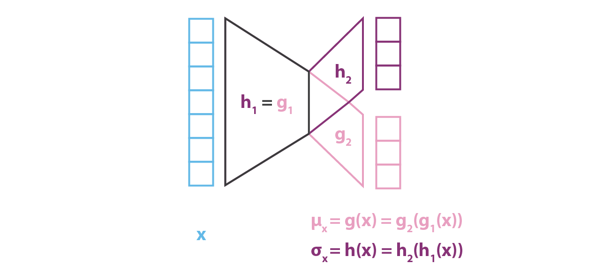 
<!--  -->

図 16. VAE の部分としての符号化器 <!-- Encoder part of the VAE. -->

$p(z\vert x)$ をモデル化する符号化部では，平均と共分散が $x$ の関数であるガウス分布 ($g$ と $h$) を考えたのとは対照的に，本モデルでは $p(x\vert z)$ に共分散固定で正規分布を仮定している。
そのガウス分布の平均を定義する変数 $z$ の関数 $f$ をニューラルネットワークでモデル化し，次のように表現することができる。
<!-- Contrarily to the encoder part that models $p(z\vert x)$ and for which we considered a Gaussian with both mean and covariance that are functions of $x$ (g and h), our model assumes for $p(x\vert z)$ a Gaussian with fixed covariance. 
The function $f$ of the variable $z$ defining the mean of that Gaussian is modelled by a neural network and can be represented as follows
-->

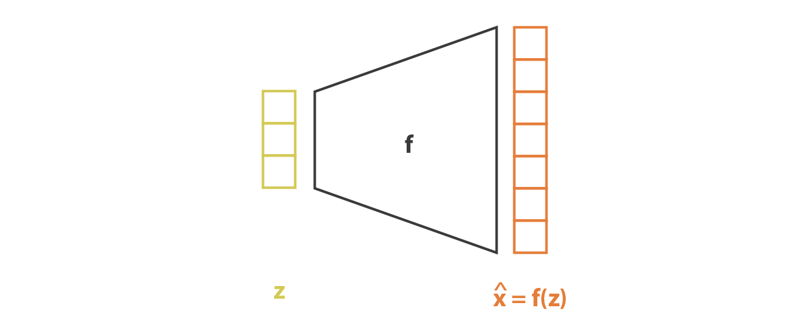 
<!--  -->

図 17. VAE の部分としての復号化器<!-- Decoder part of the VAE. -->

そして，符号化器と復号化器の部分を連結することで，全体のアーキテクチャが出来上がる。
しかし，学習中に符号化器が返す分布からサンプリングする方法には，まだ十分な注意が必要である。
サンプリング処理は，誤差がネットワークを通じて逆伝播されるような方法で表現されなければならない。
これは，**リパラメタタリゼーショントリック** と呼ばれる簡単なトリックで，アーキテクチャの途中から発生するランダムなサンプリングにもかかわらず，勾配降下を可能にするために使用される。
<!-- The overall architecture is then obtained by concatenating the encoder and the decoder parts. 
However we still need to be very careful about the way we sample from the distribution returned by the encoder during the training. 
The sampling process has to be expressed in a way that allows the error to be backpropagated through the network. 
A simple trick, called **reparametrisation trick**, is used to make the gradient descent possible despite the random sampling that occurs halfway of the architecture and consists in using the fact that if $z$ is a random variable following a Gaussian distribution with mean $g(x)$ and with covariance $H(x)=h^{t}(x)$ then it can be expressed as
-->

$$
z=h(x)\zeta + g(x)\hspace{1cm} \zeta\sim \mathcal{N}(0,I)
$$

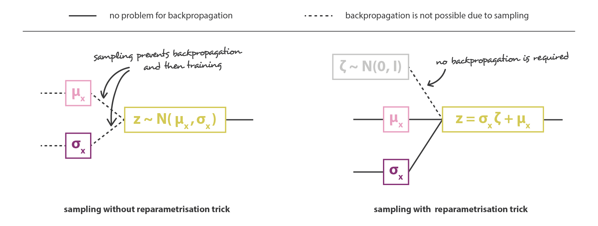 
<!--  -->

図 18. リパラメトリゼーショントリックの説明図<!-- Illustration of the reparametrisation trick. -->

<!--  -->

最後に，この方法で得られた変分自己符号化器アーキテクチャの目的関数は，理論的な期待値が，ほとんどの場合 1 回のドローで構成される多かれ少なかれ正確なモンテカルロ近似で置き換えられる前節の最後の式によって与えられる。
そこで，この近似を考慮し $C = 1/(2c)$ とすると，前節で直感的に導いた損失関数が復元され，再構成項，正則化項，およびこれら 2 項の相対重みを定義する定数で構成される。
<!-- Finally, the objective function of the variational autoencoder architecture obtained this way is given by the last equation of the previous subsection in which the theoretical expectancy is replaced by a more or less accurate Monte-Carlo approximation that consists, most of the time, into a single draw. 
So, considering this approximation and denoting C = 1/(2c), we recover the loss function derived intuitively in the previous section, composed of a reconstruction term, a regularisation term and a constant to define the relative weights of these two terms.
-->

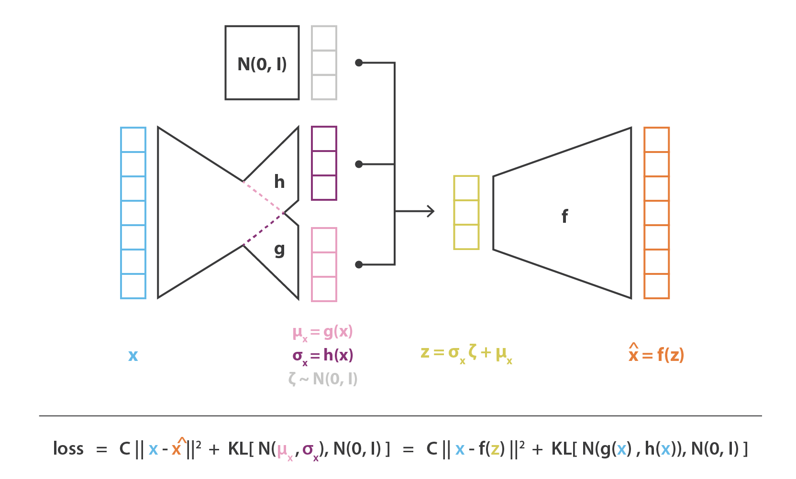 
<!--  -->

図 19. 変分自己符号化器の表現<!-- Variational Autoencoders representation. -->

# 5. お持ち帰り
<!-- # Takeaways-->

この記事の主な収穫は、以下の通り:
<!-- The main takeways of this article are: -->

* 次元削減は，あるデータを記述する特徴の数を減らす処理である (初期の特徴のサブセットのみを選択するか，それらを組み合わせて新しい特徴を減らす)。したがって符号化の処理とみなすことができる。
* 自己符号化器は，符号化器と復号化器の両方で構成されるニューラルネットワークアーキテクチャで、データに対してボトルネックを作り，符号化-復号化処理で失う情報量を最小限にするように学習する (再構成エラーを減らす目的で勾配降下の繰り返しによって学習する)。
* オーバーフィッティングにより，自己符号化器の潜在空間は非常に不規則になることがある (潜在空間内の近い点は全く異なる復号化データを与える，潜在空間のいくつかの点は復号化されると無意味な内容を与える，など)。したがって，潜在空間から点を抽出し，復号化器を通過させて新しいデータを得るだけの生成処理は定義できない。
* 変分自己符号化器 (VAEs) は，潜在空間の不規則性の問題に取り組む自己符号化器で，符号化器が単一点の代わりに潜在空間上の分布を返すようにし，損失関数に潜在空間をよりよく構成するために，その返された分布の正則化項を追加します。
* データを記述するための単純な基本的確率モデルを仮定すると，再構成項と正則化項からなる VAE の非常に直感的な損失関数は，特に変分推論の統計的手法を使用して慎重に導き出すことができる (「変分」自己符号化器という名前もそのためである)。

<!--
- dimensionality reduction is the process of reducing the number of features that describe some data (either by selecting only a subset of the initial features or by combining them into a reduced number new features) and, so, can be seen as an encoding process]
- autoencoders are neural networks architectures composed of both an encoder and a decoder that create a bottleneck to go through for data and that are trained to lose a minimal quantity of information during the encoding-decoding process (training by gradient descent iterations with the goal to reduce the reconstruction error)
- due to overfitting, the latent space of an autoencoder can be extremely irregular (close points in latent space can give very different decoded data, some point of the latent space can give meaningless content once decoded, ...) and, so, we can't really define a generative process that simply consists to sample a point from the latent space and make it go through the decoder to get a new data
- variational autoencoders (VAEs) are autoencoders that tackle the problem of the latent space irregularity by making the encoder return a distribution over the latent space instead of a single point and by adding in the loss function a regularisation term over that returned distribution in order to ensure a better organisation of the latent space
- assuming a simple underlying probabilistic model to describe our data, the pretty intuitive loss function of VAEs, composed of a reconstruction term and a regularisation term, can be carefully derived, using in particular the statistical technique of variational inference (hence the name "variational" autoencoders)
-->

結論として，ここ数年 GAN は VAE よりもはるかに多くの科学的貢献をしてきたと言える。
その理由として GAN の理論的基盤 (確率モデルや変分推論) が VAE の理論的基盤よりも複雑であること，そして GAN を支配する敵対的学習概念が単純であることが挙げられる。
今回の投稿では [今年の初めに GAN で行ったように](https://towardsdatascience.com/understanding-generative-adversarial-networks-gans-cd6e4651a29)，VAE を初めて使う人にも分かりやすくするために，価値ある直観と強力な理論的基盤を共有できたのではないかと思っている。
しかし，両者を深く議論した今，一つの疑問が残る。あなたは GAN と VAE，どちらが好きですか？
<!-- To conclude, we can outline that, during the last years, GANs have benefited from much more scientific contributions than VAEs. 
Among other reasons, the higher interest that has been shown by the community for GANs can be partly explained by the higher degree of complexity in VAEs theoretical basis (probabilistic model and variational inference) compared to the simplicity of the adversarial training concept that rules GANs. 
With this post we hope that we managed to share valuable intuitions as well as strong theoretical foundations to make VAEs more accessible to newcomers, [as we did for GANs earlier this year](/understanding-generative-adversarial-networks-gans-cd6e4651a29). 
However, now that we have discussed in depth both of them, one question remains... are you more GANs or VAEs?
-->

読んでくれてありがとう
<!-- Thanks for reading! -->

<!-- Other articles written with [Baptiste Rocca](https://medium.com/u/20ad1309823a?source=post_page-----f70510919f73--------------------------------)

### towardsdatascience.com
Written by  Joseph Rocca

Data Scientist at Teads. Towards Data Science editorial associate. Mathematics instructor at UTC. 
[www.linkedin.com/in/joseph-rocca-b01365158](http://www.linkedin.com/in/joseph-rocca-b01365158)  -->
