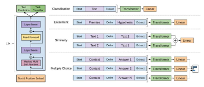

# [OpenAI GPT モデルの旅](https://medium.com/walmartglobaltech/the-journey-of-open-ai-gpt-models-32d95b7b7fb2)
<!-- #### [The Journey of Open AI GPT models](https://medium.com/walmartglobaltech/the-journey-of-open-ai-gpt-models-32d95b7b7fb2) -->

### [Priya Shree](https://medium.com/@priya.shree.1708)

# GPT1, 2, and 3 

<!-- ## [The Journey of Open AI GPT models](https://medium.com/walmartglobaltech/the-journey-of-open-ai-gpt-models-32d95b7b7fb2)-->

 

GPT1, Radford et al, 2019, Fig. 1 より

    

<!-- - [GPT 生成的事前学習による言語理解の向上](file:///Users/asakawa/study/2022personal/2019Radford_GPT_ja.md){:target="_blank"} -->

## GPT, Radford (2019)

自然言語理解は，テキストの含意，質問応答，意味的類似性評価，文書分類など，幅広い多様な課題から構成される。 
ラベル付けされていない大規模なテキストコーパスは豊富にあるが，これらの特定の課題を学習するためのラベル付きデータは少なく，識別的に学習したモデルが十分な性能を発揮することは困難である。 
我々はラベル付けされていない多様なテキストコーパスに対して言語モデルを **生成的に事前学習** し，その後，各課題に対して **識別的に微調整** を行うことにより，これらの課題で大きな利益が得られることを実証する。
従来のアプローチとは異なり，我々は課題に応じた入力変換を行うことで，モデルアーキテクチャの変更を最小限に抑えながら，効率的な学習が行えるようにする。
我々は，自然言語理解に関する広範なベンチマークにおいて，本アプローチの有効性を実証する。
課題に依存しない我々のモデルは，各課題に特化したアーキテクチャを用いた識別学習モデルを凌駕し，調査した 12 課題のうち 9 課題において現状を大幅に改善することができた。 
例えば，常識的推論 (Stories Cloze Test) では 8.9%，質問応答 (RACE) では 5.7%，テキスト含意(MultiNLI) では 1.5% の絶対的な向上を達成した。
<!-- Natural language understanding comprises a wide range of diverse tasks such as textual entailme
nt, question answering, semantic similarity assessment, and document classification.  
Although large unlabeled text corpora are abundant, labeled data for learning these specific tasks i
s scarce, making it challenging for discriminatively trained models to perform adequately.  
We demonstrate that large gains on these tasks can be realized by generative pre-training of a langu
age model on a diverse corpus of unlabeled text, followed by discriminative fine-tuning on each spec
ific task. 
In contrast to previous approaches, we make use of task-aware input transformations during fine-tuni
ng to achieve effective transfer while requiring minimal changes to the model architecture. 
We demonstrate the effectiveness of our approach on a wide range of benchmarks for natural language 
understanding. 
Our general task-agnostic model outperforms discriminatively trained models that use architectures s
pecifically crafted for each task, significantly improving upon the state of the art in 9 out of the
 12 tasks studied.  
For instance, we achieve absolute improvements of 8.9% on common sense reasoning (Stories Cloze Test
), 5.7% on question answering (RACE), and 1.5% on textual entailment (MultiNLI). -->

OpenAI による GPT (Generative Pre-trained Transformer) モデルは，非常に強力な言語モデルの導入により，自然言語処理 (NLP) コミュニティに旋風を巻き起こしている。
これらのモデルは，質問応答，テキスト含意，テキスト要約など，様々な NLP 課題を教師付き訓練なしで実行することができる。
これらの言語モデルは，課題を理解するためにほとんど例を必要とせず，教師あり方式で学習した最先端のモデルと同等かそれ以上の性能を発揮する。
この記事では，これらのモデルの歩みを取り上げ 2 年の間にどのように進化してきたかを理解する。
ここでは，以下のトピックを取り上げる予定である。 
<!-- 
Generative Pre-trained Transformer (GPT) models by OpenAI have taken natural language processing (NLP) community by storm by introducing very powerful language models. 
These models can perform various NLP tasks like question answering, textual entailment, text summarisation etc. without any supervised training. 
These language models need very few to no examples to understand the tasks and perform equivalent or even better than the state-of-the-art models trained in supervised fashion.
In this article we will cover the journey of these models and understand how they have evolved over a period of 2 years. We will be covering the following topics here:-->

1. GPT-1 論文 (Improving Language Understanding by Generative Pre-training) に関する議論。
2. GPT-2 論文 (Language Models are unsupervised multitask learners) とその後の GPT-1 からの改良点についての議論。
3. GPT-3 論文 (Language models are few shot learners) とその改良による，これまでの NLP の中で最も強力なモデルの一つについての議論。

<!--1. Discussion of GPT-1 paper (Improving Language Understanding by Generative Pre-training).
2. Discussion of GPT-2 paper (Language Models are unsupervised multitask learners) and its subsequent improvements over GPT-1.
3. Discussion of GPT-3 paper (Language models are few shot learners) and the improvements which have made it one of the most powerful models NLP has seen till date.-->

この記事は NLP の用語とトランスフォーマーのアーキテクチャの基本を熟知していることを前提としている。
<!-- This article assumes familiarity with the basics of NLP terminologies and transformer architecture.-->

まずは，これらの論文を 1 つ 1 つ理解することから始めましょう。
この旅をより理解しやすくするために，各論文は 4 節に分けた: 論文で議論された目的と概念，使用したデータセット，モデルのアーキテクチャと実装の詳細，そして性能評価である。
<!-- Let us begin by understanding these papers one by one. To make this journey more comprehendible, I have segmented each paper into four sections: objectives and concepts discussed in the papers, the datasets used, the model architecture and implementation details, and their performance evaluations.
-->

### GPT-1 生成モデルによる事前訓練による言語理解の向上 Improving Language Understanding by Generative Pre-training

本発表以前は，最新の自然言語処理モデルの多くは，教師あり学習を用いて，感情分類や含意関係などの特定の課題に特化して学習されていた。
しかし，教師あり学習には 2 つの大きな限界がある。

1. 特定の課題を学習するために大量の注釈付きデータが必要である。だが，これは容易に入手できないことが多い。
2. 学習させた課題以外の課題に対して汎化できない。

<!-- Prior to this work, most state-of-the-art NLP models were trained specifically on a particular task like sentiment classification, textual entailment etc. using supervised learning. However, supervised models have two major limitations:

1. They need large amount of annotated data for learning a particular task which is often not easily available.
2. They fail to generalize for tasks other than what they have been trained for.
-->

この論文では，ラベル付けされていないデータを用いて生成言語モデルを学習し，分類，感情分析，テキスト含意などの特定の下流課題の例を示すことによって，モデルを微調整することを提案した。
<!-- This paper proposed learning a generative language model using unlabeled data and then fine-tuning the model by providing examples of specific downstream tasks like classification, sentiment analysis, textual entailment etc.-->

本論文で取り上げたコンセプトとアプローチについて，順を追って説明する。
<!-- Let us walk through the concepts and approaches discussed in this paper.-->

#### (GPT-1) 1. 学習目標とコンセプト: 

この NLP 課題のための半教師付き学習 (教師なし事前学習と教師ありによる微調整) は，以下の 3 つの要素からなる。
<!-- 1. Learning Objectives and Concepts: This semi-supervised learning (unsupervised pre-training followed by supervised fine-tuning) for NLP tasks has following three components:-->

* **a**: Unsupervised language Modeling
* **b**: Supervised Fine-Turning
* **c**: Task Specific Input Transformations: 

**a**. 教師なし言語モデリング (事前学習)。教師なし学習では，標準的な言語モデルの目的関数を使用する。
<!-- a. Unsupervised Language Modelling (Pre-training): For unsupervised learning, standard language model objective was used. -->

$$
L_ {1}(T)=\sum_{i}\log P(t_ {i}\vert t_ {i-k},\ldots, t_ {i-1};\theta)\tag{i}
$$

ここで $T$ は教師なしデータ$\{t_ {1},\ldots,t_ {n}\}$ トークン集合，$k$ はコンテキスト窓サイズ，$\theta$ は確率的勾配降下を用いて学習したニューラルネットワークのパラメータである。
<!-- where T was the set of tokens in unsupervised data {t_1,…,t_n}, k was size of context window, θ were the parameters of neural network trained using stochastic gradient descent.-->

**b**. 教師あり微調整:  この部分は，特徴量やトークン $x_ {1},\ldots,x_ {n}$ が与えられたときに，ラベル $y$ を観測する尤度を最大化することを目的とした。<!-- Supervised Fine-Tuning: This part aimed at maximising the likelihood of observing label y, given features or tokens x_1,…,x_n. -->

$$
L_ {2}(C)=\sum_ {x,y}\log P(y\vert x_ {1},\ldots,x_ {n})\tag{ii}
$$

ここで $C$ は学習例で構成されるラベル付きデータセットである。
著者らは式 (ii) で示される目的関数を単純に最大化するのではなく，より良い汎化，より速い収束を得るために，教師ありの微調整のための補助学習目的を追加した。
修正された学習目的は以下のように記述される。
<!-- where C was the labeled dataset made up of training examples.
Instead of simply maximising the objective mentioned in equation (ii), the authors added an auxiliary learning objective for supervised fine-tuning to get better generalisation and faster convergence. The modified training objective was stated as:
-->

$$
L_ {3}(C) = L_ {2}(C) + \lambda L_ {1}(C)\tag{iii}
$$

ここで $L_ {1}(C)$ は言語モデルの学習の補助目的関数，$\lambda$ はこの補助目的に与える重みである。
$\lambda=0.5$ であった。
教師あり微調整は，下流課題のタスクラベルを得るために，変換器モデルに線形層とソフトマックス層を追加することで実現された。
<!-- where L₁(C) was the auxiliary objective of learning language model and λ was the weight given to this secondary learning objective. λ was set to 0.5.
Supervised fine-tuning was achieved by adding a linear and a softmax layer to the transformer model to get the task labels for downstream tasks.
-->

**c**. 課題固有の入力変換: 微調整の際にモデルのアーキテクチャの変更を最小限にするため，特定の下流課題への入力を順序付き系列に変換した。
トークンは以下のように並べ替えられた。<!-- Task Specific Input Transformations: In order to make minimal changes to the architecture of the model during fine tuning, inputs to the specific downstream tasks were transformed into ordered sequences. The tokens were rearranged in following manner:
 -->

* 入力系列にスタートトークンとエンドトークンを追加した。
* 例題の異なる部分の間にデリミタートークンを追加し，入力が順番に並ぶようにした。
質問応答，多肢選択課題などの課題では，各事例に対して複数の系列が送信された。
例えば，質問応答課題では，文脈，質問，答えの系列から構成される学習例である。

<!-- * Start and end tokens were added to the input sequences.
* A delimiter token was added between different parts of example so that input could be sent as ordered sequence. 
For tasks like question answering, multiple choice questions etc. multiple sequences were sent for each example. E.g. a training example comprised of sequences for context, question and answer for question answering task.
-->

#### (GPT-1) 2. データセット <!-- Dataset: --> 

GPT-1 では，言語モデルの学習に BooksCorpus データセットを使用した。
BooksCorpus には約 7000 冊の未発表の書籍があり，未発表のデータで言語モデルを学習させることができた。
このデータは，下流課題のテストセットにはほとんど含まれていない。
また，このコーパスには連続したテキストが大量に含まれているため，広い範囲の依存関係を学習することができる。
<!-- GPT-1 used the BooksCorpus dataset to train the language model. 
BooksCorpus had some 7000 unpublished books which helped training the language model on unseen data. 
This data was unlikely to be found in test set of downstream tasks. 
Also, this corpus had large stretches of contiguous text, which helped the model learn large range dependencies.-->

#### (GPT-1) 3. モデルのアーキテクチャと実装の詳細
<!-- Model Architecture and Implementation Details:-->

GPT-1 では，言語モデルの学習にマスク化された自己注意を持つ 12 層の符号化器のみのトランスフォーマー構造を用いた。
このモデルのアーキテクチャは，トランスフォーマーに関する原著論文に記載されているものとほぼ同じ。
マスク化は，言語モデルが現在の単語の右側にある後続の単語にアクセスできないようにするという言語モデルの目的を達成するのに役立ちった。
<!-- GPT-1 used 12-layer decoder only transformer structure with masked self-attention to train language model. 
The architecture of model remained same to a large extent as described in the original work on transformers. 
Masking helped achieve the language model objective wherein the language model did not have access to subsequent words to the right of current word. -->

##### (GPT-1) 3.1 教師なし学習
<!-- For Unsupervised Training:-->

* Byte Pair Encoding (BPE) を使用し 40,000 マージを行った。
* トークンの単語埋め込みに 768 次元の状態を使用。位置の埋め込みも学習された。
* 各自己注意層には 12 個の注意ヘッドを持つ 12 層モデルを使用。
* 位置情報フィードフォワード層には 3072 次元の状態を用いた。
* Adam 最適化関数を使用し，学習率は $2.5e-4$ とした。
* 正則化には，注意，残差，埋め込みのドロップアウトを用い，ドロップアウト率は 0.1。
また，非バイアス重みのために L2 正則化の修正版も使用された。
* 活性化関数として GELU を用いた。
* サイズ 64，配列長 512 のミニバッチを 100 エポック学習させた。
モデルのパラメータは全部で 117 Mであった。

<!--
* Byte Pair Encoding (BPE) vocabulary with 40,000 merges was used.
* Model used 768-dimensional state for encoding tokens into word embeddings. Position embeddings were also learnt during training.
* 12 layered model was used with 12 attention heads in each self-attention layer.
* For position wise feed forward layer 3072-dimensional state was used.
* Adam optimiser was used with learning rate of 2.5e-4.
* Attention, residual and embedding dropouts were used for regularisation, with dropout rate of 0.1. Modified version of L2 regularisation was also used for non-bias weights.
* GELU was used as activation function.
* The model was trained for 100 epochs on mini-batches of size 64 and sequence length of 512. The model had 117M parameters in total.
-->

##### (GPT-1) 3.2 教師あり微調整
<!-- 3.2 For Supervised Fine-Turing:-->

* 教師あり微調整は，ほとんどの下流課題で 3 エポックと短い時間で完了した。
これは，モデルが事前学習ですでに言語について多くのことを学んでいたことを示している。そのため，最小限の微調整で十分であったと思われる。
* 教師なし事前学習で得られたハイパーパラメータのほとんどが微調整に使用された。

<!-- * Supervised fine-tuning took as few as 3 epochs for most of the downstream tasks. This showed that the model had already learnt a lot about the language during pre-training. Thus, minimal fine-tuning was enough.
* Most of the hyper parameters from unsupervised pre-training were used for fine-tuning. -->

#### (GPT-1) 4. Performance and Summary:

* GPT-1 は 12 課題中 9 個課題で，特別に学習させた教師付き SOTA モデルより優れた性能を示した。
<!-- GPT-1 performed better than specifically trained supervised state-of-the-art models in 9 out of 12 tasks the models were compared on.-->

* このモデルのもう一つの重要な成果は，様々な課題において適切なゼロ撃学習の性能を実現したことである。
この論文では，事前学習により，質疑応答，スキーマ解決，感情分析などの様々な NLP 課題で，モデルがゼロ撃学習の性能を向上させたことを実証している。
<!-- Another significant achievement by this model was its decent zero-shot performance on various tasks. 
The paper demonstrated that model had evolved in zero shot performance on different NLP tasks like question-answering, schema resolution, sentiment analysis etc. due to pre-training. -->

* GPT-1 では，言語モデルが効果的な事前学習の対象であり，モデルの汎化を助けることができることを証明した。
このアーキテクチャは転移学習を促進し，わずかな微調整で様々な NLP 課題を実行することができる。
このモデルは生成的な事前学習の威力を示し，より大きなデータセットとより多くのパラメータでこの威力を発揮できる他のモデルへの道を開くものであった。
<!-- GPT-1 proved that language model served as an effective pre-training objective which could help model generalize well. 
The architecture facilitated transfer learning and could perform various NLP tasks with very little fine-tuning. 
This model showed the power of generative pre-training and opened up avenues for other models which could unleash this potential better with larger datasets and more parameters. -->

### GPT-2 言語モデルは教師なしマルチタスク学習器 Language Models are unsupervised multitask learners

GPT-2 モデルの開発は，より大きなデータセットを使い，より多くのパラメータを追加して，さらに強力な言語モデルを学習させるという点が主であった。
ここでは，GPT-2 モデルの重要な開発内容と，論文で議論された概念について見ていく。
<!-- The developments in GPT-2 model were mostly in terms of using a larger dataset and adding more parameters to the model to learn even stronger language model. 
Let us look at the significant developments in GPT-2 model and the concepts discussed in the paper: -->

#### (GPT-2) 1. 学習目標とコンセプト
以下は，論文で議論された，自然言語処理の文脈における 2 つの重要な概念である。
<!-- 1. Learning Objectives and Concepts: Following are the two important concepts discussed in this paper in the context of NLP. -->

* **課題条件付け**: 言語モデルの学習目的は $P(\text{output}\vert\text{input})$ で定式化されることを見てきた。しかし GPT-2 では，教師なしモデルを用いて複数課題を学習することを目的とした。そのため，学習目標を $P(\text{output}\vert\text{|input};\text{task})$ に変更する必要がある。これは課題条件付ングと呼ばれ，同じ入力に対して課題が異なればモデルも異なる出力をすることが期待される。モデルによっては課題条件付けをアーキテクチャレベルで実装し，モデルに入力と課題の両方が与えられる。言語モデルの場合，出力，入力，課題はすべて自然言語の系列であった。したがって，言語モデルの課題条件付けは，モデルに課題を実行させるための事例や自然言語の指示を与えることによって行われる。課題条件付けは，次に説明するゼロ撃学習課題の転移学習の基礎を形成する。
* **ゼロ撃学習とゼロ撃転移学習**:  GPT-2 の興味深い機能として，ゼロ撃学習課題転送がある。 ゼロ撃学習は，ゼロ撃学習の転移学習の特殊な場合で，事例が全く提供されず，与えられた命令に基づいてモデルが課題を理解するものである。GPT-2 では，微調整のために GPT-1 で行った配列の組み替えの代わりに，モデルが課題の性質を理解して答えを出すことを期待する形式で入力を行った。これは，ゼロ撃課題の転送学習の動作をエミュレートするために行われた。例えば，英仏翻訳課題では，モデルに英文の後に仏語とプロンプト(:)が与えられた。モデルはこれが翻訳課題であることを理解し，英文のフランス語の対訳を与えることになっていた。

<!--     * **Task Conditioning**: We had seen that training objective of language model is formulated as P(output|input). However, GPT-2 aimed at learning multiple tasks using the same unsupervised model. To achieve that, the learning objective should be modified to P(output|input, task). This modification is known as task conditioning, where the model is expected to produce different output for same input for different tasks. Some models implement task conditioning at an architectural level where the model is fed both, the input and the task. For language models, the output, input and task, all are sequences of natural language. Thus, task conditioning for language models is performed by providing examples or natural language instructions to the model to perform a task. Task conditioning forms the basis for zero-shot task transfer which we will cover next.
* **Zero Shot Learning and Zero Short Task Transfer**: An interesting capability of GPT 2 is zero shot task transfer. Zero shot learning is a special case of zero shot task transfer where no examples are provided at all and the model understands the task based on the given instruction. Instead of rearranging the sequences, as was done for GPT-1 for fine-tuning, input to GPT-2 was given in a format which expected the model to understand the nature of task and provide answers. This was done to emulate zero-shot task transfer behaviour. E.g. for English to French translation task, the model was given an English sentence followed by the word French and a prompt (:). The model was supposed to understand that it is a translation task and give French counterpart of English sentence.-->

#### (GPT-2) 2. データセット

広範かつ良質なデータセットを作成するために，著者らは Redditプラットフォームをスクレイピングし，高アップボーティングの記事のアウトバウンドリンクからデータを取得した。
その結果 WebText と呼ばれるデータセットには 800 万以上のドキュメントから 40GBのテキストデータが含まれていた。
このデータセットは GPT-2 の学習に使用され GPT-1 の学習に使用された Book Corpus データセットと比較して巨大なデータセットであった。
多くのテストセットには Wikipedia の記事が含まれているため WebText から Wikipedia の記事をすべて削除した。

<!-- 2. **Dataset**: To create an extensive and good quality dataset the authors scraped the Reddit platform and pulled data from outbound links of high upvoted articles. 
The resulting dataset called WebText, had 40GB of text data from over 8 million documents. 
This dataset was used for training GPT-2 and was huge compared to Book Corpus dataset used for training GPT-1 model. 
All Wikipedia articles were removed from WebText as many test sets contain Wikipedia articles.
-->

#### (GPT-2) 3. モデル・アーキテクチャと実装の詳細
GPT-2 は 15億 のパラメータを持っていた。
これは GPT-1 (1億1700万パラメータ) の 10 倍である。GPT-1 との主な相違点は以下の通り。

* GPT-2 は 48 層で，単語埋め込みに 1600 次元のベクトルを使用。
* より大きな語彙 (50,257個) を用いた。
* バッチサイズを 512，文脈窓幅を 1024 とした。
* 層正規化を各下位ブロックの入力に移動し，最終自己認識ブロックの後に層正規化を追加した。
* 初期化時に残差層の重みを $1/\sqrt{N}$ ($N$ は残差層の数) でスケーリング。

著者らは 117M (GPT-1 と同じ)，345 M， 762 M，1.5 B (GPT-2) のパラメータで 4 つの言語モデルを学習させた。
その結果，GPT-1 よりも GPT-2 の方が錯綜度が低いことがわかった。
このことから，同一データセットに対する言語モデルの錯綜度は，パラメータ数の増加とともに減少することが確認された。
また，すべての下流課題において，パラメータ数の多いモデルの方が性能が高いことがわかった。

<!-- 3. **Model architecture and Implementation Details**: GPT-2 had 1.5 billion parameters. 
which was 10 times more than GPT-1 (117M parameters). Major differences from GPT-1 were:

* GPT-2 had 48 layers and used 1600 dimensional vectors for word embedding.
* Larger vocabulary of 50,257 tokens was used.
* Larger batch size of 512 and larger context window of 1024 tokens were used.
* Layer normalisation was moved to input of each sub-block and an additional layer normalisation was added after final self-attention block.
* At initialisation, the weight of residual layers was scaled by 1/√N, where N was the number of residual layers.

    The authors trained four language models with 117M (same as GPT-1), 345M, 762M and 1.5B (GPT-2) parameters. 
    Each subsequent model had lower perplexity than previous one. 
    This established that the perplexity of language models on same dataset decreases with an increase in the number of parameters. 
    Also, the model with the highest number of parameters performed better on every downstream task.
-->

#### (GPT-2) 4. 性能とまとめ

GPT-2 は，読解，要約，翻訳，質問応答などの下流課題のいくつかのデータセットで評価された。
それらの課題と GPT-2 の性能について詳しく見ていく。
    
* GPT-2 は 8 つの言語モデリングデータセットのうち 7 つにおいて，ゼロ撃学習設定で当時の SOTA を向上させた。
* Children's Book Dataset は，名詞，前置詞，名前付きエンティティなどの単語のカテゴリに関する言語モデルの性能を評価するものであった。GPT-2 は，普通名詞と名前付き実体の認識において，最先端の精度を約 7% 向上させた。
* LAMBADA データセットは，長距離依存関係の識別と文末単語の予測におけるモデルの性能を評価するものであった。GPT-2 は，錯綜度 を 99.8 から 8.6 に減少させ，精度を大幅に向上させた。
* GPT-2 は，ゼロ撃学習環境における読解課題において，ベースライン 4 モデルのうち 3 モデルを上回る性能を示した。
* フランス語から英語への翻訳課題において，GPT-2 は教師無しモデルよりも優れた性能を示したが，最新の教師無しモデルを上回る性能は得られなかった。
* テキスト要約課題において GPT-2 は多くの教師無しモデルより高い性能を示したが，最新の教師無しモデルより低い性能であった。
GPT-2 は，ゼロ撃学習でテストした 8 つの言語モデリングデータセットのうち7 つで，最先端の結果を得ることができた。
GPT-2 では，より大きなデータセットで学習し，より多くのパラメータを持つことで，言語モデルの課題理解能力が向上し，ゼロ撃学習設定において多くの課題で SOTA を上回ることを示した。
この論文では，モデルの容量が増えるにつれて，性能が対数線形的に増加すると述べている。また，言語モデルの錯綜度の低下は飽和を示さず，パラメータ数の増加とともに低下し続けることが確認された。
実は GPT-2 は WebText データセットへの適合度が低く，より多くの時間をかけて学習すれば，さらに錯綜度を下げることができたと考えられる。
このことから GPT-2 のモデルサイズは限界ではなく，さらに大きな言語モデルを構築することで錯綜度を減らし、言語モデルの自然言語理解能力を向上させることができることが分かった。

<!-- 4. Performance and Summary: GPT-2 was evaluated on several datasets of downstream tasks like reading comprehension, summarisation, translation, question answering etc. 
Let us look at some of those tasks and GPT-2’s performance on them in detail:
    
* GPT-2 improved the then existing state-of-the-art for 7 out of 8 language modelling datasets in zero shot setting.
* Children’s Book Dataset evaluates the performance on language models on categories of words like nouns, prepositions, named entities etc. GPT-2 increased the state-of-the-art accuracy approximately by 7% for common noun and named entity recognition.
* LAMBADA dataset evaluates the performance of models in identifying long range dependencies and predicting last word of a sentence. GPT-2 reduced the perplexity from 99.8 to 8.6 and improved the accuracy significantly.
* GPT-2 outperformed 3 out 4 baseline models in reading comprehension tasks in zero shot setting.
* In French to English translation task, GPT-2 performed better than most unsupervised models in zero shot setting but did not outperform the state-of-the-art unsupervised model.
* GPT-2 could not perform well on text summarisation and its performance was similar or lesser than classic models trained for summarisation.
-->

<!-- > GPT-2 was able to achieve state-of-the-art results on 7 out of 8 tested language modelling datasets in zero-shot.

GPT-2 では，より大きなデータセットで学習し，より多くのパラメータを持つことで，言語モデルの課題理解能力が向上し，ゼロ撃学習設定において多くの課題で SOTA を上回ることを示した。
この論文では，モデルの容量が増えるにつれて，性能が対数線形的に増加すると述べている。また，言語モデルの錯綜度の低下は飽和を示さず，パラメータ数の増加とともに低下し続けることが確認された。
実は GPT-2 は WebText データセットへの適合度が低く，より多くの時間をかけて学習すれば，さらに錯綜度を下げることができたと考えられる。
このことから GPT-2 のモデルサイズは限界ではなく，さらに大きな言語モデルを構築することで錯綜度を減らし、言語モデルの自然言語理解能力を向上させることができることが分かった。 -->

<!-- GPT-2 showed that training on larger dataset and having more parameters improved the capability of language model to understand tasks and surpass the state-of-the-art of many tasks in zero shot settings. 
    The paper stated that with increase in the capacity of the model, the performance increased in log-linear fashion. Also, the drop in perplexity of language models did not show saturation and kept on decreasing with increase in number of parameters. 
    As a matter of fact, GPT-2 under fitted the WebText dataset and training for more time could have reduced the perplexity even more. 
    This showed that model size of GPT-2 was not the limit and building even larger language models would reduce the perplexity and make language models better at natural language understanding. -->

### GPT-3 言語モデルは少数撃学習機 Language models are few shot learners

Open AI は課題を理解し実行するために微調整を必要とせず，わずかなデモンストレーションで済む，非常に強力な言語モデルの構築を目指し，1750 億のパラメータを持つ GPT-3 モデルを構築した。
このモデルは，Microsoft の強力な Turing NLG 言語モデルの 10 倍，GPT-2 の 100倍 のパラメータを備えていた。
GPT-3 は多くのパラメータと豊富なデータセットで学習されているため，ゼロ撃および少数撃の設定において，下流の NLP 課題で優れた性能を発揮する。
また，大容量であるため，人間が書いた記事と見分けがつかないような記事を書く能力も持っている。
また，数字の合計，SQL クエリやコードの記述，文中の単語のスクランブル解除，課題の自然言語記述による React や JavaScript コードの記述など，明示的に学習させていない課題をオンザフライで実行することができる。
GPT-3 論文で言及された概念と開発について，このモデルの広範な影響と限界とともに理解しよう。
<!-- In its quest to build very strong and powerful language models which would need no fine-tuning and only few demonstrations to understand tasks and perform them, Open AI built the GPT-3 model with 175 billion parameters. 
This model had 10 times more parameters than Microsoft’s powerful Turing NLG language model and 100 times more parameters than GPT-2. Due to large number of parameters and extensive dataset GPT-3 has been trained on, it performs well on downstream NLP tasks in zero-shot and few-shot setting. 
Owing to its large capacity, it has capabilities like writing articles which are hard to distinguish from ones written by humans. 
It can also perform on-the-fly tasks on which it was never explicitly trained on, like summing up numbers, writing SQL queries and codes, unscrambling words in a sentence, writing React and JavaScript codes given natural language description of task etc. 
Let’s understand the concepts and developments mentioned in GPT-3 paper along with some broader impacts and limitations of this model:
-->

#### (GPT-3) 1. 学習目標と概念

この論文で取り上げた 2 つの概念について説明する
<!-- 1. **Learning Objectives and Concepts**: Let us discuss the two concepts discussed in this paper.-->

* インコンテキスト学習: 大規模言語モデルは，学習させたテキストデータを用いてパターン認識などの能力を身につける。
言語モデルは文脈から次単語を予測するという第一の目的を学習する一方で，言語モデリング課題の損失を最小化するのに役立つデータのパターンを認識し始める。
その後，この能力はゼロ撃課題転送の際にモデルを助ける。言語モデルは，いくつかの例や，何をすべきかの説明が提示されると，その例のパターンを，過去に類似のデータについて学習したものと照合し，その知識を用いて課題を実行する。
これは大規模言語モデルの強力な能力であり，モデルのパラメータ数が増えるにつれて増加する。
* 少数撃学習，一撃げ句集，ゼロ撃学習の設定: 
先に述べたように，少数撃，一撃，ゼロ撃設定は，ゼロ撃課題の転移学習の特殊なケースである。
数撃ちゃ当たるの設定では，モデルには課題の説明と，モデルの文脈窓に適合する数の例が提供される。
一撃学習設定では，モデルは正確に 1 つの事例を提供され，ゼロ撃学習設定では，事例は提供されない。
モデルの容量が大きくなるにつれて，少数撃，一撃，ゼロ撃学習の能力も向上する。

<!-- * In-context learning: Large language models develop pattern recognition and other skills using the text data they are trained on. While learning the primary objective of predicting the next word given context words, the language models also start recognising patterns in data which help them minimise the loss for language modelling task. Later, this ability helps the model during zero-shot task transfer. When presented with few examples and/or a description of what it needs to do, the language models matches the pattern of the examples with what it had learnt in past for similar data and uses that knowledge to perform the tasks. This is a powerful capability of large language models which increases with the increase in the number of parameters of the model.
* Few-shot, one-shot and zero-shot setting: As discussed earlier, few, one and zero-shot settings are specialised cases of zero-shot task transfer. In few-shot setting, the model is provided with task description and as many examples as fit into the context window of model. In one-shot setting the model is provided exactly one example and in zero-shot setting no example is provided. With increase in capacity of model, few, one and zero-shot capability of model also improves.-->

#### (GPT-3) 2. データセット

GPT-3 は 5 つのコーパスを組み合わせて学習させた。それぞれのコーパスには一定の重みが設定されている。高品質なデータセットはより頻繁にサンプリングされ，モデルはそれらに対して 1 回以上のエポックについて学習された。使用したデータセットは Common Crawl, WebText2, Books1, Books2,  Wikipedia の 5 つであった。

<!-- 2. Dataset: GPT-3 was trained on a mix of five different corpora, each having certain weight assigned to it. High quality datasets were sampled more often, and model was trained for more than one epoch on them. The five datasets used were Common Crawl, WebText2, Books1, Books2 and Wikipedia.-->

#### (GPT-3) 3. モデルおよび実装の詳細

GPT-3 のアーキテクチャは GPT-2 と同じである。GPT-2 との主な相違点は以下の通り:

* GPT-3 は 96 層で ，各層に 96 個の注意ヘッドを持つ。
* 単語埋め込みのサイズが 1600 から 12888 に増加。
* 文脈窓幅サイズを GPT-2 の1 024 から GPT-3 の 2048 トークンに変更。
* Adam optimiser を使用し $\beta _ {1}=0.9,\beta_ {2}=0.95,\epsilon=10^(-8)$ とした。
* 密な注意パターンと局所的にバンド化された疎な注意パターンを交互に使用。

<!-- 3. Model and Implementation details: The architecture of GPT-3 is same as GPT-2. Few major differences from GPT-2 are:

    * GPT-3 has 96 layers with each layer having 96 attention heads.
    * Size of word embeddings was increased to 12888 for GPT-3 from 1600 for GPT-2.
    * Context window size was increased from 1024 for GPT-2 to 2048 tokens for GPT-3.
    * Adam optimiser was used with β_1=0.9,β_2=0.95 and ε= 10^(-8).
    * Alternating dense and locally banded sparse attention patterns were used.
-->

#### (GPT-3) 4. 性能とまとめ

GPT-3 は，多くの言語モデリングと NLP のデータセットで評価された。
LAMBADA や Penn Tree Bank のような言語モデリングデータセットにおいて GPT-3 は少数撃またはゼロ撃学習の設定で SOTA (最先端技術) より優れた性能を発揮した。
その他のデータセットでは GPT-3 は最先端技術に勝ることはできなかった。だが，ゼロ撃学習では SOTA (最先端技術の) 性能を向上させることができた。
GPT-3 は，閉じた本の質問応答，スキーマ解決，翻訳などの自然言語処理課題においても，多くの場合，SOTA に勝るか，微調整したモデルに匹敵する性能を発揮することができた。
ほとんどの課題で GPT-3 は 1 撃学習やゼロ撃学習に比べ，少数撃学習設定でより良い性能を発揮した。
<!-- 4. Performance and Summary: GPT-3 was evaluated on a host of language modelling and NLP datasets. 
GPT-3 performed better than state-of-the-art for language modelling datasets like LAMBADA and Penn Tree Bank in few or zero-shot setting. 
For other datasets it could not beat the state-of-the-art but improved the zero-shot state-of-the-art performance. 
GPT-3 also performed reasonably well in NLP tasks like closed book question answering, schema resolution, translation etc., often beating the state-of-the-art or performing comparable to fine-tuned models. 
For most of the tasks, the model performed better in few-shot setting as compared to one and zero-shot.-->

従来の自然言語処理課題での評価とは別に，算術加算，単語のスクランブル解除，ニュース記事生成，新規単語の学習と使用などの合成課題でもモデルを評価した。
これらの課題においても，パラメータ数の増加とともに性能が向上し，1 撃やゼロ撃よりも少数撃学習の設定の方が，モデルの性能が向上した。

<!-- Apart from evaluating the model on conventional NLP task, the model was also evaluated on synthetic tasks like arithmetic addition, unscrambling of words, news article generation, learning and using novel words etc. 
For these tasks too, the performance increased with increase in number of parameters and the model performed better in few-shot setting than one and zero-shot. -->

#### (GPT-3) 5. 限界と広範な影響

この論文では GPT-3 モデルのいくつかの弱点と，改善の余地がある分野について論じている。ここでは，それらを要約してみる。

* GPT-3 は高品質のテキストを生成することができるが，長い文章を作成する際に首尾一貫性を失い始め，テキスト系列を何度も繰り返してしまうことがある。また，自然言語推論 (ある文が他の文を含意しているかどうかを判断する) ，空欄補充，いくつかの読解課題などでは，GPT-3 はあまり良い成績を示さない。この論文では，これらの限界の原因として GPT モデルの一方向性を挙げ，これらの問題を克服するために，このスケールで双方向モデルを訓練することを提案しています。
* また GPT-3 の一般的な言語モデリング目的は，各トークンを均等に重み付けし，課題や目標に沿ったトークンの予測という概念を欠いていることも指摘されている。この対策として，論文では，学習目的関数の拡張，強化学習によるモデルの微調整，他のモダリティの追加などのアプローチを提案している。
* GPT-3 の他の限界としては，その重いアーキテクチャによる複雑で高価な推論，言語とモデルによって生成された結果の解釈可能性の低さ，モデルがその少数撃学習動作を達成するのに役立つものについての不確実性などがある。
* これらの制約に加え GPT-3 の人間らしいテキスト生成機能は，フィッシング，スパム，誤報の拡散，その他の不正行為に悪用される可能性がある。また，GPT-3 が生成するテキストは，学習させた言語のバイアスを含んでいる。また GPT-3 が生成する文章には，性別，民族，人種，宗教などのバイアスがかかっている可能性がある。そのため，このようなモデルは慎重に使用し，使用前に生成されたテキストをモニターすることが非常に重要になる。

<!-- 5. Limitations and Broader Impacts: The paper discusses several weaknesses of GPT-3 model and areas open for improvement. Let’s summarise them here.

* Though GPT-3 is able to produce high quality text, at times it starts losing coherency while formulating long sentences and repeats sequences of text over and over again. Also, GPT-3 does not perform very well on tasks like natural language inference (determining that if a sentence implies other sentence), fill in the blanks, some reading comprehension tasks etc. The paper cites unidirectionality of GPT models as the probable cause for these limitations and suggests training bidirectional models at this scale to overcome these problems.
* Another limitation pointed by the paper is GPT-3’s generic language modelling objective which weighs each token equally and lacks the notion of task or goal-oriented prediction of tokens. To counter this, the paper suggests approaches like augmentation of learning objective, use of reinforcement learning to fine tune models, addition of other modalities etc.
* Other limitations of GPT-3 include complex and costly inferencing from model due to its heavy architecture, less interpretability of the language and results generated by model and uncertainty around what helps the model achieve its few shot learning behaviour.
* Along with these limitations, GPT-3 carries potential risk of misuse of its human-like text generating capability for phishing, spamming, spreading misinformation or performing other fraudulent activities. Also, the text generated by GPT-3 possesses the biases of the language it is trained on. The articles generated by GPT-3 might have gender, ethnicity, race or religion bias. Thus, it becomes extremely important to use such models carefully and to monitor the text generated by them before its usage.
-->

### (GPT 全般) 用語集
<!-- ### Glossary: -->

* 補助学習目的関数 (Auxiliary Learning Objective) とは，主学習目的関数と一緒に学習することで，モデルの汎用性を高め，性能を向上させるための追加学習目的または課題のこと。
この [論文](https://arxiv.org/abs/1704.07156) では，この概念について詳しく説明している。
* **マスク化** Masking とは，文中の単語を削除したり，他のダミートークンで置き換えたりして，学習時にモデルがそれらの単語にアクセスできないようにすること。
* **バイトペアエンコーディング** : データ圧縮技術の 1つ。頻繁に出現する連続したバイト対を，データには存在しないバイトに置き換えることでデータを圧縮する技術。元データを復元するには，置き換えられたバイトの写像を含むテーブルを使用する。
[このブログ](https://towardsdatascience.com/byte-pair-encoding-the-dark-horse-of-modern-nlp-eb36c7df4f10) では BPE について詳しく説明している。
* **ゼロショット学習**:  ある課題を実行する際に，過去にその課題を実行したことがないモデルの能力である。
ゼロ撃学習では勾配の更新は行われず，モデルは例題を見ることなく課題を理解することになっている。
* ゼロ撃課題転送またはメタ学習は，モデルにほとんど例を示さず，課題を理解させる設定を指す。ゼロ撃という言葉は，勾配更新が行われないことに由来する。
モデルは例題と指示に基づいて課題を理解することになっている。
* 言語モデルの標準的な評価指標は錯綜度（Perplexity) である。
パープレックスとは，テストセットの逆確率をテストセットの単語数で正規化したものである。
パープレックス値が低い言語モデルは，高い言語モデルよりも優れているとされる。
パープレックスについての詳しい説明は [こちらのブログ](https://towardsdatascience.com/perplexity-in-language-models-87a196019a94) を参照。

<!-- * Auxiliary Learning Objective is an additional training objective or task that is learnt along with primary learning objective to improve the performance of the models by making them more generic. This paper provides more details on this concept.
* Masking refers to removing or replacing words in a sentence by some other dummy token such that the model does not have access to those words at the time of training.
* Byte Pair Encoding is a data compression technique in which frequently occurring pairs of consecutive bytes are replaced with a byte not present in data to compress the data. To reconstruct the original data, a table containing mapping of replaced bytes is used. This blog explains BPE in detail.
* Zero shot learning or behaviour refers to the ability of a model to perform a task without having seen any example of that kind in past. No gradients update happen during zero shot learning and the model is supposed to understand the task without looking at any examples.
* Zero shot task transfer or meta-learning refers to the setting in which the model is presented with few to no examples, to make it understand the task. The term zero shot comes from the fact that no gradient updates are performed. The model is supposed to understand the task based on the examples and instruction.
* Perplexity is the standard evaluation metric for language models. Perplexity is the inverse probability of test set which is normalised by number of words in test set. Language models with lower perplexity are considered to better than ones with higher perplexity. Read this blog for more explanation on perplexity.
-->
