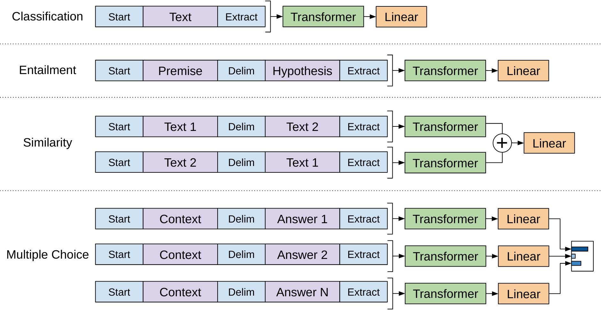
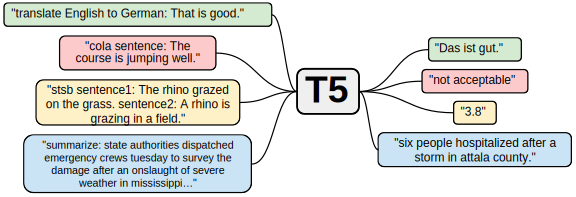

## 目次

### 2022_0501

- [機械学習 ML と自然言語処理 NLP 研究 2021 年ハイライト ](2022Ruder_ML_and_NLP_Research_Highlights_of_2021_ja) 4月20日に Slack にてお送りした文の全訳になります。
- [連続空間からのテキスト生成](2016Bowman_LM_VAE_ja) 変分自己符号化器モデル (VAE) を用いて文生成を行うモデルの提案
- [OpenAI GPT モデルの旅](2020GPT_journey_ja) GPT モデルの概説
- [変分自己符号化器 (VAE:Variational Auto Encoders) の理解](2019Rocca_VAE_ja) VAE の解説記事
- [ベイズ推論問題 MCMC と変分推論](2019Rocca_Bayes_MCMC_VI_ja) 上の VAE 解説に加えて広くベイズモデルとの関連にまで言及した記事
- [Sentencepiece : ニューラル言語処理向けトークナイザ (開発者工藤さんによる Qiita 記事)](https://qiita.com/taku910/items/7e52f1e58d0ea6e7859c) トークンに依存しないモデルについて言及されている sentence piece について。こちらは BERT でも採用されているトークン化手法となります。
- [Byte Pair Encoding (wikipedia)](2022wikipedia_BPE_ja.md) sentenceバイト対符号化。
- [文字戦争 (Char Wars)](2022char_wars_ja) 文字か単語かの論争についてのエッセイ
<!-- -  -->
- [宇宙人の夢: アートシーンの出現 (プロンプトの例 CLIP による絵画生成)](2021Snell_clip_art_ja_)

---

 

異なる課題で微調整を行うための入力変換。
すべての構造化された入力をトークン列に変換し，事前学習されたモデルで処理し，線形＋ソフトマックス層が続く。
(Radford, 2018, GPT 論文 Fig.1 より)
<!-- Figure 1: (left) Transformer architecture and training objectives used in this work. 
(right) Input transformations for fine-tuning on different tasks. 
We convert all structured inputs into token sequences to be processed by our pre-trained model, followed by a 
linear+softmax layer.
-->

 

テキスト2テキストの模式図。
翻訳，質問応答，分類など，考えられるすべての課題で，モデルにテキストを入力として与え，モデルを訓練して何らかの
目標テキストを生成するように設定されている。
これにより，様々な課題で同じモデル，損失関数，ハイパーパラメータなどを使用することができる。
また，実証実験に含まれる手法の標準的なテストベッドにもなっている。
**T5** とは提案モデルを指し **T**ext-**t**o-**T**ext **T**ransfer **T**ransformer である。
Rafffel, 2019, Fig.1 より
<!-- Figure 1: A diagram of our text-to-text framework. 
Every task we consider – including translation, question answering, and classification – is cast as feeding r model text as input and training it to generate some target text. 
This allows us to use the same model, loss function, hyperparameters, etc. across our diverse set of tasks. 
It also provides a standard testbed for the methods included in our empirical survey. 
“T5” refers to our model, which we dub the “Text-to-Text Transfer Transformer”.-->
<!-- Raffel ら (2019) Fig. 1 より -->

### 2022_0410

- [Unicode 正規化など雑多な話 ](https://colab.research.google.com/github/ShinAsakawa/ShinAsakawa.github.io/blob/master/2022notebooks/2022_0410iwa_yoshi_presentation.ipynb)

... To Iwashita-sensei and Yoshihara-sensei with my respect